# Marketplace Product Data Capture Analysis

**Repository:** `integration-amazon-api-worker`  
**Marketplace:** Amazon (via Amazon Selling Partner API — SP-API)  
**Technology stack:** .NET 6.0 / C#, ASP.NET Core, MassTransit, Amazon SQS, Redis, EF Core, Dapper  
**Analysis date:** 2026-05-06

---

## 1. Executive Summary

This application is the VTEX–Amazon integration, responsible for synchronizing VTEX sellers' product catalog, pricing, and inventory to Amazon's marketplace through Amazon's Selling Partner API (SP-API). The application is deployed as two separate services — an HTTP API and a background worker — and communicates entirely through Amazon SQS queues managed by the MassTransit framework.

Product data travels from VTEX to Amazon through a **multi-stage, fully asynchronous pipeline** with clear separation between catalog/content synchronization, inventory/price updates, and the matching process that links VTEX SKUs to Amazon ASINs. Two distinct outbound paths exist: a legacy XML Feed API path and a modern SP-API Listings API path. The application also receives inbound Amazon events (listing status changes, price notifications, order notifications) and reacts to them.

Key architectural facts:
- Entry points are a VTEX Affiliate webhook (for incremental sync) and a manual full-catalog load endpoint.
- Inventory and price are computed at runtime via a VTEX cart simulation (Fulfillment API), not from a static pricing API.
- Redis is used extensively for deduplication and payload caching.
- Bridge documents serve as the main observability and support mechanism for understanding per-SKU synchronization status.

---

## 2. Application Scope and Marketplace Responsibilities

**Marketplace/channel:** Amazon (global — supports North America: BRA, USA, CAN, MEX; Europe: ESP, GBR, FRA, NLD, DEU, ITA, SWE, POL, EGY, TUR, SAU, IND; Far East: SGP, AUS, JPN).

**Product-related responsibilities:**

| Responsibility | Handled? | Notes |
|---|---|---|
| Catalog / content sync | ✅ | SKU name, description, brand, images, dimensions, EAN/GTIN, specifications |
| Price sync | ✅ | Selling price and list price from cart simulation |
| Inventory / availability sync | ✅ | Stock balance and fulfillment latency from cart simulation |
| Logistics / SLA | ✅ | Used for availability payload and order reservations; not sent as a standalone payload |
| Order data (inbound from Amazon) | ✅ | Full order lifecycle: notification → acknowledge → integration → invoicing |
| Listing management | ✅ | Product type mapping, attribute mapping, SP-API Listings API PUT/PATCH |
| ASIN matching | ✅ | Matches VTEX SKU to Amazon ASIN using EAN/UPC/ASIN lookup |
| Inbound marketplace feedback | ✅ | ListingsItemStatusChange, ListingsItemIssuesChange, AnyOfferChanged, PricingHealth |
| FBA / DBA fulfillment | ✅ | Separate flows for Amazon-Fulfilled and Dropshipping by Amazon |

---

## 3. Product Discovery Process

### 3.1 Incremental sync — VTEX Affiliate webhook

The primary incremental entry point is the VTEX Affiliate mechanism. When the seller creates the integration, the application registers an affiliate pointing to:

```
http://integration-amazon.vtexinternal.com/api/integration-amazon/catalog/commercialcondition?an={accountName}
```

VTEX calls this URL whenever a SKU associated with the affiliate changes. The handler is:

**File:** `src/IntegrationAmazon.API/Controllers/CatalogController.cs`  
**Method:** `EnqueueCatalogNotificationAsync(StockKeepingUnitNotification notification, string an)` — `POST /api/integration-amazon/catalog/commercialcondition`

The notification carries flags `HasSkuModified`, `HasSkuRemovedFromAffiliate`, and `IsActive`. The controller applies the following routing logic:

| Condition | Action |
|---|---|
| `HasSkuModified=true AND HasSkuRemovedFromAffiliate=false AND IsActive=true` | Enqueue to `GetProductIdentifier` (catalog update path) — deduplicated with 30-min Redis lock |
| `HasSkuRemovedFromAffiliate=true OR IsActive=false` | Enqueue to **both** `GetProductIdentifier` (catalog) and `SkuAvailability` (to zero stock) — with separate Redis locks |
| Default (price/inventory-only change) | Enqueue to `SkuAvailability` only — deduplicated with 30-min Redis lock |

Redis keys used for deduplication:
- `RedisKeys.SkuBuildCacheKey(an, notification.SkuId)` — prevents duplicate catalog builds
- `RedisKeys.InventoryPriceBuildCacheKey(an, notification.SkuId)` — prevents duplicate availability updates

### 3.2 Full catalog sync — manual admin action

A full catalog load can be triggered by an admin:

**File:** `src/IntegrationAmazon.API/Controllers/CatalogController.cs`  
**Method:** `SendAllSellerProductsAsync` — `POST /api/integration-amazon/catalog/send-all`

This endpoint:
- Is rate-limited to once every 24 hours (Redis cache), bypassed with `bypass=true`.
- Supports two load types: `catalog` (triggers full catalog build) or `inventory` (triggers full availability update).
- Enqueues a `FullCatalogLoadRequest` message to the `FullCatalogLoad` SQS queue.

The `FullCatalogLoadConsumer` then paginates through VTEX's catalog using 3-page batches of 1000 SKUs per call, calling:

```
GET /api/catalog_system/pvt/sku/stockkeepingunitidsbysaleschannel?page={n}&pagesize=1000&sc={salesChannel}&an={accountName}
```

**File:** `src/IntegrationAmazon.Worker/Consumers/Catalog/FullCatalogLoadConsumer.cs`  
**File:** `src/IntegrationAmazon.BO/VTEX/VTEXCatalogBO.cs` — `GetAllStockKeepingUnitsByAccountNameAsync`  
**File:** `src/IntegrationAmazon.Infrastructure/Clients/VTEX/CatalogCustomClient.cs` — `GetAllStockKeepingUnitByAccountNameAsync`

For each page, SKU IDs are batched and sent to either `GetProductIdentifier` or `SkuAvailability` queues. A follow-up message with `page+3` is self-scheduled to continue pagination.

### 3.3 Batch manual enqueue (admin/API)

**File:** `src/IntegrationAmazon.API/Controllers/CatalogController.cs`
- `POST /api/integration-amazon/catalog/enqueue/batch` — enqueues a list of SKU IDs to `GetProductIdentifier`
- `POST /api/integration-amazon/catalog/enqueue/availability/batch` — enqueues to `SkuAvailability`

### 3.4 Amazon push notifications (inbound)

Amazon pushes `LISTINGS_ITEM_STATUS_CHANGE` and `LISTINGS_ITEM_ISSUES_CHANGE` notifications to the application's SQS queues. These are subscribed via the Amazon SP-API Notifications API.

**Files:**
- `src/IntegrationAmazon.Worker/Consumers/Catalog/Listing/ListingsItemStatusChangeConsumer.cs`
- `src/IntegrationAmazon.Worker/Consumers/Catalog/Listing/ListingsItemIssuesChangeBatchConsumer.cs`
- `src/IntegrationAmazon.API/Controllers/NotificationController.cs` — manages subscriptions

### 3.5 Eligibility filters applied to each SKU

The following checks are applied in `AmazonCatalogBO.SkuValidator`:

**File:** `src/IntegrationAmazon.BO/Amazon/AmazonCatalogBO.cs` — `SkuValidator` (line 245)

```csharp
if (!vtexSku.IsActive ?? false)
    throw new IntegrationException("SKU not actived", true); // warning

if (!vtexSku.SalesChannels.Contains(int.Parse(storeConfig.SalesChannel)))
    throw new IntegrationException("SKU out of SalesChannel", true); // warning

if ((vtexSku.IsKit ?? false) && !storeConfig.SendKit)
    throw new IntegrationException("This connector is set not to send SKU of type kit", true);
```

Additional image validation:
- SKU must have at least 1 image; main image must be present.
- A warning Bridge document is sent if fewer than 3 images are found (a TODO comment shows this was meant to be a blocking error).

---

## 4. End-to-End Product Data Capture Flow

The flow for a full catalog synchronization follows these stages:

### Stage 1 — Identifier resolution (`GetProductIdentifier` queue)

**Consumer:** `src/IntegrationAmazon.Worker/Consumers/Catalog/GetProductIdentifierConsumer.cs`  
**Business logic:** `src/IntegrationAmazon.BO/Amazon/AmazonCatalogBO.cs` — `ProcessGetProductIdentifierAsync`

1. Fetches the full SKU from VTEX: `GET /api/catalog_system/pvt/sku/stockkeepingunitbyid/{skuId}?an={accountName}`
2. Runs `SkuValidator` (active, in sales channel, kit check).
3. Validates image count; sends Bridge warning if < 3 images.
4. Checks whether the SKU fulfillment channel changed (FBA toggle detection, via Redis).
5. Determines identifier type/value:
   - If the store config has `SendEAN=true`: checks VTEX `SpecificationKey.IdType` specification first. If absent, defaults to `EAN` from `AlternateIds`.
   - If an explicit `Asin` was provided in the notification, uses `IdentifierType.ASIN` directly.
   - If the SKU was already matched and has no open issues, returns `null` (skip, already integrated).
6. Returns a `VtexSkuIdentifier` with title (built from `amazon_title` spec or `NameComplete`), description (HTML-stripped, 2000-char limit), brand, EAN, bullet points, images, dimensions.

**Output:** `VtexSkuIdentifier` sent to `GetAmazonProductBatch_{accountName}` queue.

If the SKU has no EAN/identifier, it is sent directly to `SkuBuild_{accountName}` as `SKUCOMPLETE`.

### Stage 2 — Amazon catalog lookup (`GetAmazonProductBatch` queue)

**Consumer:** `src/IntegrationAmazon.Worker/Consumers/Catalog/GetAmazonProductBatchConsumer.cs`  
**Business logic:** `src/IntegrationAmazon.BO/Amazon/AmazonCatalogBO.cs` — `ProcessGetAmazonProductBatchAsync`

1. Deduplicates identifiers in the batch by `(SkuId, IdentifierType, IdentifierValue)`.
2. Calls Amazon SP-API Catalog Items API (`GET /catalog/2022-04-01/items`) in pages of 20 identifiers per call, grouped by identifier type.
3. Calls `BuildIdentifiersMatchAsync`:
   - **ASIN match with exact ASIN identifier:** calls `DoMatchAsync` → sends to `SkuBuild` with `SkuBuildType.SKUMATCH`. Optionally validates image count against ASIN (if `SyncImagesAfterMatching` feature flag is enabled).
   - **EAN/UPC match without explicit ASIN:** calls `CreateNewMatchEntryAsync` → creates a `SkuMatch` DB record with `Matched=false`, sends to `SkuMatching` queue (awaits seller confirmation in the admin UI).
   - **No Amazon match found:** calls `CreateNewListingEntryAsync` → persists a `SkuListing` record with status `NOT_INITIATED` in the local database. The SKU will be published as a new listing.
4. SKUs with no Amazon match are batched and sent to `SkuBuild_{accountName}` as `SKUCOMPLETE`.

### Stage 3 — Product build (`SkuBuild_{accountName}` queue)

**Consumer:** `src/IntegrationAmazon.Worker/Consumers/Catalog/SkuBuildConsumer.cs`  
**Business logic:** `src/IntegrationAmazon.BO/Amazon/AmazonCatalogBO.cs` — `ProcessSkuBuildAsync`

Two paths are available at this stage depending on feature flags:

**Path A — New SP-API Listings API (`PutListingItemRequest`)**  
If `MakeMatchingUsingPatchInsteadOfPut` is enabled (SKUMATCH): builds a `MatchingItemRequest` (PATCH) and calls `AmazonListingBO.MatchingSkuAsync`.  
Otherwise (SKUMATCH or SKUCOMPLETE/SKUPARENT with mapper category configured): builds a `PutListingItemRequest` and sends to `ProductOrSkuListing` queue.

**Path B — Legacy XML Feed (SKUCOMPLETE/SKUPARENT without mapper)**  
Calls `AmazonCatalogBO.ProcessSkuBuildAsync` which builds an `AmazonProduct` and sends it to `SkuSendBatch_{accountName}` queue.

The `AmazonProduct` build logic (for SKUCOMPLETE):
- Fetches SKU from VTEX again: `GetSkuByIdAsync`.
- Fetches `ProductsDataMws` from the legacy MWS integration client (contains `ProductDataComplete` XML, `BrowseNode`, and `AttributeMap`).
- Assembles `DescriptionData`: title, brand, description (HTML-stripped), bullet points, manufacturer, MfrPartNumber (ManufacturerCode or SKU ID), search terms (keywords, max 249 chars), RecommendedBrowseNode.
- Assembles dimensions: RealDimension (item) and Dimension (package) — both in CM and GR.
- If `SendEAN=true`: sets `StandardProductID`.
- If USA account: sets `ProductTaxCode = "A_GEN_TAX"`.
- Reads `TargetAudience` from `CategoryAttributeMap` or VTEX specifications.

### Stage 4a — Legacy XML Feed submission (`SkuSendBatch_{accountName}` queue)

**Consumer:** `src/IntegrationAmazon.Worker/Consumers/Catalog/SkuSendBatchConsumer.cs`  
**Business logic:** `src/IntegrationAmazon.BO/Amazon/AmazonFeedBO.cs` — `ProcessSkuSendBatchAsync`

- Batches up to 500 products per 6-minute window (rate-limited to 1500 req per 2 min).
- Serializes to XML using `AmazonProductEnvelopeFeed` / `AmazonProductMessage`.
- Submits to Amazon via `POST /feeds/2021-06-30/documents` then `POST /feeds/2021-06-30/feeds`.
- Feed result is checked asynchronously via `FeedResultDone` queue.

Image upload is a separate flow via `SkuImage` queue → `SkuImageConsumer` → `AmazonProductImageEnvelopeFeed`.  
Relationship (parent-child variation) upload is via `Relationship` queue → `RelationshipConsumer` → `AmazonRelationshipEnvelopeFeed`.

### Stage 4b — SP-API Listings API submission (`ProductOrSkuListing` queue)

**Consumer:** `src/IntegrationAmazon.Worker/Consumers/Catalog/Listing/ProductOrSkuListingConsumer.cs`  
**Business logic:** `src/IntegrationAmazon.BO/Amazon/AmazonListingBO.cs` — `ListingProductOrSkuAsync`

- Calls `PUT /listings/2021-08-01/items/{sellerId}/{sku}` with the full `PutListingItemRequest`.
- The request includes product type, attributes (mapped from VTEX specs via the Mapper service), condition type, fulfillment availability, price, and images.

### Stage 5 — Availability update (`SkuAvailability` queue)

**Consumer:** `src/IntegrationAmazon.Worker/Consumers/Catalog/SkuAvailabilityConsumer.cs`  
**Business logic:** `src/IntegrationAmazon.BO/Amazon/AmazonAvailabilityBO.cs` — `ProcessSkuAvailabilityAsync`

Described in detail in Section 7.

---

## 5. Catalog and Content Data

### 5.1 Data captured from VTEX

All catalog data is fetched from a single VTEX endpoint:

```
GET /api/catalog_system/pvt/sku/stockkeepingunitbyid/{skuId}?an={accountName}
```

**File:** `src/IntegrationAmazon.Infrastructure/Clients/VTEX/CatalogCustomClient.cs` — `GetSkuByIdAsync`

The `StockKeepingUnit` contract contains:

| VTEX field | Amazon destination |
|---|---|
| `NameComplete` / `ProductName` | Title (fallback if `amazon_title` spec absent) |
| Product specification `amazon_title` | Title (overrides NameComplete) |
| `ProductDescription` (HTML-stripped, max 2000 chars) | Description / BulletPoints |
| `BrandName` | Brand, Manufacturer |
| `ManufacturerCode` or `Id.ToString()` (max 40 chars) | MfrPartNumber |
| `KeyWords` (max 249 chars, UTF-8 capped, diacritics removed if overflow) | SearchTerms |
| `AlternateIds[EAN]` or spec `IdTypeValue` | StandardProductID (EAN/UPC/etc.) |
| `Images` (up to 9: 1 Main + 8 PT1–PT8) | Product images |
| `RealDimension` (Length/Width/Height in cm, Weight in g) | ItemDimensions |
| `Dimension` (package dimensions) | PackageDimensions / PackageWeight |
| `ProductSpecifications` + `SkuSpecifications` | ProductDataXml, TargetAudience, IdType/IdTypeValue |
| `SalesChannels` | Eligibility filter (must include configured sales channel) |
| `IsActive` | Eligibility filter |
| `IsKit` + `KitItems` | Kit eligibility filter; kit items used for reservation |
| `ProductCategoryId()` | Category mapping to Amazon product type |

**File:** `src/IntegrationAmazon.BO/Amazon/AmazonCatalogBO.cs`

### 5.2 Title building logic

**Method:** `BuildTitle` (`AmazonCatalogBO.cs:100`)

```
1. Read "amazon_title" product specification
2. If present and NameComplete == ProductName → use amazon_title as-is
3. If present and NameComplete != ProductName → append SkuName suffix (variation discriminator)
4. If absent → use NameComplete (or ProductName for parent products)
```

### 5.3 Description and bullet points

`Helper.RemoveHtml(vtexSku.ProductDescription).LimitCharacters(2000)` — HTML tags are stripped, truncated at 2000 chars.  
`Helper.DescriptionToBulletPoints(description)` — split into bullet point list.

### 5.4 Category and attribute mapping

Amazon product type classification (e.g., `HOME`, `SHOES`) is done via a separate VTEX Mapper service, not inline with catalog data capture.

**File:** `src/IntegrationAmazon.BO/VTEX/MapperBO.cs`  
**File:** `src/IntegrationAmazon.Infrastructure/Clients/VTEX/MapperClient.cs`

The Mapper stores category → Amazon product type mappings. `ProductsDataMws` (from the legacy MWS client) provides:
- `BrowseNode` — Amazon browse node identifier
- `ProductDataXml` — serialized XML for the product type (e.g., `<Clothing>`, `<Home>`)
- `AttributeMap` — JSON mapping of VTEX spec names to Amazon attribute names

When the Mapper provides a category mapping, the new SP-API Listings path is used (`PutListingItemRequest`); otherwise, the legacy XML feed path is used.

### 5.5 Image URL transformation

VTEX image URLs are modified before submission: the file ID portion is replaced with `{fileId}-1000-1000` to request the 1000×1000 version.

**Method:** `ProcessSkuImageAsync` (`AmazonCatalogBO.cs:868`)

### 5.6 Product/catalog data validation

- SKU must be active and in the configured sales channel (throws `IntegrationException` — warning).
- At least 1 image required; main image must match `ImageUrl` field.
- Less than 3 images → Bridge warning (business decision pending, not a blocking error per TODO comment).
- EAN/identifier absence is controlled by `IgnoreEanValidation` feature toggle.
- ProductDataXml must be present and non-empty (throws `IntegrationException` — error).

---

## 6. Price Synchronization

### 6.1 Price source

**Prices are NOT captured from a VTEX pricing API.** They are obtained exclusively from a **VTEX cart simulation** (Fulfillment API).

**File:** `src/IntegrationAmazon.BO/Amazon/AmazonPriceBO.cs` — `BuildPriceAsync`  
**File:** `src/IntegrationAmazon.BO/VTEX/FulfillmentBO.cs` — `SimulateCartAsync`  
**File:** `src/IntegrationAmazon.Infrastructure/Clients/VTEX/FulfillmentCustomClient.cs` — `SimulateCartAsync`

The simulation request:
```
POST /api/fulfillment/pvt/orderForms/simulation?sc={salesChannel}&affiliateId={affiliateId}&an={accountName}
```
With `X-VTEX-Cache-Client-Bypass: 1` header (bypasses VTEX response cache).

Parameters used:
- `postalCode = "04538132"` (hardcoded São Paulo postal code — `DefaultPostalCodeForCartSimulation`)
- `country = storeConfig.Country`
- `items = [{ id: skuId, quantity: 1, seller: "1" }]`

### 6.2 Price fields extracted

From the cart simulation response `cartItem`:
- `cartItem.Price` → selling price (Amazon `DiscountedPrice.ValueWithTax` when `price < listPrice`)
- `cartItem.ListPrice` → list price (Amazon `OurPrice.ValueWithTax`)

**File:** `src/IntegrationAmazon.BO/Amazon/AmazonPriceBO.cs` — `BuildPrice` (line 129)

If `price < listPrice`: the `DiscountedPrice` schedule is set to start one month in the past and end 5 months in the future (valid sale price window).  
If `price >= listPrice`: the `DiscountedPrice` schedule is set to a past date (effectively no discount).

Currency is derived from `storeConfig.GetCurrency()` (country → currency mapping hardcoded in `StoreConfig.cs`).  
MarketplaceId is derived from `storeConfig.GetMarketplaceId()` (country → Amazon marketplace ID mapping in `SPAPIStoreConfig.cs`).

### 6.3 Price update triggers

Price updates occur as part of the `SkuAvailability` flow, not as a standalone price sync. Price is always bundled with inventory in the PATCH payload. Triggers:
- VTEX Affiliate webhook (price/inventory change)
- Full catalog inventory load
- Manual `PUT /api/integration-amazon/catalog/amazon/sku/{skuId}/availability`

### 6.4 Price deduplication (Redis cache)

Before sending, `SkuAvailabilityConsumer.ShouldProcessPatchOperationAsync` checks whether the same `quantity::fulfillmentLatency::discountedPrice::ourPrice` tuple was already submitted within the last hour.

**File:** `src/IntegrationAmazon.Worker/Consumers/Catalog/SkuAvailabilityConsumer.cs` — `ShouldProcessPatchOperationAsync` (line 126)

Redis key: `RedisKeys.InventoryPriceUpdateCacheKey(accountName, skuId)` — TTL: 1 hour.

### 6.5 Price suggestions from Amazon (inbound)

Amazon pushes `ANY_OFFER_CHANGED` and `PRICING_HEALTH` notifications, which the application receives as competitive price intelligence. These do **not** trigger automatic price updates — they create Bridge documents with competitive price data for the merchant.

**Files:**
- `src/IntegrationAmazon.Worker/Consumers/Prices/AnyOfferChangedNotificationConsumer.cs`
- `src/IntegrationAmazon.Worker/Consumers/Prices/PricingHealthNotificationConsumer.cs`
- `src/IntegrationAmazon.BO/Amazon/AmazonPriceBO.cs` — `HandlePriceSuggestionFromAOCAsync`, `HandlePriceSuggestionFromPHAsync`
- `src/IntegrationAmazon.BO/Builder/Prices/BuyboxCompetitivePriceBuilder.cs`

---

## 7. Inventory and Availability Synchronization

### 7.1 Availability source

Like price, **inventory is NOT fetched from a VTEX inventory API directly.** It is derived from the same VTEX cart simulation as price.

**File:** `src/IntegrationAmazon.BO/Amazon/AmazonAvailabilityBO.cs` — `BuildInventoryPriceAsync`  
**File:** `src/IntegrationAmazon.BO/VTEX/FulfillmentBO.cs` — `SimulateCartAsync`

### 7.2 Inventory fields extracted from cart simulation

From the cart simulation's `logisticInfo[0]`:
- `logisticInfo.StockBalance` → available quantity
- `logisticInfo.Slas` → list of SLAs with `DockEstimate`

### 7.3 Availability calculation

**File:** `src/IntegrationAmazon.BO/Amazon/AmazonAvailabilityBO.cs` — `BuildInventory` (line 208)

```
quantity = logisticInfo.StockBalance > storeConfig.MinimumStock ? logisticInfo.StockBalance : 0
```

If `StockBalance <= MinimumStock` → quantity is sent as 0 (effectively unavailable).

Fulfillment latency (`LeadTimeToShipMaxDays`):
```
- If any SLA has DockEstimate containing "h" (hours) → latency = 1 day
- Else → latency = min(int(SLA.DockEstimate)) across all SLAs
- If latency == 0 → use defaultLeadTime (storeConfig.DefaultLeadTimeInBusinessDays ?? 3)
```

### 7.4 Inactive or out-of-sales-channel SKUs

If `vtexSku.IsActive == false` OR `vtexSku.SalesChannels` does not contain the configured sales channel:

```csharp
// If SendInventory enabled: sends quantity = 0
itemPatchRequest.Patches.Add(PatchOperationBuilder.Create()
    .WithOp(ListingItemOperation.replace)
    .WithPath(PatchOperationPath.Inventory)
    .WithValue(new ListingItemValue { FulfillmentChannelCode = FulfillmentChannelCode.DEFAULT, Quantity = 0 })
    .Build());
```

**File:** `src/IntegrationAmazon.BO/Amazon/AmazonAvailabilityBO.cs` — `BuildInventoryPriceAsync` (line 148)

If `SendInventory=false`, the method returns `null` (no update sent).

### 7.5 FBA (Amazon Fulfillment) channel handling

If the SKU has a product specification `SpecificationAmazonFulfillmentChannel = "AFN"`:

**File:** `src/IntegrationAmazon.BO/Amazon/AmazonAvailabilityBO.cs` — `BuildFulfillmentChannelFromMFNtoAFN`

The PATCH removes the `DEFAULT` fulfillment channel and replaces it with `AMAZON_NA` (AFN). Price is still appended from cart simulation. This is sent with `PatchRequestType.ConvertToAFN`.

Change detection: Redis key `RedisKeys.ChangeFulfillmentChannelKey(accountName, skuId)` stores the last known fulfillment channel value (TTL: 1 hour). If it changed, a `SkuAvailability` message is re-sent.

### 7.6 SkuAvailability queue flow (availability deduplication)

1. `SkuAvailabilityConsumer` builds the `ListingsItemPatchRequestWrapper`.
2. Checks Redis cache: if `quantity::fulfillmentLatency::discountedPrice::ourPrice` unchanged → skip (returns early).
3. Dynamically connects the account-specific `SkuAvailabilityBatch_{accountName}` endpoint if not yet connected.
4. Sends wrapper to `SkuAvailabilityBatch_{accountName}`.
5. `SkuAvailabilityBatchConsumer` receives batches:
   - If batch size > 5: uses XML Feed API (`AmazonFeedBO.ProcessSkuAvailabilityBatchAsync`)
   - Otherwise: uses SP-API Listings PATCH API directly (`AmazonAvailabilityBO.ProcessSkuAvailabilityBatchAsync`)

**File:** `src/IntegrationAmazon.Worker/Consumers/Catalog/SkuAvailabilityBatchConsumer.cs`

---

## 8. Logistics and Delivery Synchronization

### 8.1 Logistics role in product data

Logistics data is **not sent as a standalone payload** to Amazon. It serves two internal purposes:
1. **Availability computation** — `DockEstimate` values from SLAs determine `LeadTimeToShipMaxDays` sent to Amazon.
2. **Order reservations** — logistic data is used when creating VTEX reservations for incoming Amazon orders.

### 8.2 SLA data in availability

**Source:** `logisticInfo.Slas[].DockEstimate` — parsed from the cart simulation response.

The `DockEstimate` field from VTEX logistics:
- Contains `"h"` suffix for same-day/hour SLAs → `LeadTimeToShipMaxDays = 1`
- Contains `"bd"` or `"d"` suffix → parsed as integer number of business days

**File:** `src/IntegrationAmazon.BO/Amazon/AmazonAvailabilityBO.cs` — `BuildInventory` (line 208)

### 8.3 Logistics API for order reservations

For orders, `LogisticBO.BuildReservationRequestAsync` and `CreateReservationAsync` use:

```
POST /api/logistics/pvt/inventory/reservations
```

**File:** `src/IntegrationAmazon.BO/VTEX/LogisticBO.cs`  
**File:** `src/IntegrationAmazon.Infrastructure/Clients/VTEX/LogisticClient.cs`

The reservation uses SKU dimensions (height, length, width, weight) from VTEX catalog and the SLA selected by `FulfillmentBO.GetSlaAsync`.

SLA selection for orders (`FulfillmentBO.GetSlaAsync`):
1. Simulates a cart for the order's postal code and country.
2. Filters out SLAs with available delivery windows or pickup-in-point channel.
3. Finds the SLA common to all order items.
4. Selects the cheapest common SLA. If USA account with `ChooseSlaIdByShipServiceLevel=true`, uses Amazon's `ShipServiceLevel` as the SLA ID.

---

## 9. Synchronization Architecture

### 9.1 Overview

The application is **fully asynchronous**, event-driven, and queue-based. There are no scheduled polling jobs — all sync is triggered by external events (VTEX webhooks, Amazon notifications) or manual admin actions.

```
VTEX Affiliate webhook → HTTP API → SQS queue → Worker consumer → Amazon SP-API
```

### 9.2 Queue topology for product data

All queues are Amazon SQS queues named with the pattern `AmazonIntegrationSPAPI_{Type}{_Dev if debug}{_accountName if account-scoped}`.

**Account-scoped queues** (created dynamically per seller account via `ConsumerUtil`):
- `AmazonIntegrationSPAPI_GetAmazonProductBatch_{accountName}`
- `AmazonIntegrationSPAPI_SkuBuild_{accountName}`
- `AmazonIntegrationSPAPI_SkuSendBatch_{accountName}`
- `AmazonIntegrationSPAPI_SkuAvailability_{accountName}` (batch variant)

**Global queues** (shared across all accounts):
- `AmazonIntegrationSPAPI_GetProductIdentifier`
- `AmazonIntegrationSPAPI_SkuAvailability`
- `AmazonIntegrationSPAPI_SkuImage`
- `AmazonIntegrationSPAPI_Relationship`
- `AmazonIntegrationSPAPI_ProductOrSkuListing`
- `AmazonIntegrationSPAPI_SkuMatching`

### 9.3 Concurrency configuration (per consumer)

| Consumer | ConcurrentMessageLimit | PrefetchCount |
|---|---|---|
| `GetProductIdentifierConsumer` | 50 | 50 |
| `SkuAvailabilityConsumer` | 50 | 50 |
| `SkuBuildConsumer` | 30 | 30 |
| `ProductOrSkuListingConsumer` | 2 | 10 |
| `SkuSendBatchConsumer` | 1 | 10 (batch: 500 items, 6-min window) |
| `FullCatalogLoadConsumer` | 1 | 1 |

### 9.4 Retry behavior

All consumers use `WithDefaultRetryConfig()` and `WithDefaultErrorPipeline()` from the MassTransit SQS configuration. The exact retry policy is defined in the `WithDefaultRetryConfig` extension (in `ConsumerQueueBinding.cs` or a shared extension method).

MassTransit moves messages to an error queue after exhausting retries (dead-letter equivalent).

### 9.5 State stored locally

| State | Storage | TTL | Purpose |
|---|---|---|---|
| SKU build lock | Redis `SkuBuildCacheKey` | 30 min | Deduplication at entry point |
| Inventory/price build lock | Redis `InventoryPriceBuildCacheKey` | 30 min | Deduplication at entry point |
| Last inventory/price update | Redis `InventoryPriceUpdateCacheKey` | 1 hour | Skip identical updates |
| Product type schema | Redis `ProductTypeSchemaRawCacheKey` | 2 hours | Cache Amazon schema lookup |
| Fulfillment channel value | Redis `ChangeFulfillmentChannelKey` | 1 hour | Detect FBA toggle changes |
| Full catalog load timestamp | Redis `LoadSellerCatalogCacheKey` | 24 hours | Rate-limit full-load |
| SKU build in progress | Redis `SkuBuildCacheKey` | (cleared on completion) | Prevent concurrent builds |
| SKU-ASIN matching record | SQL (EF Core `SkuMatch` table) | Permanent | Links VTEX SKU to Amazon ASIN |
| SKU listing state | SQL (Dapper `SkuListing`/`ProductListing`) | Permanent | Listing status, mapped attributes, product type |
| Attribute generation groups | SQL (Dapper) | Permanent | Mass listing templates |

### 9.6 Separate flows by data type

| Data type | Queue / flow |
|---|---|
| Catalog/content | `GetProductIdentifier` → `GetAmazonProductBatch_{an}` → `SkuBuild_{an}` → `SkuSendBatch_{an}` (XML) or `ProductOrSkuListing` (SP-API) |
| Images (XML path) | `SkuImage` → `SkuImageBatch_{an}` |
| Variations/relationships (XML path) | `Relationship` → `RelationshipBatch_{an}` |
| Price + inventory | `SkuAvailability` → `SkuAvailabilityBatch_{an}` |
| ASIN matching | `SkuMatching` → `BuildSkuMatch` |
| Amazon listing feedback | `ListingsItemStatusChange`, `ListingsItemIssuesChange` (inbound from Amazon) |

---

## 10. Marketplace Payload Assembly

### 10.1 Legacy XML Feed payload (`AmazonProduct`)

**Contract:** `src/IntegrationAmazon.Contracts/Amazon/Product/AmazonProduct.cs`  
**Builder:** `src/IntegrationAmazon.BO/Amazon/AmazonCatalogBO.cs`  
**Envelope:** `src/IntegrationAmazon.Contracts/Amazon/Feed/Xml/Request/AmazonProductEnvelopeFeed.cs`

The `AmazonProduct` is serialized to XML and wrapped in an `AmazonEnvelopeFeed<AmazonProductMessage>`. Key fields:

| VTEX field | XML element |
|---|---|
| SKU ID (or `{ProductId}p` for parent) | `<SKU>` |
| `"New"` (hardcoded) | `<Condition><ConditionType>` |
| Built title | `<DescriptionData><Title>` |
| `BrandName` | `<DescriptionData><Brand>` |
| Description | `<DescriptionData><Description>` |
| Bullet points | `<DescriptionData><BulletPoint>` |
| ManufacturerCode / SKU ID | `<DescriptionData><MfrPartNumber>` |
| Keywords | `<DescriptionData><SearchTerms>` |
| BrowseNode | `<DescriptionData><RecommendedBrowseNode>` |
| EAN/identifier | `<StandardProductID><IdType>/<IdTypeValue>` |
| RealDimension | `<DescriptionData><ItemDimensions>` |
| Dimension | `<DescriptionData><PackageDimensions>/<PackageWeight>` |
| ProductDataXml (from MWS) | `<ProductData><{TypeMarker}>` (category-specific XML fragment) |
| USA only: `"A_GEN_TAX"` | `<ProductTaxCode>` |

### 10.2 SP-API Listings API payload (`PutListingItemRequest`)

**Contract:** `src/IntegrationAmazon.Contracts/Amazon/Listing/Request/PutListingItemRequest.cs`  
**Builder:** `src/IntegrationAmazon.BO/Amazon/AmazonListingBO.cs` — `BuildPutListingItemRequestAsync`

Structure: `PUT /listings/2021-08-01/items/{sellerId}/{sku}` body with:
- `productType` — Amazon product type (e.g., `HOME`)
- `attributes` — JSON object with all mapped attributes; validated against Amazon's product type JSON schema before sending
- The SP-API path includes `fulfillment_availability`, `list_price`, and image locators directly in `attributes`

Blacklisted attributes (excluded from mapping):
```
item_name, brand, parentage_level, country_of_origin, product_description,
child_parent_sku_relationship, fulfillment_availability, generic_keyword,
number_of_items, recommended_browse_nodes, bullet_point,
main_offer_image_locator, main_product_image_locator,
other_offer_image_locator, other_product_image_locator, list_price
```

### 10.3 Availability PATCH payload (`ListingsItemPatchRequest`)

**Builder:** `src/IntegrationAmazon.BO/Amazon/AmazonAvailabilityBO.cs` — `BuildInventoryPriceAsync`

The PATCH payload contains up to 3 operations:
1. `delete` on `fulfillment_availability` for AFN channel (cleanup)
2. `replace` on `fulfillment_availability` for DEFAULT channel with `{ fulfillmentChannelCode, quantity, leadTimeToShipMaxDays }`
3. `replace` on `purchasable_offer` with `{ marketplaceId, currency, discountedPrice, ourPrice }` (only if `SendPrice=true`)

---

## 11. Error Handling and Observability

### 11.1 Bridge documents — primary observability mechanism

The application writes Bridge documents for each significant event in the product sync pipeline. These are visible in VTEX's integration admin UI.

**File:** `src/IntegrationAmazon.BO/VTEX/BridgeBO.cs`  
**Queue:** `AmazonIntegrationSPAPI_BridgeDocument`  
**Consumer:** `src/IntegrationAmazon.Worker/Consumers/Log/BridgeConsumer.cs`

Document types:
- `SendProductDocumentAsync` — catalog/product sync events
- `SendInventoryDocumentAsync` — inventory update events
- `SendPriceDocumentAsync` — price update events
- `SendOrderDocumentAsync` — order events

Status values: `Success`, `Warning`, `Error`.

Bridge messages are country-localized via `BridgeMessages.GetCountryMessage(MessageEnum.*, storeConfig.Country, ...)`.

### 11.2 Structured logging

**File:** `src/IntegrationAmazon.Infrastructure/Observability/OpenTelemetryLogger.cs`

All consumers and BO classes log with `_logger.Info/Warning/Error` using a consistent signature:
`(method, skuId/orderId, message, accountName, fields[], evidence, exception)`

OpenTelemetry is configured in both API and Worker services.

### 11.3 MassTransit error pipeline

All consumers use `WithDefaultErrorPipeline()`. MassTransit automatically moves exhausted messages to an SQS dead-letter queue after all retries are consumed.

### 11.4 `AmazonUnauthorizedException` observer

**File:** `src/IntegrationAmazon.Worker/Consumers/Observer/AmazonUnauthorizedObserver.cs`

When any consumer throws `AmazonUnauthorizedException`, the observer intercepts and sends the account to `CheckSellerStatus` queue. The `CheckSellerStatusConsumer` verifies whether the seller's token is still valid and marks it as expired if necessary.

### 11.5 Token expiry check

All consumers check `storeConfig.IsTokenExpired` at the start and return early (skip processing) if expired. Token refresh is handled via `OAuthSPAPIConsumer`.

### 11.6 `IntegrationException` — warning vs error

Errors thrown as `new IntegrationException(message, isWarning: true)` create Bridge documents with `DocumentStatus.Warning` and are logged at `Warning` level (not `Error`), allowing support to distinguish blocking issues from advisory messages.

### 11.7 Key failure points

| Failure scenario | Handling |
|---|---|
| VTEX SKU not found | `IntegrationException("SKU not found")` → Bridge error |
| SKU inactive or out of sales channel | `IntegrationException` warning → Bridge warning, skip |
| No images found | `IntegrationException` error → Bridge error, skip |
| EAN missing | Controlled by `IgnoreEanValidation` toggle; otherwise `IntegrationException` |
| Amazon SP-API auth expired | `AmazonUnauthorizedException` → `CheckSellerStatus` queue |
| Amazon PATCH returns `INVALID` | `IntegrationException(response JSON)` → MassTransit retry |
| No VTEX SLA available for postal code | Exception thrown → order reservation fails |
| ProductDataXml empty (MWS) | `IntegrationException("ProductData is empty")` → Bridge error |
| Amazon listing INVALID status | `ItemSubmissionStatus.INVALID` check → `IntegrationException` |

### 11.8 Prometheus metrics

Both API and Worker expose Prometheus metrics endpoints. No specific metric names were found in the analyzed code (they are likely set by the Vtex.Core framework).

---

## 12. Dependencies, Assumptions, and Risks

### 12.1 VTEX platform dependencies

| Dependency | API endpoint | Purpose |
|---|---|---|
| VTEX Catalog API | `/api/catalog_system/pvt/sku/stockkeepingunitbyid/{skuId}` | SKU data (primary source) |
| VTEX Catalog API | `/api/catalog_system/pvt/sku/stockkeepingunitidsbysaleschannel` | Full catalog pagination |
| VTEX Catalog API | `/api/catalog_system/pvt/products/ProductGet/{productId}` | Product data |
| VTEX Catalog API | `/api/catalog/pvt/skuimages/{skuId}` | Image list |
| VTEX Catalog API | `/api/catalog_system/pvt/sku/stockKeepingUnitByProductId/{productId}` | Product variations |
| VTEX Catalog API | `/api/catalog_system/pub/category/tree/{levels}` | Category tree |
| VTEX Fulfillment API | `/api/fulfillment/pvt/orderForms/simulation` | Cart simulation (price + inventory) |
| VTEX Fulfillment API | `/api/fulfillment/pvt/affiliates/{affiliateId}` | Affiliate management |
| VTEX OMS API | `/api/oms/pvt/orders/{orderId}` | Order data |
| VTEX Logistic API | `/api/logistics/pvt/inventory/reservations` | Stock reservation |
| VTEX Mapper service | (internal service) | Category → Amazon product type mapping |
| VTEX Bridge service | (internal service) | Integration log documents |
| VTEX IO | (internal) | Feature toggle, IO app management |
| AWS S3 (`Commerce-Files` bucket) | Pre-signed URL | SKU image retrieval for matching |
| Redis (Vtex.Core) | (internal) | Deduplication, caching |

### 12.2 Amazon SP-API dependencies

| Dependency | API | Purpose |
|---|---|---|
| Amazon SP-API Catalog Items | `GET /catalog/2022-04-01/items` | ASIN lookup by EAN/UPC |
| Amazon SP-API Listings Items | `PUT/PATCH /listings/2021-08-01/items/{sellerId}/{sku}` | Create/update listings |
| Amazon SP-API Listings Items | `GET /listings/2021-08-01/items/{sellerId}/{sku}` | Read current listing state |
| Amazon SP-API Definitions | `GET /definitions/2020-09-01/productTypes/{productType}` | Product type schema |
| Amazon SP-API Feeds | `POST /feeds/2021-06-30/feeds` | XML feed submission |
| Amazon SP-API Reports | `POST /reports/2021-06-30/reports` | Report requests |
| Amazon SP-API Notifications | `POST /notifications/v1/subscriptions` | Subscribe to events |
| Amazon LWA (Login with Amazon) | `https://api.amazon.com/auth/o2/token` | Token refresh |

### 12.3 Required account/app settings (`SPAPIStoreConfig`)

| Setting | Default | Purpose |
|---|---|---|
| `AccountName` | (required) | VTEX account identifier |
| `SalesChannel` | (required) | Filters which SKUs are eligible |
| `SellerId` | (required) | Amazon seller account ID |
| `Country` | (required) | Determines marketplace ID, currency, SP-API region |
| `AffiliateId` | (required) | VTEX affiliate for webhook callbacks |
| `RefreshToken` | (required) | Amazon LWA refresh token |
| `SendEAN` | `true` | Whether to include EAN in product identifier |
| `SendPrice` | `true` | Whether to send price in availability updates |
| `SendInventory` | `true` | Whether to send inventory in availability updates |
| `SendKit` | `true` | Whether to process kit SKUs |
| `SendProduct` | `true` | Whether to send catalog data |
| `SendImage` | `true` | Whether to send product images |
| `MinimumStock` | `0` | Stock threshold below which quantity is sent as 0 |
| `DefaultLeadTimeInBusinessDays` | `3` | Fallback lead time if no SLA available |
| `RateLimitPlan` | `SMALL` | Controls API rate limiting |
| `PostalCodeForStockReservation` | (optional) | Postal code for order reservations |

### 12.4 Hardcoded assumptions

1. **Postal code `"04538132"`** (São Paulo, Brazil) is used for all cart simulations regardless of the seller's country. This means inventory and pricing are computed for a Brazilian location even for non-Brazilian accounts.
2. **Seller `"1"`** is hardcoded in cart simulation items — assumes VTEX seller 1 is always the main seller.
3. **Image resolution `{fileId}-1000-1000`** — assumes VTEX's image service supports this URL pattern.
4. **`ProductTaxCode = "A_GEN_TAX"`** for USA accounts — assumes all US products use the generic tax code.
5. **`"New"` condition** is always sent for all products — no condition variation support.
6. Legacy XML feed path depends on the **MWS integration client** (`IMWSIntegrationClient`) which calls an older API to retrieve `ProductsDataMws`. This creates a dependency on a separate legacy system.
7. A maximum of **9 images** (1 Main + 8 PT1–PT8) are sent per SKU.

### 12.5 Coupling and risks

- Price and inventory are tightly coupled (both come from the same cart simulation call). There is no way to update only inventory without also computing/sending price (when `SendPrice=true`).
- The hardcoded postal code for cart simulation is a significant risk for non-Brazilian accounts — the simulated stock and price may differ from what's available for the actual Amazon marketplace postal codes.
- The legacy XML feed path depends on a separate MWS client service with its own availability and schema. If that service is unavailable, new product creation fails.
- Feature flags (`IgnoreEanValidation`, `DisableOldListingSendToAmazon`, `MakeMatchingUsingPatchInsteadOfPut`, `SyncImagesAfterMatching`) control critical branches of the sync flow — their state must be consistently managed across all consumers.

---

## 13. Step-by-Step Flow

### Full catalog sync — incremental (SKU change)

1. VTEX calls `POST /api/integration-amazon/catalog/commercialcondition?an={account}` when a SKU in the affiliate changes.
2. `CatalogController.EnqueueCatalogNotificationAsync` evaluates the notification flags.
3. A Redis lock prevents duplicate processing within 30 minutes.
4. Message is enqueued to SQS `AmazonIntegrationSPAPI_GetProductIdentifier`.
5. `GetProductIdentifierConsumer` processes the message:
   a. Fetches full SKU from VTEX Catalog API.
   b. Validates: active, in sales channel, has images.
   c. Resolves identifier type and value (EAN, ASIN, etc.).
   d. Returns `VtexSkuIdentifier` with title, description, brand, images, dimensions.
6. Message enqueued to `AmazonIntegrationSPAPI_GetAmazonProductBatch_{accountName}`.
7. `GetAmazonProductBatchConsumer` batches identifiers and searches Amazon Catalog Items API.
8. For each identifier:
   - **Match found (seller's ASIN):** `DoMatchAsync` → enqueue to `SkuBuild_{an}` with type `SKUMATCH`.
   - **Match found (EAN/UPC):** `CreateNewMatchEntryAsync` → create `SkuMatch` DB record, enqueue to `SkuMatching` for merchant confirmation.
   - **No match:** `CreateNewListingEntryAsync` → persist `SkuListing` DB record, enqueue to `SkuBuild_{an}` with type `SKUCOMPLETE`.
9. `SkuBuildConsumer` receives the message:
   - If `HasCategoryIdMappedInMapper` or `SKUMATCH`: builds `PutListingItemRequest` and enqueues to `ProductOrSkuListing`.
   - Else: builds `AmazonProduct` (XML) and enqueues to `SkuSendBatch_{an}`.
10. **SP-API path** (`ProductOrSkuListing`): `ProductOrSkuListingConsumer` calls `AmazonListingBO.ListingProductOrSkuAsync` → `PUT /listings/2021-08-01/items/{sellerId}/{sku}`.
11. **XML Feed path** (`SkuSendBatch_{an}`): `SkuSendBatchConsumer` batches (up to 500 products, 6-min window) → `AmazonFeedBO.ProcessSkuSendBatchAsync` → XML serialized → `POST /feeds/2021-06-30/feeds`.
12. For XML path: image feed sent via `SkuImage` queue; relationship feed via `Relationship` queue.

### Availability update (inventory/price)

1. VTEX triggers `POST /commercialcondition` with only price/inventory change.
2. Controller routes to `SkuAvailability` queue (with 30-min Redis dedup lock).
3. `SkuAvailabilityConsumer`:
   a. Fetches full SKU from VTEX.
   b. Checks FBA channel spec → routes to `BuildFulfillmentChannelFromMFNtoAFN` or `BuildInventoryPriceAsync`.
   c. `BuildInventoryPriceAsync` → calls cart simulation → extracts `StockBalance`, `DockEstimate`, `Price`, `ListPrice`.
   d. Builds `ListingsItemPatchRequestWrapper` with inventory (quantity, lead time) and price patches.
   e. Checks Redis: if same quantity+price tuple sent in last hour → skip.
   f. Connects account-specific batch endpoint, enqueues to `SkuAvailabilityBatch_{an}`.
4. `SkuAvailabilityBatchConsumer` receives batch:
   - If > 5 items: XML Feed (`AmazonFeedBO.ProcessSkuAvailabilityBatchAsync`).
   - Else: SP-API PATCH (`AmazonAvailabilityBO.ProcessSkuAvailabilityBatchAsync` → `PATCH /listings/2021-08-01/items`).
5. After send: `ProcessHandleSkuAvailability` writes Bridge inventory/price documents.

---

## 14. Mermaid Diagram

```mermaid
flowchart TD
    subgraph VTEXPlatform["VTEX Platform"]
        Affiliate["Affiliate webhook\n(SKU change)"]
        CatalogAPI["Catalog API\n(SKU details, images)"]
        FulfillmentAPI["Fulfillment API\n(cart simulation)"]
        LogisticAPI["Logistic API\n(reservations)"]
        MapperSvc["Mapper Service\n(category → product type)"]
        BridgeSvc["Bridge\n(integration logs)"]
    end

    subgraph IntegrationAPI["Integration Amazon API"]
        CommercialCond["POST /commercialcondition\n(affiliate webhook)"]
        SendAll["POST /send-all\n(full catalog load)"]
    end

    subgraph SQS["Amazon SQS Queues"]
        Q_GetIdentifier["GetProductIdentifier"]
        Q_GetBatch["GetAmazonProductBatch_{an}"]
        Q_SkuBuild["SkuBuild_{an}"]
        Q_SkuSendBatch["SkuSendBatch_{an}"]
        Q_ProductListing["ProductOrSkuListing"]
        Q_SkuAvailability["SkuAvailability"]
        Q_SkuAvailBatch["SkuAvailabilityBatch_{an}"]
        Q_SkuImage["SkuImage"]
        Q_Relationship["Relationship"]
        Q_SkuMatching["SkuMatching"]
    end

    subgraph Workers["Integration Amazon Worker"]
        C_GetIdentifier["GetProductIdentifierConsumer\nFetches SKU, resolves EAN/ASIN"]
        C_GetBatch["GetAmazonProductBatchConsumer\nLooks up Amazon catalog"]
        C_SkuBuild["SkuBuildConsumer\nBuilds product payload"]
        C_SkuSendBatch["SkuSendBatchConsumer\nXML Feed (batched ≤500)"]
        C_ProductListing["ProductOrSkuListingConsumer\nSP-API Listings PUT"]
        C_SkuAvailability["SkuAvailabilityConsumer\nCart sim → inventory+price"]
        C_SkuAvailBatch["SkuAvailabilityBatchConsumer\nPATCH or XML Feed"]
        C_SkuImage["SkuImageConsumer\nImage XML Feed"]
        C_Relationship["RelationshipConsumer\nRelationship XML Feed"]
    end

    subgraph AmazonSPAPI["Amazon SP-API"]
        AMZ_Catalog["Catalog Items API\nASIN lookup"]
        AMZ_Listings["Listings Items API\nPUT/PATCH"]
        AMZ_Feeds["Feeds API\nXML submission"]
    end

    subgraph LocalDB["Local Database (SQL + Redis)"]
        SkuMatch["SkuMatch (EF Core)\nSKU ↔ ASIN"]
        SkuListing["SkuListing / ProductListing (Dapper)\nListing state, mapped attributes"]
        RedisCache["Redis\nDedup locks, schema cache,\npayload hash cache"]
    end

    Affiliate --> CommercialCond
    SendAll --> Q_GetIdentifier

    CommercialCond -->|"HasSkuModified"| Q_GetIdentifier
    CommercialCond -->|"price/inventory change"| Q_SkuAvailability

    Q_GetIdentifier --> C_GetIdentifier
    C_GetIdentifier --> CatalogAPI
    C_GetIdentifier --> Q_GetBatch
    C_GetIdentifier -->|"no EAN"| Q_SkuBuild

    Q_GetBatch --> C_GetBatch
    C_GetBatch --> AMZ_Catalog
    C_GetBatch -->|"ASIN match"| Q_SkuBuild
    C_GetBatch -->|"EAN match"| Q_SkuMatching
    C_GetBatch -->|"no match → new listing"| Q_SkuBuild
    C_GetBatch --> SkuListing

    Q_SkuBuild --> C_SkuBuild
    C_SkuBuild --> CatalogAPI
    C_SkuBuild --> MapperSvc
    C_SkuBuild -->|"mapper mapped"| Q_ProductListing
    C_SkuBuild -->|"legacy XML path"| Q_SkuSendBatch
    C_SkuBuild --> Q_SkuImage
    C_SkuBuild --> Q_Relationship

    Q_SkuSendBatch --> C_SkuSendBatch
    C_SkuSendBatch --> AMZ_Feeds

    Q_ProductListing --> C_ProductListing
    C_ProductListing --> AMZ_Listings

    Q_SkuImage --> C_SkuImage
    C_SkuImage --> AMZ_Feeds

    Q_Relationship --> C_Relationship
    C_Relationship --> AMZ_Feeds

    Q_SkuAvailability --> C_SkuAvailability
    C_SkuAvailability --> CatalogAPI
    C_SkuAvailability --> FulfillmentAPI
    C_SkuAvailability --> RedisCache
    C_SkuAvailability --> Q_SkuAvailBatch

    Q_SkuAvailBatch --> C_SkuAvailBatch
    C_SkuAvailBatch -->|"batch > 5"| AMZ_Feeds
    C_SkuAvailBatch -->|"batch ≤ 5"| AMZ_Listings

    C_SkuAvailBatch --> BridgeSvc
    C_GetIdentifier --> BridgeSvc
    C_SkuBuild --> BridgeSvc
    C_SkuSendBatch --> BridgeSvc

    C_GetBatch --> SkuMatch
    C_SkuBuild --> SkuListing
```



---

## 15. Source-to-Destination Mapping Table

| Data type | VTEX source / API / module | Main files / functions | Transformation / business logic | Marketplace destination / use |
|---|---|---|---|---|
| **Catalog / content** | `GET /api/catalog_system/pvt/sku/stockkeepingunitbyid/{skuId}` | `CatalogCustomClient.GetSkuByIdAsync`, `AmazonCatalogBO.BuildCompleteProductAsync`, `AmazonCatalogBO.BuildTitle` | `amazon_title` spec overrides NameComplete; HTML stripped from description; bullet points split from description; keywords limited to 249 chars/bytes; MfrPartNumber truncated to 40 chars | `AmazonProduct.DescriptionData` (XML Feed) or `PutListingItemRequest.attributes` (Listings API) |
| **Images** | `StockKeepingUnit.Images[]` from same SKU endpoint | `AmazonCatalogBO.ProcessSkuImageAsync` | Main image identified by matching URL suffix; additional images PT1–PT8; URL modified to `{fileId}-1000-1000` | `AmazonProductImageEnvelopeFeed` (XML Feed) or `main_product_image_locator` / `other_product_image_locator` (Listings API attributes) |
| **Dimensions** | `StockKeepingUnit.RealDimension`, `StockKeepingUnit.Dimension` | `AmazonCatalogBO.BuildCompleteProductAsync` (lines 742–759) | Both item dimensions and package dimensions sent; values converted to int; units = CM, GR | `<ItemDimensions>`, `<PackageDimensions>`, `<PackageWeight>` in XML or Listings API attributes |
| **EAN / identifier** | `StockKeepingUnit.AlternateIds[EAN]` or specs `IdType`/`IdTypeValue` | `AmazonCatalogBO.GetSkuIdentifierTypeValue` | Type parsed from `IdType` spec; defaults to EAN; guarded by `SendEAN` config flag | `<StandardProductID>` in XML Feed |
| **Category / product type** | VTEX Mapper service (category → Amazon product type) | `MapperBO`, `MapperClient`, `AmazonListingBO.HasCategoryIdMappedInMapper` | Category ID mapped via Mapper service to Amazon product type string; product type schema fetched from Amazon Definitions API (cached in Redis 2h) | `PutListingItemRequest.productType`; drives which SP-API schema is used for attributes |
| **Specifications / attributes** | `StockKeepingUnit.ProductSpecifications`, `SkuSpecifications` | `AmazonCatalogBO.GetRawSpecificationValue`, `AmazonListingBO.BuildPutListingItemRequestAsync` | VTEX spec names mapped to Amazon attribute names via `CategoryAttributeMap`; blacklisted attributes excluded | `PutListingItemRequest.attributes` or `ProductDataXml` in XML Feed |
| **Price** | `POST /api/fulfillment/pvt/orderForms/simulation` | `AmazonPriceBO.BuildPriceAsync`, `FulfillmentBO.SimulateCartAsync`, `FulfillmentCustomClient.SimulateCartAsync` | `cartItem.Price` = selling price; `cartItem.ListPrice` = list price; if `price < listPrice` → creates `DiscountedPrice` schedule; currency from `storeConfig.GetCurrency()`; marketplace from `storeConfig.GetMarketplaceId()` | `ListingsItemPatchRequest.Patches[price]` (PATCH, Listings API); `purchasable_offer` attribute |
| **Inventory / stock** | `POST /api/fulfillment/pvt/orderForms/simulation` | `AmazonAvailabilityBO.BuildInventory`, `AmazonAvailabilityBO.BuildInventoryPriceAsync` | `StockBalance > MinimumStock ? StockBalance : 0`; postal code hardcoded to `"04538132"` (São Paulo) | `ListingsItemPatchRequest.Patches[inventory].Quantity` (PATCH, Listings API); Amazon `fulfillment_availability.quantity` |
| **Availability / lead time** | `logisticInfo.Slas[].DockEstimate` from cart simulation | `AmazonAvailabilityBO.BuildInventory` | `"h"` suffix → 1 day; `"bd"`/`"d"` suffix → parsed int; min across all SLAs; 0 → `defaultLeadTime` (default: 3) | `ListingsItemPatchRequest.Patches[inventory].LeadTimeToShipMaxDays` |
| **Logistics / SLA (for orders)** | `POST /api/fulfillment/pvt/orderForms/simulation` | `FulfillmentBO.GetSlaAsync`, `LogisticBO.BuildReservationRequestAsync` | Selects cheapest SLA common to all order items; USA: uses Amazon `ShipServiceLevel` as VTEX SLA ID | VTEX Logistic API reservation (`POST /api/logistics/pvt/inventory/reservations`) |
| **ASIN matching (mapping)** | Amazon Catalog Items API + local `SkuMatch` table | `AmazonCatalogBO.BuildIdentifiersMatchAsync`, `SkuMatchRepository` | EAN lookup on Amazon → if match → ASIN stored in `SkuMatch` SQL table with `Matched` flag | SKU-ASIN link stored locally; drives whether SKUMATCH or SKUCOMPLETE path is used |
| **Listing state** | Local SQL (`SkuListing`, `ProductListing` tables) | `AmazonListingBO.GetSkuListingFromDatabaseAsync`, `SaveSkuListingOnDatabaseAsync` | Persists `ListingStatus`, `MappedAttributes`, `ProductType`, `IsDeleted`; updated throughout sync lifecycle | Internal routing (determines whether to create new listing or update existing) |

---

## 16. Open Questions and Unclear Areas in the Code

1. **Hardcoded postal code `"04538132"` (São Paulo) for all cart simulations.** This is used for non-Brazilian accounts (USA, Europe, etc.). The inventory and price returned by the simulation may not reflect what's actually available for the Amazon marketplace's region. This appears to be a known limitation — no code comment explains the reason.

2. **`DefaultRetryConfig` and `DefaultErrorPipeline` definitions** — these MassTransit extension methods are referenced in all consumers but their implementation (retry count, interval, error queue name) was not found in the analyzed files. The exact retry behavior is unclear without reading those extension methods.

3. **`ProductsDataMws` (legacy MWS integration client)** — the `IMWSIntegrationClient` is a dependency for building SKUCOMPLETE and SKUPARENT products. This legacy client calls a separate MWS-era API to retrieve `ProductDataXml`, `BrowseNode`, and `AttributeMap`. The implementation (`MWSIntegrationClient.cs`) was not fully analyzed, so the MWS mapping logic remains a black box.

4. **The `AmazonListingBO.BuildPutListingItemRequestAsync` full body** was not fully read beyond line ~400. The exact attribute-mapping logic between VTEX specs and Amazon product type schema attributes is partially unknown.

5. **`SkuAcknowledgeBO`** — referenced in `GetProductIdentifierConsumer` (`IsAmazonProductNotFound`, `HasAmazonProductIssues`) but not fully analyzed. It appears to check whether Amazon previously returned a "not found" or issue response for a SKU, short-circuiting further processing.

6. **`GetListingItemsByIdentifierTypeAsync` vs. `GetProductByIdentifierTypeAsync`** — both search Amazon's catalog by identifier. The first returns `ItemSearchResults` (Listings Items API), the second returns `List<ItemSearch>` (Catalog Items API). The distinction in usage context was not fully clarified.

7. **`WithDefaultConfig()` and `WithVisibilityTimeout()`** — SQS-specific configuration extension methods; their exact parameter values were not found in the analyzed files.

8. **Matching confirmation flow** — after `CreateNewMatchEntryAsync` creates a `SkuMatch` record with `Matched=false` and sends to `SkuMatching` queue, the flow for merchant confirmation (via admin UI) was not analyzed. It's unclear how `BuildSkuMatchConsumer` processes the final confirmation.

9. **Attribute generation groups** (mass listing) — the `MassListingBO`, `AttributeGenerationGroupRepository`, and related Dapper tables were not analyzed. Their role in the product data capture pipeline is not fully understood.

---

## 17. Recommendations for Comparison with Other Marketplace Applications

When comparing this Amazon integration with other VTEX marketplace integrations, focus on:

1. **Price/inventory source** — this app uses VTEX cart simulation (Fulfillment API) as the single source for both price and inventory, which is unusual. Most integrations query the Pricing API and Inventory API separately. Verify whether other marketplaces use cart simulation or direct API calls.

2. **Hardcoded postal code** — the `"04538132"` (São Paulo) postal code for cart simulation regardless of account country is a potential bug for non-Brazilian accounts. Check if other marketplace apps have the same issue.

3. **Two submission paths** — this app has both a legacy XML Feed path and a modern SP-API Listings API path, controlled by feature flags. Other marketplaces likely use only one approach. Assess which is the current primary path and whether the legacy XML path should be deprecated.

4. **ASIN matching** — this app has a unique "matching" step that links VTEX SKUs to existing Amazon ASINs. Most other marketplaces don't have this concept (they create new product listings without matching to an existing catalog). Compare this matching pattern with how other integrations handle catalog overlap.

5. **Dynamic account-scoped queues** — this app dynamically connects additional SQS queue endpoints per account (`ConsumerUtil.Connect*`). Most simpler integrations use only global queues. Evaluate whether this pattern is necessary or creates operational complexity.

6. **Redis deduplication** — the application uses Redis extensively to prevent duplicate processing (30-min window for catalog builds, 1-hour for inventory/price). Verify whether other marketplace applications have similar mechanisms and whether 30 minutes is the right window.

7. **MinimumStock threshold** — the app supports a configurable `MinimumStock` that zeros out inventory below the threshold. Check whether other marketplaces support this concept and whether it's implemented consistently.

8. **FBA/DBA fulfillment modes** — Amazon has multiple fulfillment modes (MFN, AFN/FBA, DBA). Other marketplaces should be simpler. These modes significantly branch the code path. Confirm this is Amazon-specific logic and not shared.

9. **Product type / category mapping via Mapper service** — the Mapper service translates VTEX category IDs to Amazon product types (e.g., `HOME`, `SHOES`). Check if other marketplace integrations use the same Mapper service or have their own mapping approach.

10. **Bridge document observability** — this app uses Bridge documents as the primary support/observability tool per SKU. Verify whether other integrations use the same mechanism to achieve parity in supportability.
