# Marketplace Product Data Capture Analysis

**Repository:** `integration-magazineluiza`  
**Technology:** C# / .NET (ASP.NET Core Web API + Background Worker)  
**Infrastructure:** AWS Elastic Beanstalk (two separate apps: `web-app` and `worker`)  
**Analysis date:** 2026-05-06

---

## 1. Executive Summary

`integration-magazineluiza` is a VTEX internal middleware integration service that synchronizes product catalog, price, and inventory data from VTEX seller stores to the **Magazine Luiza (Magalu)** marketplace — one of Brazil's largest retailers. The application supports two distinct API generations from Magalu's side:

- **Integracommerce (legacy/old API):** Products and SKUs are managed as separate entities in a product-then-SKU hierarchy, with batch price/stock updates.
- **Magalu OpenAPI (new API):** SKUs are the primary entity (no separate product-level creation), with channel-based price and stock management.

The `OpenAPIEnabled` flag on `StoreConfiguration` selects the flow at runtime. The application is outbound-only for product data (VTEX → Magalu), but also receives **webhook callbacks** from Magalu to confirm publishing status, price updates, stock updates, and order events.

Key product data responsibilities:
- **Catalog/content:** Product name, brand, description, category hierarchy, images, EAN/GTIN, dimensions (real and package), specifications/attributes, and variation attributes.
- **Price:** Sale price and list price derived from VTEX Fulfillment simulation, scoped to trade policy and Magalu channel ID.
- **Inventory/Availability:** Available stock quantity obtained from Fulfillment simulation or Checkout stock balance, with optional fulfillment warehouse exclusion.
- **Logistics:** Delivery SLA selection is performed when processing Magalu order webhook events (for freight calculation), not during product synchronization.

---

## 2. Application Scope and Marketplace Responsibilities

| Responsibility | Present | Notes |
|---|---|---|
| Catalog/content | ✅ | Full product and SKU data sent to Magalu |
| Price | ✅ | Sale price + list price via fulfillment simulation |
| Inventory/stock | ✅ | Available quantity via fulfillment or checkout |
| Logistics/delivery | ✅ (partial) | Used for order freight, not for offer payload |
| Order management | ✅ | Order placement, tracking, invoicing, cancellation |
| Marketplace feedback (inbound) | ✅ | Magalu webhook callbacks for SKU/price/stock/order status |
| Availability gate | ✅ | SKU active + product active + trade policy check |

The application is **bidirectional for orders** and **unidirectional (outbound) for product/catalog data**.

---

## 3. Product Discovery Process

### Entry Points

Product synchronization starts from multiple entry points:

| Entry point | File | Description |
|---|---|---|
| Broadcaster notification (VTEX webhook) | `NotificationController.cs:28` | VTEX platform sends `BroadCasterNotificationDto` to `/api/magazineluizaintegration/indexedstockkeepingunit` |
| Bridge manual trigger | `BridgeController.cs:64,96,130,163` | Admin user triggers per-SKU re-sync of catalog, stock, or price |
| Full batch sync | `BatchBo.cs:37` | Admin-triggered full scan of all SKUs on trade policy |
| New SKU creation (internal) | `CatalogBo.cs:377` | After product creation, enqueues SKU for processing with a 300-second delay |
| Magalu OpenAPI webhook | `WebhookController.cs` / `WebhookBO.cs:316` | Inbound webhook from Magalu, routes to SQS for async processing |

### Broadcaster Notification Flow

The main incremental trigger is the **VTEX Broadcaster** mechanism. VTEX calls the integration's HTTP endpoint when:

- An SKU is modified (`HasStockKeepingUnitModified`)
- An SKU is removed from the affiliate (`HasStockKeepingUnitRemovedFromAffiliate`)
- Price is modified (`PriceModified`)
- Stock is modified (`StockModified`)

**Deduplication / throttle control:** Before enqueuing, `BroadcasterNotificationControl.MustAddAndBlockAsync()` sets a Redis key (`accountName:skuId:queueName`) with a TTL of 1800 seconds. If the key already exists, the notification is dropped. This prevents flooding for burst events.

```
NotificationController.EnqueueBroadCasterNotification()
  → BroadcasterNotificationControl.MustAddAndBlockAsync() [Redis TTL 1800s]
  → SqsClient.SendMessage(OnBroadCasterNotification)
```

`BroadCasterWorker` then consumes from `OnBroadCasterNotification` queue and calls `NotificationBo.ProcessBroadCasterNotificationAsync()`, which:
1. Fetches the SKU from VTEX Catalog API.
2. Validates SKU validity (active + product active + on trade policy).
3. Routes the event:
   - SKU modified → `OnSkuChanged` queue (or `EnqueueSkuProcessingIfNeededAsync` for OpenAPI)
   - Price modified → `OnPriceChanged` queue
   - Stock modified → `OnStockChanged` queue
   - SKU removed → `OnSkuRemovedFromAffiliate` queue → `DeactivatedSkuWorker`

### SKU Validity Gate

`CatalogBo.IsStockKeepingUnitValid()` ([CatalogBo.cs:1307](src/Vtex.Integration.MagazineLuiza.Bussiness/CatalogBo.cs)):

```csharp
bool isOnTradePolicie = skuVtex.SalesChannels.Contains(storeConfiguration.SaleChannelId);
bool isSkuActive = skuVtex.IsActive.HasValue ? skuVtex.IsActive.Value : false;
bool isProductActive = skuVtex.IsProductActive.HasValue ? skuVtex.IsProductActive.Value : false;
return isOnTradePolicie && isSkuActive && isProductActive;
```

A SKU is only processed if it is **active**, its **product is active**, and it is **present on the configured trade policy (sales channel)**.

### Kit/Bundle Handling

If `storeConfiguration.SendKit` is null or false, and the SKU is a kit (`skuVtex.IsKit == true`), an `IntegrationException` is thrown preventing synchronization of kit SKUs. ([CatalogBo.cs:226](src/Vtex.Integration.MagazineLuiza.Bussiness/CatalogBo.cs))

### Full Batch Sync

`BatchBo.ProcessBatchActionAsync()` ([BatchBo.cs:37](src/Vtex.Integration.MagazineLuiza.Bussiness/BatchBo.cs)):
1. Paginates through all SKU IDs via `CatalogClient.StockKeepingUnitIdGetPagedAsync()` (1000 per page).
2. For each SKU, checks it is on the configured trade policy.
3. Sends to the appropriate SQS queue (`OnSkuChanged`, `OnPriceChanged`, or `OnStockChanged`) based on `batchAction`.
4. Processes SKUs in parallel batches of 100.

### Migrated Account Discovery

For accounts that migrated from one Magalu account to another (`storeConfiguration.MigratedAccount`), the SKU ID and product ID use the `RefId` field from VTEX instead of the internal numeric ID. S3 files (`MigrationBo`) are used to store and retrieve the old-to-new Magalu ID mappings:

- `_migrationBo.GetProductMapFileAsync()` / `SaveProductMapFileAsync()` — product ID mapping
- `_migrationBo.GetSkuMapFileAsync()` / `SaveSkuMapFileAsync()` — SKU ID mapping

---

## 4. End-to-End Product Data Capture Flow

### Old API (Integracommerce) Flow — Catalog

```
1. Trigger: Broadcaster notification / Bridge / Batch
2. NotificationBo → enqueue OnSkuChanged (SQS)
3. ProductWorker: dequeue OnSkuChanged
4. CatalogBo.ProcessProductAsync()
   a. CatalogClient.GetStockKeepingUnitAsync() → VTEX Catalog API
   b. IsStockKeepingUnitValid() check
   c. CatalogClient.GetCategoryAsync() × N → build category hierarchy
   d. FulfillmentClient.GetInfoAsync() → Fulfillment simulation (price + stock)
   e. ProductClient.GetProductAsync() → Magalu Integracommerce (check existing)
   f. If new: ProductClient.InsertProductAsync() → Magalu
   g. If existing: MD5 hash comparison → ProductClient.UpdateProductAsync() if changed
   h. EnqueueSkuProcessingIfNeededAsync() → SqsQueueBo → WhenProductHasProcessed queue (60–300s delay)
5. SkuWorker / SkuConsumer: dequeue WhenProductHasProcessed
6. CatalogBo.OldProcessStockKeepingUnitAsync()
   a. CatalogClient.GetStockKeepingUnitAsync()
   b. IsStockKeepingUnitValid()
   c. ProductClient.GetProductAsync() → verify product exists in Magalu
   d. SkuClient.GetSkuAsync() → check if SKU exists in Magalu
   e. OldBuildStockKeepingUnitAsync():
      - SimulateCartAsync() → FulfillmentClient (price + stock)
      - ExtractMarketplaceIds() (EAN, RefId)
      - GetUnitMeasures() → CrepoClient
      - BuildSkuSpecifications() (attributes)
   f. SkuClient.InsertSkuAsync() or UpdateSkuAsync() → Magalu
```

### New API (OpenAPI) Flow — Catalog

```
1. Trigger: Broadcaster notification / Bridge / Batch
2. NotificationBo → EnqueueSkuProcessingIfNeededAsync() [BroadcasterNotificationControl + Redis TTL 7200s]
3. SqsQueueBo.HandleQueueAsync() → WhenProductHasProcessed queue (tier-based routing)
4. SkuConsumer.Consume() → CatalogBo.ProcessStockKeepingUnitAsync()
5. NewProcessStockKeepingUnitAsync():
   a. CatalogClient.GetStockKeepingUnitAsync() → VTEX Catalog API
   b. IsStockKeepingUnitValid()
   c. MigrationBo.GetProductMapFileAsync() (if migrated account)
   d. GetSkuIdValidatingMigratedStore() → RefId or numeric ID
   e. SkuAcknowledge.GetAsync() → MySQL (track export state)
   f. OpenApiSkuClient.GetSkuByIdAsync() → Magalu OpenAPI (check existing)
   g. If new: NewBuildStockKeepingUnitAsync() → OpenApiSkuClient.CreateSkuAsync()
              → enqueue OnPriceChanged + OnStockChanged
   h. If existing: NewBuildStockKeepingUnitAsync() → OpenApiSkuClient.UpdateSkuAsync()
```

### Price Flow

```
Trigger: OnPriceChanged SQS queue
PriceWorker.ProcessItemAsync()
  → PriceBo.ProcessPriceAsync()
    a. CatalogBo.GetStockKeepingUnitAsync() → VTEX Catalog
    b. IsStockKeepingUnitValid()
    c. SkuAcknowledge.GetAsync() → MySQL (skip if not yet exported)
    d. GetPriceFromVtexAsync() → FulfillmentClient.GetInfoAsync() (simulation)
    e. Extract salePrice and listPrice from simulation result
    f. OLD API: PriceClient.UpdatePriceAsync() (batch via OnPriceBatchAction queue)
       NEW API: OpenApiPriceClient.GetPricesBySkuIdAsync() → compare → Create/Update
```

### Stock Flow

```
Trigger: OnStockChanged SQS queue
StockWorker.ProcessItemAsync()
  → StockBo.ProcessStockAsync()
    a. CatalogBo.GetStockKeepingUnitAsync()
    b. IsStockKeepingUnitValid()
    c. SkuAcknowledge.GetAsync() (skip if not yet exported)
    d. IsFulfillmentSpecificationEnabled() → check magalu_fulfillment spec
    e. SimulationBo.UseDeliveryFromFranchise() → decide simulation path
       - If franchise: CheckoutClient.GetStockBalanceAsync() (paginated)
       - If normal: FulfillmentClient.GetInfoAsync() → LogisticsInfo.DeliveryChannels[delivery].StockBalance
    f. FilterStockAvailableBasedOnFulfillment() → subtract fulfillment warehouse stock if needed
    g. Apply MinStock threshold (set stock = 0 if ≤ MinStock or < 0)
    h. OLD API: StockClient.UpdateStockAsync() (batch via OnStockBatchAction queue, with Redis cache for dedup)
       NEW API: OpenApiStockClient.GetStocksBySkuIdAsync() → compare → Create/Update
```

---

## 5. Catalog and Content Data

### Data Source

VTEX Catalog API via `CatalogClient.GetStockKeepingUnitAsync()`:

```
GET /api/catalog_system/pvt/sku/stockkeepingunitbyid/{skuId}?an={accountName}
```

Returns `StockKeepingUnitDto` containing:

| Field | Description |
|---|---|
| `Id` | VTEX numeric SKU ID |
| `ProductId` | VTEX numeric product ID |
| `ProductRefId` | Reference ID (used for migrated accounts) |
| `SkuName` | SKU name |
| `ProductName` | Product name |
| `ProductDescription` | HTML product description |
| `BrandName` | Brand name |
| `BrandId` | Brand identifier |
| `ProductCategoryIds` | Category path (`/1/2/3/`) |
| `ProductCategories` | Dictionary categoryId → categoryName |
| `AlternateIds` | Dictionary with `Ean` and `RefId` |
| `Images` | List of `ImageDto` (URL, label, file ID) |
| `ImageUrl` | Primary image URL |
| `Dimension` | Package dimensions (height, width, length, weight) |
| `RealDimension` | Real product dimensions |
| `SkuSpecifications` | SKU-level variation attributes |
| `ProductSpecifications` | Product-level technical specifications |
| `SalesChannels` | List of trade policy IDs |
| `IsActive` | SKU active flag |
| `IsProductActive` | Product active flag |
| `IsKit` | Kit flag |

### Category Hierarchy

`CatalogBo.BuildCategoriesAsync()` ([CatalogBo.cs:704](src/Vtex.Integration.MagazineLuiza.Bussiness/CatalogBo.cs)) fetches each category in the SKU's `ProductCategoryIds` path separately via:

```
GET /api/catalog_system/pvt/category/{categoryId}?an={accountName}
```

**Cache:** Category data is cached in Redis for **1 hour** per category per account (`Vtex:GetCategoryAsync:{accountName}:{categoryId}`).

For the **Old API (Integracommerce)**, the full category hierarchy is sent as a `ProductDto.Categories` array, where each element has `Id`, `Name`, and `ParentId`.

For the **New API (OpenAPI)**, no category hierarchy is sent — categories are not part of the OpenAPI SKU payload. The product is referenced via `Group.Id = productId`.

### Specifications / Attributes

**Old API — Product-level specs → `ProductDto.Attributes`:**

`OldBuildProductSpecification()` ([CatalogBo.cs:1080](src/Vtex.Integration.MagazineLuiza.Bussiness/CatalogBo.cs)):
- Iterates `skuDto.ProductSpecifications`
- Skips specs filtered by `AttributeFilterBo` (per-category omission config from MySQL)
- Applies `HomologCertificationField` mapping for certification fields
- Validates: name ≤ 50 chars, value ≤ 2000 chars
- If any spec violates limits → sends error to Bridge, returns empty list → SKU not sent

**Old API — SKU-level specs → `SkuDto.Attributes`:**

`OldBuildSkuSpecifications()` ([CatalogBo.cs:1230](src/Vtex.Integration.MagazineLuiza.Bussiness/CatalogBo.cs)):
- Iterates `skuDto.SkuSpecifications`
- Checks attribute filter omissions
- Handles integration-specific specs (e.g., `magalu_fulfillment` → renamed to `fulfillment`)

**New API — SKU-level specs → `OpenApiBaseSkuDto.Attributes` (max 3):**

`NewBuildSkuSpecifications()` ([CatalogBo.cs:1418](src/Vtex.Integration.MagazineLuiza.Bussiness/CatalogBo.cs)):
- Same filtering logic
- Optional fuzzy matching via Levenshtein distance (when `NormalizeSKUAttribute` feature toggle enabled): maps variations like "Côr" → "Cor", "tamanhos" → "Tamanho"
- Hard limit: **max 3 attributes** (throws `IntegrationException` if exceeded)

**New API — Product-level specs → `OpenApiBaseSkuDto.Datasheet` (max 50):**

`NewBuildProductSpecification()` ([CatalogBo.cs:1472](src/Vtex.Integration.MagazineLuiza.Bussiness/CatalogBo.cs)):
- Sends product specs as datasheet entries
- Rejects values containing HTML tags or pipe character `|`
- Hard limit: **max 50 datasheet entries**

### Images

**Old API:** `SkuDto.UrlImages` = list of image URLs, up to 30, with `.jpg` replaced by `.jpeg`. `SkuDto.MainImageUrl` = the image whose URL path matches `skuDto.ImageUrl`.

**New API:** `ImageBo.BuildSkuImages()` ([ImageBo.cs:48](src/Vtex.Integration.MagazineLuiza.Bussiness/ImageBo.cs)):
1. Calls `CatalogClient.GetStockKeepingUnitImagesFilesAsync()` → `GET /api/catalog/pvt/skuimages/{skuId}?an=...`
2. For each image, validates MIME type via HTTP GET (accepted: `image/jpeg`, `image/png`, `image/webp`)
3. Validates image filename does not contain consecutive special characters
4. `.jpg` URLs → replaced with `.jpeg`, forced `image/jpeg` MIME type
5. Returns up to 30 `OpenApiImageDto` records with `Reference` (URL) and `Type` (MIME type)

### Dimensions

`BuildSkuDimensions()` ([CatalogBo.cs:821](src/Vtex.Integration.MagazineLuiza.Bussiness/CatalogBo.cs)):

Two dimension sets are sent to OpenAPI:
- `"product"` — real dimensions (`RealDimension`: height, width, length in cm; weight in grams)
- `"package"` — package dimensions (`Dimension`: same fields)

Unit conversion is applied using `CrepoClient.GetUnitOfLengthAsync()` / `GetUnitOfMassAsync()` — defaults to `cm` and `g` if empty. Minimum values are 0.001 for length/width/height and 1 for weight. All must be > 0 (throws `IntegrationException` with Bridge error message otherwise).

**Old API** uses metric units directly: `GetMeters()`, `GetKilograms()`.

### EAN/GTIN

`ExtractMarketplaceIds()` ([CatalogBo.cs:1065](src/Vtex.Integration.MagazineLuiza.Bussiness/CatalogBo.cs)):
- Reads from `skuDto.AlternateIds["Ean"]` and `AlternateIds["RefId"]`
- EAN is sent as `CodeEan` (Old API) or as `Identifiers[{Type:"ean", Value:...}]` (New API)
- For New API: `HasEan = !string.IsNullOrWhiteSpace(ean)`

### Fulfillment Flag

If the product spec `magalu_fulfillment` = `"true"` is present and `storeConfiguration.FulfillmentEnabled = true`, the SKU's `Fulfillment` field is set to `true` in the OpenAPI payload ([CatalogBo.cs:752](src/Vtex.Integration.MagazineLuiza.Bussiness/CatalogBo.cs)).

### Custom Catalog Fields

`BuildProductCustomData()` ([CatalogBo.cs:1148](src/Vtex.Integration.MagazineLuiza.Bussiness/CatalogBo.cs)) checks `storeConfiguration.CustomCatalogFields` dictionary (configured per store). If a mapping exists for `ProductName` or `ProductDescription`, the value is read from the corresponding product specification field instead of the default VTEX field.

### Missing/Invalid Data Handling

| Scenario | Behavior |
|---|---|
| SKU not found | `IntegrationException(SkuNotFound)` |
| Category not found | `IntegrationException` with category ID |
| Dimensions ≤ 0 | `IntegrationException` with Bridge error and actionable link |
| Weight < 1 gram | `IntegrationException` |
| Attribute name > 50 chars | Bridge error, SKU not sent (Old API) |
| Attribute value > 2000 chars | Bridge error, SKU not sent (Old API) |
| > 3 SKU attributes | `IntegrationException` with link to attribute filter screen (New API) |
| > 50 product datasheets | `IntegrationException` (New API) |
| Invalid image MIME type | `IntegrationException` |
| Image URL with consecutive special chars | `IntegrationException` |
| HTML/pipe in product spec value | `IntegrationException` (New API) |
| Forbidden chars in Old API (⁰, ¹, º, etc.) | `IntegrationException` |
| Migrated account missing RefId | `IntegrationException(MsgErroProdutoMigrado)` + Bridge HTML error |

---

## 6. Price Synchronization

### Data Source

Price is obtained via VTEX Fulfillment/Checkout cart simulation — **not from a dedicated pricing API**. The same simulation call returns both price and stock.

`FulfillmentClient.GetInfoAsync()` ([FulfillmentClient.cs:54,102](src/Vtex.Integration.MagazineLuiza.Clients/Seller/FulfillmentClient.cs)):

**Normal path:**
```
POST /api/fulfillment/pvt/orderForms/simulation?sc={saleChannelId}&affiliateId={affiliateId}&an={accountName}
Body: { country: "BRA", items: [{id, quantity:1, seller:"1"}], shippingData: {} }
```

**Franchise path (UseDeliveryFromFranchise):**
```
POST /api/checkout/pvt/orderForms/simulation?sc={saleChannelId}&affiliateId={affiliateId}&an={accountName}
```

The `UseDeliveryFromFranchise` flag is determined by `SimulationBO` ([SimulationBo.cs:23](src/Vtex.Integration.MagazineLuiza.Bussiness/SimulationBo.cs)): uses `storeConfiguration.UseDeliveryFromFranchise` OR feature toggles `UseCheckoutSimulation` + `CheckoutSimulationAllowedOnSKU` per SKU.

### Price Extraction

From `CartSimulationResponseDto`:
- `salePrice = Items[0].Price` (Old API: decimal) or `Items[0].PriceAsInt` (New API: integer cents)
- `listPrice = Items[0].ListPrice` or `Items[0].ListPriceAsInt`
- If `listPrice < salePrice`, listPrice is set to salePrice (floor)
- If `salePrice == 0` → throws `IntegrationException` (SKU has no price on trade policy)

### Price Delivery

**Old API:** `PriceDto { IdSku, ListPrice, SalePrice }` → sent to `OnPriceBatchAction` Redis queue → batched by `PriceLotWorker` → `PriceClient.UpdatePriceAsync()` → Magalu Integracommerce:

```
POST /marketplace/skus/prices?api_key=...
```

**New API:** `OpenApiBasePriceDto { Channel: {Id: channelId}, ListPrice: int, Price: int }` → `OpenApiPriceClient`:

- Check existing: `GET /api/mktp/skus/{skuId}/prices` (Magalu OpenAPI)
- Create: `POST /api/mktp/skus/{skuId}/prices`
- Update: `PUT /api/mktp/skus/{skuId}/prices/{priceId}`

Price is only updated if it changed (compared via `ArePricesTheSame()` which checks `ListPrice`, `Price`, `Currency`, `Normalizer`, `Channel.Id`).

### Price Idempotency

- New API: before sending, fetches existing price from Magalu and compares → skips if identical.
- Old API: no explicit idempotency (batch update is always sent).

### Price Caching

No local price caching beyond the in-memory comparison in the New API flow. The Redis key `enqueuedprice:{accountName}` was referenced but not actively used for deduplication in the current code.

### Price Change Detection

Incremental: VTEX Broadcaster sends `PriceModified = true` → `OnPriceChanged` SQS queue → `PriceWorker`.
Batch: Admin-triggered batch sends all SKUs on trade policy to `OnPriceChanged`.

---

## 7. Inventory and Availability Synchronization

### Simulation Path Decision

`SimulationBO.UseDeliveryFromFranchise()` decides whether to use:
1. **Normal path** (Fulfillment simulation) — `api/fulfillment/pvt/orderForms/simulation`
2. **Franchise path** (Checkout stock balance) — `api/checkout/pvt/stockBalance`

### Normal Path: Fulfillment Simulation

`FulfillmentClient.GetInfoAsync()` (single SKU):

From response `LogisticsInfo[0].DeliveryChannels` → filter `Id == "delivery"` → `StockBalance`.

For the **Old API (Integracommerce)**, the `StockBo.OldBuildStockAvailable()` uses:
```
purchaseContextResponse.LogisticsInfo[0].DeliveryChannels.First(c => c.Id == "delivery").StockBalance
```

For SKU-level catalog (in `OldBuildStockKeepingUnitAsync`), stock comes from `purchaseContextResponse.LogisticsInfo[0].StockBalance`.

### Franchise Path: Checkout Stock Balance

`CheckoutClient.GetStockBalanceAsync()` ([CheckoutClient.cs:273](src/Vtex.Integration.MagazineLuiza.Clients/Seller/CheckoutClient.cs)):

```
POST /api/checkout/pvt/stockBalance?page={n}&sc={saleChannelId}&an={accountName}
Body: { itemList: [{itemId: skuId}] }
```

Paginated. Applies `StockUpdateStrategy` (Max or Sum across sellers).

### Fulfillment Warehouse Exclusion

`CatalogBo.FilterStockAvailableBasedOnFulfillment()` ([CatalogBo.cs:1327](src/Vtex.Integration.MagazineLuiza.Bussiness/CatalogBo.cs)):

If `FulfillmentEnabled = true` AND `FulfillmentWarehouseId` is configured AND the SKU has `magalu_fulfillment = true` spec:
1. Calls `LogisticsClient.GetStockBalanceBySku()` → `GET /api/logistics/pvt/inventory/skus/{skuId}?an=...`
2. Finds the specific fulfillment warehouse balance
3. Subtracts: `currentStock - (fulfillmentTotal - fulfillmentReservedQuantity)`

This ensures fulfillment stock is not sent to the Magalu seller offer.

### Minimum Stock Threshold

If `stockAvailable <= storeConfiguration.MinStock OR stockAvailable < 0` → `stockAvailable = 0`.

This means zero is sent to the marketplace (offer appears out of stock) when the balance is below the minimum threshold. ([StockBo.cs:295](src/Vtex.Integration.MagazineLuiza.Bussiness/StockBo.cs))

### Stock Delivery

**Old API:**
- `StockDto { IdSku, ProcessDate, Quantity, IdSKUVTEX }` → enqueued to Redis list `enqueuedstock:{accountName}`
- `StockLotWorker` batches: waits until `MIN_BATCH_SIZE` or `MAX_BATCH_WAIT_TIME` minutes elapsed
- Dedup: `FilterDuplicatedSkus()` keeps the most recent `ProcessDate` entry per SKU
- `StockClient.UpdateStockAsync()` → Magalu Integracommerce

**New API:**
- `OpenApiBaseStockDto { Channel: {Id: channelId}, Quantity: int }` → `OpenApiStockClient`:
  - Check existing: `GET /api/mktp/skus/{skuId}/stocks`
  - Create: `POST /api/mktp/skus/{skuId}/stocks`
  - Update: `PATCH /api/mktp/skus/{skuId}/stocks/{stockId}`
- Skips if stock is unchanged (`AreStocksTheSame()`)

### Stock Caching (Old API)

Redis key `stocksent:{accountName}:{skuIdVTEX}` stores the last sent stock quantity with TTL = `STOCK_QUANTITY_REDIS_TIME` hours (configurable via MySQL `AppConfiguration`). If the new quantity matches the cached value, the update is skipped. ([StockBo.cs:309](src/Vtex.Integration.MagazineLuiza.Bussiness/StockBo.cs))

### Out-of-Stock / Inactive SKUs

If `IsStockKeepingUnitValid()` returns false when processing stock:
- Returns early (no update sent)
- For catalog worker (`OnSkuRemovedFromAffiliate` queue) → `DeactivatedSkuWorker` → `CatalogBo.InactivateStockKeepingUnitAsync()` → sets `Status = false, StockQuantity = 0` in Old API

---

## 8. Logistics and Delivery Synchronization

Logistics data is **not synchronized as part of offer/catalog publishing**. It is used in two places:

### 1. Fulfillment Simulation for Price and Stock

The same `FulfillmentClient.GetInfoAsync()` call used for price and stock also returns SLA data in `CartSimulationResponseDto.LogisticsInfo` — however, only `Price`, `ListPrice`, and `StockBalance` fields are extracted. SLA details (delivery time, carrier) are discarded.

### 2. Freight Simulation for Order Processing

`FreightBo.GetFreightSimulationAsync()` ([FreightBo.cs:26](src/Vtex.Integration.MagazineLuiza.Bussiness/FreightBo.cs)) is called when processing a Magalu order's freight information:

**Normal freight (`HandleNormalFreightAsync`):**
- Removes pickup-in-point SLAs and scheduled delivery windows
- Returns JSON of remaining SLAs

**Franchise freight (`HandleFranchiseFreightAsync`):**
- Collects all valid delivery SLAs from `PurchaseConditions.ItemPurchaseConditions`
- A SLA is valid if: `DeliveryChannel == "delivery"` AND no delivery windows
- Groups by `seller-slaId`, counts how many items can be served
- Only SLAs that cover ALL items are eligible
- Applies sort strategy: `DeliveryFromFranchiseStrategy.Faster` → sort by `EstimateInt` then `Price`; otherwise sort by `Price` then `EstimateInt`
- Runs a second simulation with the selected SLA explicitly specified
- Returns the cleaned simulation response

`LogisticsInfoBo` identifies FOB orders (carrier name contains "magalu entregas", "magalu log", "logbee", "magalog") and fulfillment orders ("magalu entregas - fulfillment").

**Logistics data does not affect product availability or offer status** — it is exclusively used for order placement and invoice/tracking routing.

---

## 9. Synchronization Architecture

### Two Applications

| Component | Purpose |
|---|---|
| `Vtex.Integration.MagazineLuiza.Web` | API server: receives VTEX broadcaster hooks, Bridge admin triggers, Magalu webhook callbacks, batch triggers |
| `Vtex.Integration.MagazineLuiza.WebWorker` | Worker: consumes SQS queues, runs background workers for catalog/price/stock/orders |

### Queue Architecture (AWS SQS)

| Queue | Producer | Consumer | Purpose |
|---|---|---|---|
| `OnBroadCasterNotification` | `NotificationController` | `BroadCasterWorker` | VTEX broadcaster events |
| `OnSkuChanged` | `NotificationBo`, `BridgeController`, `BatchBo` | `ProductWorker` (Old) | Catalog update trigger |
| `OnPriceChanged` | `NotificationBo`, `BridgeController`, `BatchBo`, `StockKeepingUnitCreationHandler` | `PriceWorker` | Price update trigger |
| `OnStockChanged` | `NotificationBo`, `BridgeController`, `BatchBo`, `StockKeepingUnitCreationHandler` | `StockWorker` | Stock update trigger |
| `OnSkuRemovedFromAffiliate` | `NotificationBo`, `CatalogBo` | `DeactivatedSkuWorker` | SKU inactivation |
| `WhenProductHasProcessed_{index}` | `SqsQueueBo` | `SkuConsumer` (MassTransit) | New OpenAPI SKU processing (tier-based) |
| `OnPriceBatchAction` | `PriceBo` | `PriceLotConsumer` (MassTransit) | Old API price batching |
| `OnStockBatchAction` | `StockBo` | `StockLotConsumer` (MassTransit) | Old API stock batching |
| `OnBridgeDocumentChanged` | Various | `BridgeWorker` | Bridge log updates |
| `OnBatchActionRequested` | `StoreConfigurationBo` | `BatchWorker` | Full batch sync trigger |
| `OnSubscriptionsCreation` | Various | Worker | Magalu webhook subscription setup |
| `OnSkuWebhookNotification` | `WebhookController` | Worker → `WebhookBO.SkuWebHookNotificationHandler()` | Magalu SKU status callbacks |
| `OnPriceWebhookNotification` | `WebhookController` | Worker → `WebhookBO.PriceWebHookNotificationHandler()` | Magalu price status callbacks |
| `OnStockWebhookNotification` | `WebhookController` | Worker → `WebhookBO.StockWebHookNotificationHandler()` | Magalu stock status callbacks |

### Tier-Based Queue Routing (New OpenAPI)

`SqsQueueBo.HandleQueueAsync()` ([SqsQueueBo.cs:85](src/Vtex.Integration.MagazineLuiza.Bussiness/SqsQueueBo.cs)):

Tier mapping is loaded from S3 (`magazineluizaintegration/utils/tiers`):
- **T1/T2 accounts** → dedicated queue `WhenProductHasProcessed_{accountName}` (priority)
- **T3 accounts** → divided across numbered queues `WhenProductHasProcessed_0`, `..._1`, etc.
- **Unmapped accounts** → `WhenProductHasProcessed_General`

Tier mapping and queue assignments are cached in Redis for 7 days.

### Message Delay

When a product is newly created in Magalu, the SKU is enqueued with a **300-second delay** ([CatalogBo.cs:242](src/Vtex.Integration.MagazineLuiza.Bussiness/CatalogBo.cs)) to allow the product to be processed by Magalu before the SKU creation is attempted.

### Caching Summary

| Cache | Backend | TTL | Purpose |
|---|---|---|---|
| Broadcaster dedup key | Redis | 1800s | Prevent duplicate notifications |
| SKU processing dedup key | Redis | 7200s | Prevent concurrent duplicate SKU processing |
| Product creation lock | Redis | 60s | Prevent race condition on product insert |
| Category data | Redis | 1h | Reduce Catalog API calls |
| Category tree | Redis | 24h | Reduce Catalog API calls |
| Stock quantity sent | Redis | `STOCK_QUANTITY_REDIS_TIME` h | Suppress duplicate stock updates (Old API) |
| OrderForm config | Redis | 30m | Checkout API config |
| Throttle control (stock) | Redis | `Retry-After` seconds | Rate limit compliance |
| Tier mapping | Redis | 7d | Queue routing configuration |

### Concurrency and Idempotency

- **Redis mutex:** `RedisClient.SetIfNotExistsAsync()` is used as a distributed lock before creating products (1-minute TTL) and SKUs (10-second TTL) to prevent duplicate inserts on concurrent workers.
- **SkuAcknowledge table:** MySQL table tracking `(accountName, skuId, exported)`. Price and stock workers skip processing if the SKU has not yet been exported to Magalu.
- **MD5 hash comparison:** In Old API product update, the serialized product from VTEX is compared to the serialized product from Magalu to avoid unnecessary updates.
- **`AreStocksTheSame()` / `ArePricesTheSame()`:** New API price and stock updates are skipped if the values are identical to what is already in Magalu.

### Full Sync vs. Incremental

| Type | Trigger | Scope |
|---|---|---|
| Incremental | VTEX Broadcaster notification | Single SKU |
| Incremental (manual) | Bridge admin endpoint | Single SKU |
| Full sync | `BatchBo` admin trigger | All SKUs on trade policy |

---

## 10. Marketplace Payload Assembly

### Old API — ProductDto

Assembled in `CatalogBo.BuildProductAsync()`:

```json
{
  "IdProduct": "...",     // VTEX ProductId or ProductRefId (migrated)
  "Code": "...",          // same as IdProduct
  "Active": true,
  "Brand": "...",         // BrandName
  "Name": "...",          // ProductName or custom spec
  "WarrantyTime": "0",
  "NbmOrigin": "0",
  "Attributes": [...],    // product specs
  "Categories": [...]     // category hierarchy
}
```

Sent to: `POST/PUT /marketplace/products/{productId}` (Integracommerce)

### Old API — SkuDto

Assembled in `CatalogBo.OldBuildStockKeepingUnitAsync()`:

```json
{
  "IdSku": "...",
  "IdProduct": "...",
  "Name": "...",
  "Description": "...",    // HTML stripped
  "Height": 0.00,          // meters
  "Width": 0.00,
  "Length": 0.00,
  "Weight": 0.000,         // kilograms
  "CodeEan": "...",
  "Status": true,
  "Price": { "SalePrice": 0.00, "ListPrice": 0.00 },
  "StockQuantity": 0,
  "MainImageUrl": "...",
  "UrlImages": [...],      // up to 30 URLs
  "Attributes": [...]      // SKU specs
}
```

Sent to: `POST/PUT /marketplace/skus/{skuId}` (Integracommerce)

### New API — OpenApiBaseSkuDto

Assembled in `CatalogBo.NewBuildStockKeepingUnitAsync()`:

```json
{
  "SkuId": "...",
  "Active": true,
  "Brand": "...",
  "Channels": [{ "Id": "channelId" }],
  "Condition": "NEW",
  "Description": "...",
  "Dimensions": [
    { "Name": "product", "Height": {"Unit":"cm","Value":0}, "Width": ..., "Length": ..., "Weight": {"Unit":"g","Value":0} },
    { "Name": "package", ... }
  ],
  "Fulfillment": false,
  "Group": { "Id": "productId" },
  "HasEan": true,
  "Identifiers": [{ "Type": "ean", "Value": "..." }],
  "Images": [{ "Reference": "url", "Type": "image/jpeg" }],
  "Perishable": false,
  "Title": "...",
  "Attributes": [...],  // max 3 SKU specs
  "Datasheet": [...]    // max 50 product specs
}
```

Sent to: `POST/PUT /api/mktp/skus/{skuId}` (Magalu OpenAPI)

### New API — OpenApiBasePriceDto

```json
{
  "Channel": { "Id": "channelId" },
  "ListPrice": 12345,    // integer cents
  "Price": 11999,        // integer cents
  "Currency": null
}
```

### New API — OpenApiBaseStockDto

```json
{
  "Channel": { "Id": "channelId" },
  "Quantity": 10
}
```

### Validation Before Sending

| Validation | Level |
|---|---|
| SKU active + product active + trade policy | Before any send |
| Dimensions > 0 | Before SKU build |
| Price > 0 | During price/stock simulation |
| SKU acknowledged (exported to Magalu) | Before price/stock update |
| Attribute limits | During spec build |
| Image MIME type | During image build |
| Redis mutex (no duplicate create) | Before product/SKU insert |
| MD5 hash match (Old API) | Before product update |
| Price/stock equality check (New API) | Before price/stock update |

---

## 11. Error Handling and Observability

### Error Classification

| Exception Type | Handling |
|---|---|
| `IntegrationException` | Business error; logged + sent to Bridge as Error; message deleted from queue |
| `ApiException` with 429 | Rate limit; message kept in queue (not deleted); 1-in-100 log sampling |
| `ApiException` retryable | Message kept; re-enqueued via `SqsQueueBo.HandleQueueAsync()` |
| `ApiException` non-retryable | Bridge error; message deleted |
| Generic `Exception` | Logged; message re-enqueued |

### Bridge (VTEX Marketplace Operator Log)

`BridgeBo.BuildAndSendBridgeMessage()` ([BridgeBo.cs:24](src/Vtex.Integration.MagazineLuiza.Bussiness/BridgeBo.cs)):

Sends a `DocumentDto` message to `OnBridgeDocumentChanged` SQS queue → `BridgeWorker` → `BridgeClient.CreateDocumentAsync()`. The Bridge log is visible to the seller in the VTEX admin panel.

Document types: `Product`, `Price`, `Stock`, `Order`, `Tracking`.
Statuses: `Success`, `Warning`, `Error`.

Bridge messages include actionable HTML links (e.g., link to SKU admin form) for merchant-fixable errors.

### Magalu Webhook Feedback Loop

`WebhookBO` ([WebhookBO.cs:316](src/Vtex.Integration.MagazineLuiza.Bussiness/WebhookBO.cs)) processes inbound Magalu webhooks:

- **SKU webhook:** Status `Published`, `PoliciesApproved` → currently ignored (commented out to avoid suppressing error messages). Status `Unpublished`, `Inactivated` → Bridge Warning. Status `PoliciesBlocked`, `PublishingError` → Bridge Error + fetches validation info from Magalu (`OpenApiSkuClient.GetSkuValidationInfoAsync()`).
- **Price webhook:** Status `Updated` → Bridge Success with new price value. `PoliciesBlockedPrice` → Bridge Warning.
- **Stock webhook:** Status `Updated` → Bridge Success with new quantity.
- **Order webhook:** Routed to order processing queues.

### Rate Limit Handling

**Stock (StockWorker):** When Magalu returns 429 with `Retry-After` header, a Redis throttle key is set for the indicated duration. While throttled, all stock messages for that account are skipped (returned without confirmation, staying in queue).

**SKU (SkuConsumer):** 429 responses are logged with 1-in-100 sampling. Retryable status codes cause re-enqueue; non-retryable errors cause Bridge error.

### Logging

`LogClient` provides structured logging with:
- `LogLevel.Important`
- `LogType.Info`, `Error`, `Warning`
- `skuId`, `accountName`
- Optional `evidence` (full request/response JSON)
- `workflowType` (calling method name)
- PII-safe variant `LogPii` for order data

### SkuAcknowledge Table

MySQL table tracking whether each SKU has been successfully exported. Used by price and stock workers to prevent processing SKUs not yet created in Magalu.

---

## 12. Dependencies, Assumptions, and Risks

### VTEX Platform Dependencies

| API | Endpoint | Used For |
|---|---|---|
| Catalog API | `/api/catalog_system/pvt/sku/stockkeepingunitbyid/{id}` | SKU data |
| Catalog API | `/api/catalog_system/pvt/category/{id}` | Category data |
| Catalog API | `/api/catalog/pvt/skuimages/{id}` | Image file metadata |
| Catalog API | `/api/catalog_system/pvt/sku/stockkeepingunitids/` | Full SKU list (batch) |
| Catalog API | `/api/catalog/pvt/stockkeepingunit?refId=` | SKU by RefId (migrated) |
| Fulfillment API | `/api/fulfillment/pvt/orderForms/simulation` | Price + stock simulation |
| Checkout API | `/api/checkout/pvt/orderForms/simulation` | Price + stock (franchise) |
| Checkout API | `/api/checkout/pvt/stockBalance` | Stock (franchise) |
| Logistics API | `/api/logistics/pvt/inventory/skus/{id}` | Warehouse stock balance |
| OMS API | Order management | Order data |
| Crepo API | Unit of length/mass | Dimension units |
| Bridge API | Marketplace Bridge | Log/observability |
| VtexId API | Authentication | Token validation |
| LicenseManager API | API key validation | Auth |
| ChannelManager API | Affiliate management | (referenced) |

### Magalu API Dependencies

| API | Purpose |
|---|---|
| Integracommerce (legacy) | Products, SKUs, prices, stock, orders |
| OpenAPI (new) | SKUs, prices, stock, orders, webhooks |
| OAuth 2.0 | Authentication for both APIs |

### Required Account/App Settings (`StoreConfiguration`)

| Field | Purpose |
|---|---|
| `AccountName` | VTEX seller account identifier |
| `AffiliateId` | VTEX affiliate ID (3-letter, no digits) |
| `SaleChannelId` | Trade policy ID |
| `AccessToken` / `RefreshToken` | Integracommerce OAuth tokens |
| `OpenApiAccessToken` / `OpenApiRefreshToken` | OpenAPI OAuth tokens |
| `OpenAPIEnabled` | Selects new vs. old API |
| `FulfillmentEnabled` | Enables Magalu Fulfillment |
| `FulfillmentWarehouseId` | Warehouse ID to exclude from stock |
| `MinStock` | Minimum stock threshold (sets to 0 if ≤) |
| `MigratedAccount` | Uses RefId instead of ID |
| `IsCatalogIntegrationBlocked` | Incident mode toggle |
| `IsPriceIntegrationBlocked` | Incident mode toggle |
| `IsInventoryIntegrationBlocked` | Incident mode toggle |
| `SendKit` | Whether to send kit SKUs |
| `HomologCertificationField` | Certification spec name mapping |
| `CustomCatalogFields` | Custom spec → field mapping |
| `UseDeliveryFromFranchise` | Force franchise simulation path |
| `DeliveryFromFranchiseStrategy` | Faster or Cheaper SLA selection |
| `SlaMap` | SLA name mapping (max 10, name max 100 chars) |
| `OrderAllowanceRate` | Price divergence tolerance % |
| `SelectedShipmentLabel` | ZPL or PDF for shipping label |
| `SelectedStockUpdateStrategy` | Max or Sum for franchise stock |

### Required Infrastructure

| Component | Purpose |
|---|---|
| AWS SQS (14 queues) | Async message routing |
| AWS S3 | Tier mapping file, migration maps, subscription state |
| AWS Parameter Store | Credentials/secrets |
| Redis | Caching, locks, dedup, throttling |
| MySQL | `StoreConfiguration`, `SkuAcknowledge`, `OrderAcknowledge`, `AppConfiguration` |

### Hardcoded Assumptions

- Default country: `"BRA"` in simulation requests
- Default postal code: `"04538132"` (Fulfillment simulation)
- Default seller: `"1"` in simulation items
- Max images per SKU: 30
- Product ID max length (migrated): 32 characters
- New API max SKU attributes: 3
- New API max product datasheet entries: 50
- Old API max attribute name: 50 chars
- Old API max attribute value: 2000 chars
- Category cache TTL: 1 hour
- Magalu `Condition` is always `"NEW"` (hardcoded, [CatalogBo.cs:746](src/Vtex.Integration.MagazineLuiza.Bussiness/CatalogBo.cs))
- `Perishable` is always `false` (hardcoded)
- Magalu channel ID is global config (`MagazineConfiguration.ChannelId`), not per-account

### Risks

1. **Fulfillment simulation as price source:** Price is obtained from a logistics simulation, not a pricing API. This ties price accuracy to the affiliate/simulation configuration. If the affiliate is misconfigured, prices may be wrong or zero.
2. **No retry/dead-letter for fulfillment errors:** If the fulfillment API is down, the SKU message is re-queued but there is no dedicated dead-letter or alerting mechanism beyond log entries.
3. **Old API price batch timing:** Prices are accumulated in a Redis list and sent in batches. There is a `MIN_BATCH_SIZE` / `MAX_BATCH_WAIT_TIME` mechanism, but during high volume periods, price updates could be delayed.
4. **Sequential category fetching:** Categories are fetched one by one in `BuildCategoriesAsync()`. For products with deep category hierarchies, this adds latency proportional to the hierarchy depth.
5. **Image validation involves HTTP HEAD/GET:** Each image is validated by making an HTTP request to the image URL. This adds latency and an external dependency per image per SKU sync.
6. **Webhook subscription state in S3:** Subscription state is stored in S3 and synchronized via a Redis lock. If S3 is unavailable, subscription management fails.
7. **Migration data in S3:** For migrated accounts, product/SKU ID mappings rely on S3 availability. A gap here could cause duplicate product creation.

---

## 13. Step-by-Step Flow

### Incremental Sync (New OpenAPI path)

1. VTEX platform detects change (catalog, price, or stock modification on a SKU).
2. VTEX Broadcaster calls `POST /api/magazineluizaintegration/indexedstockkeepingunit?an={account}` with `BroadCasterNotificationDto`.
3. `NotificationController.EnqueueBroadCasterNotification()` checks Redis dedup (1800s TTL). If not duplicated, publishes to `OnBroadCasterNotification` SQS queue.
4. `BroadCasterWorker` consumes message → `NotificationBo.ProcessBroadCasterNotificationAsync()`.
5. Calls VTEX Catalog API (`/api/catalog_system/pvt/sku/stockkeepingunitbyid/{id}`) to fetch full SKU data.
6. Validates SKU: active + product active + on trade policy.
   - If invalid: publishes to `OnSkuRemovedFromAffiliate` queue → `DeactivatedSkuWorker` → inactivation flow.
7. Routes by event type:
   - `HasStockKeepingUnitModified = true` → `CatalogBo.EnqueueSkuProcessingIfNeededAsync()` → Redis dedup (7200s) → `SqsQueueBo.HandleQueueAsync()` → tier-based `WhenProductHasProcessed_{x}` queue (delay = 60s default).
   - `PriceModified = true` → publishes skuId to `OnPriceChanged` SQS.
   - `StockModified = true` → publishes skuId to `OnStockChanged` SQS.
8. **Catalog path:** `SkuConsumer.Consume()` dequeues from `WhenProductHasProcessed_{x}`:
   a. Loads `StoreConfiguration` from MySQL.
   b. Calls `CatalogBo.ProcessStockKeepingUnitAsync()` → `NewProcessStockKeepingUnitAsync()`.
   c. Fetches SKU from VTEX Catalog API again.
   d. Resolves product ID and SKU ID (with migration mapping if needed).
   e. Checks/creates `SkuAcknowledge` record in MySQL.
   f. Calls Magalu OpenAPI to check if SKU exists.
   g. Builds `OpenApiBaseSkuDto`:
      - EAN from `AlternateIds["Ean"]`
      - Dimensions converted from VTEX units to cm/g
      - Fetches unit of measure from Crepo API
      - Images validated and fetched from VTEX Catalog images API
      - Attributes filtered and normalized (Levenshtein if feature toggle enabled)
      - Product specs added as datasheet
   h. Creates or updates SKU in Magalu OpenAPI.
   i. If new creation: also publishes to `OnPriceChanged` + `OnStockChanged` queues.
   j. Sends Bridge success message.
9. **Price path:** `PriceWorker` dequeues `OnPriceChanged`:
   a. Validates SKU and `SkuAcknowledge` (must be exported).
   b. Calls VTEX Fulfillment simulation → extracts `PriceAsInt` and `ListPriceAsInt`.
   c. Fetches current price from Magalu OpenAPI.
   d. Skips if identical; otherwise creates or updates price.
   e. Sends Bridge success/error message.
10. **Stock path:** `StockWorker` dequeues `OnStockChanged`:
    a. Validates SKU and `SkuAcknowledge`.
    b. Determines simulation path (franchise or normal).
    c. Runs simulation → extracts `delivery` channel stock balance.
    d. Applies minimum stock threshold and fulfillment warehouse exclusion.
    e. Fetches current stock from Magalu OpenAPI.
    f. Skips if identical; otherwise creates or updates stock.
    g. Sends Bridge success/error message.
11. **Magalu webhook feedback:** Magalu sends webhook to `POST /api/magazineluizaintegration/webhook/sku|price|stock|order|delivery`.
    a. `WebhookController` publishes to `OnSkuWebhookNotification` (or price/stock/order/delivery queues).
    b. Worker processes → `WebhookBO.SkuWebHookNotificationHandler()` fetches validation info if error, sends Bridge message with Magalu's status.

---

## 14. Mermaid Diagram

```mermaid
flowchart TD
    subgraph VTEX["VTEX Platform"]
        VTEX_CATALOG["Catalog API\n(SKU, Category, Images)"]
        VTEX_FULFILLMENT["Fulfillment API\n(Price + Stock Simulation)"]
        VTEX_CHECKOUT["Checkout API\n(Stock Balance / Franchise)"]
        VTEX_LOGISTICS["Logistics API\n(Warehouse Stock)"]
        VTEX_BROADCASTER["Broadcaster\n(Change Events)"]
    end

    subgraph WEB["Web App (API)"]
        NOTIF_CTRL["NotificationController\nPOST /indexedstockkeepingunit"]
        BRIDGE_CTRL["BridgeController\nManual Trigger"]
        WEBHOOK_CTRL["WebhookController\nMagalu Callbacks"]
    end

    subgraph QUEUES["AWS SQS Queues"]
        Q_BROADCASTER["OnBroadCasterNotification"]
        Q_SKU_CHANGED["OnSkuChanged"]
        Q_PRICE["OnPriceChanged"]
        Q_STOCK["OnStockChanged"]
        Q_SKU_REMOVED["OnSkuRemovedFromAffiliate"]
        Q_SKU_PROC["WhenProductHasProcessed_{tier}"]
        Q_PRICE_BATCH["OnPriceBatchAction"]
        Q_STOCK_BATCH["OnStockBatchAction"]
        Q_BRIDGE["OnBridgeDocumentChanged"]
    end

    subgraph WORKER["Worker App"]
        W_BROADCASTER["BroadCasterWorker"]
        W_PRODUCT["ProductWorker"]
        W_SKU_CONSUMER["SkuConsumer (MassTransit)"]
        W_PRICE["PriceWorker"]
        W_STOCK["StockWorker"]
        W_PRICE_LOT["PriceLotConsumer"]
        W_STOCK_LOT["StockLotConsumer"]
        W_DEACTIVATE["DeactivatedSkuWorker"]
        W_BRIDGE["BridgeWorker"]
    end

    subgraph BO["Business Logic"]
        NOTIFICATION_BO["NotificationBo"]
        CATALOG_BO["CatalogBo\nBuildProduct/BuildSKU"]
        PRICE_BO["PriceBo"]
        STOCK_BO["StockBo"]
        IMAGE_BO["ImageBo"]
        FREIGHT_BO["FreightBo"]
        SIMULATION_BO["SimulationBO"]
    end

    subgraph INFRA["Infrastructure"]
        REDIS["Redis\n(Cache, Dedup, Locks)"]
        MYSQL["MySQL\n(StoreConfig, SkuAck)"]
        S3["AWS S3\n(Tier Map, Migration Map)"]
    end

    subgraph MAGALU["Magazine Luiza APIs"]
        MAGALU_OLD["Integracommerce API\n(Product, SKU, Price, Stock)"]
        MAGALU_NEW["OpenAPI\n(SKU, Price, Stock)"]
        MAGALU_WEBHOOK["Magalu Webhooks\n(Status Callbacks)"]
    end

    subgraph BRIDGE["VTEX Bridge"]
        BRIDGE_LOG["Bridge Log\n(Seller Admin UI)"]
    end

    VTEX_BROADCASTER -->|HTTP POST| NOTIF_CTRL
    NOTIF_CTRL -->|Redis dedup| REDIS
    NOTIF_CTRL --> Q_BROADCASTER
    BRIDGE_CTRL --> Q_SKU_CHANGED
    BRIDGE_CTRL --> Q_PRICE
    BRIDGE_CTRL --> Q_STOCK

    Q_BROADCASTER --> W_BROADCASTER
    W_BROADCASTER --> NOTIFICATION_BO
    NOTIFICATION_BO -->|validate SKU| VTEX_CATALOG
    NOTIFICATION_BO --> Q_SKU_CHANGED
    NOTIFICATION_BO --> Q_PRICE
    NOTIFICATION_BO --> Q_STOCK
    NOTIFICATION_BO --> Q_SKU_REMOVED

    Q_SKU_CHANGED --> W_PRODUCT
    W_PRODUCT --> CATALOG_BO
    CATALOG_BO -->|GetSKU| VTEX_CATALOG
    CATALOG_BO -->|GetCategory cached| VTEX_CATALOG
    CATALOG_BO -->|Simulation| VTEX_FULFILLMENT
    CATALOG_BO --> Q_SKU_PROC

    Q_SKU_PROC --> W_SKU_CONSUMER
    W_SKU_CONSUMER --> CATALOG_BO
    CATALOG_BO --> IMAGE_BO
    IMAGE_BO -->|GetImages| VTEX_CATALOG
    CATALOG_BO -->|Read/Write| MYSQL
    CATALOG_BO -->|Read/Write| REDIS
    CATALOG_BO -->|MigrationMap| S3

    CATALOG_BO -->|InsertProduct/SKU| MAGALU_OLD
    CATALOG_BO -->|CreateSKU| MAGALU_NEW
    CATALOG_BO --> Q_PRICE
    CATALOG_BO --> Q_STOCK

    Q_PRICE --> W_PRICE
    W_PRICE --> PRICE_BO
    PRICE_BO -->|Simulation| VTEX_FULFILLMENT
    PRICE_BO --> SIMULATION_BO
    PRICE_BO --> Q_PRICE_BATCH
    PRICE_BO -->|Create/Update Price| MAGALU_NEW

    Q_PRICE_BATCH --> W_PRICE_LOT
    W_PRICE_LOT -->|UpdatePrices| MAGALU_OLD

    Q_STOCK --> W_STOCK
    W_STOCK --> STOCK_BO
    STOCK_BO --> SIMULATION_BO
    SIMULATION_BO -->|UseDeliveryFromFranchise?| VTEX_CHECKOUT
    SIMULATION_BO -->|Normal path| VTEX_FULFILLMENT
    STOCK_BO -->|FulfillmentWarehouse| VTEX_LOGISTICS
    STOCK_BO --> Q_STOCK_BATCH
    STOCK_BO -->|Create/Update Stock| MAGALU_NEW

    Q_STOCK_BATCH --> W_STOCK_LOT
    W_STOCK_LOT -->|UpdateStock| MAGALU_OLD

    Q_SKU_REMOVED --> W_DEACTIVATE
    W_DEACTIVATE --> CATALOG_BO

    Q_BRIDGE --> W_BRIDGE
    W_BRIDGE --> BRIDGE_LOG

    MAGALU_WEBHOOK -->|HTTP POST| WEBHOOK_CTRL
    WEBHOOK_CTRL --> MAGALU_NEW
    WEBHOOK_CTRL --> Q_BRIDGE

    CATALOG_BO --> Q_BRIDGE
    PRICE_BO --> Q_BRIDGE
    STOCK_BO --> Q_BRIDGE
```



---

## 15. Source-to-Destination Mapping Table

| Data Type | VTEX Source/API/Module | Main Files/Functions | Transformation/Business Logic | Marketplace Destination/Use |
|---|---|---|---|---|
| **Catalog/content — Product** | `GET /api/catalog_system/pvt/sku/stockkeepingunitbyid/{id}` | `CatalogClient.GetStockKeepingUnitAsync()`, `CatalogBo.BuildProductAsync()` | Brand, name (or custom spec), category hierarchy fetched separately, MD5 dedup | Magalu Integracommerce `POST/PUT /marketplace/products/{id}` (`ProductDto`) |
| **Catalog/content — SKU (Old)** | Same Catalog API endpoint | `CatalogBo.OldBuildStockKeepingUnitAsync()`, `SkuClient.InsertSkuAsync/UpdateSkuAsync()` | Dimensions unit-converted (cm→m, g→kg), EAN from AlternateIds, specs filtered + attribute-mapped, price/stock from fulfillment simulation, images up to 30 URLs | Magalu Integracommerce `POST/PUT /marketplace/skus/{id}` (`SkuDto`) |
| **Catalog/content — SKU (New)** | Same Catalog API endpoint + Images API | `CatalogBo.NewBuildStockKeepingUnitAsync()`, `ImageBo.BuildSkuImages()`, `OpenApiSkuClient.CreateSkuAsync/UpdateSkuAsync()` | Dimensions → cm/g with unit lookup from Crepo; EAN as Identifier object; images MIME-validated; specs → Attributes (max 3, Levenshtein normalization optional) + Datasheet (max 50); always Condition="NEW", Perishable=false; Group.Id = productId | Magalu OpenAPI `POST/PUT /api/mktp/skus/{id}` (`OpenApiBaseSkuDto`) |
| **Category hierarchy** | `GET /api/catalog_system/pvt/category/{id}` | `CatalogClient.GetCategoryAsync()`, `CatalogBo.BuildCategoriesAsync()` | Per-category API call, cached 1h in Redis; builds array of {Id, Name, ParentId} | Old API: `ProductDto.Categories[]`; New API: not sent separately (only `Group.Id`) |
| **Images** | `GET /api/catalog/pvt/skuimages/{skuId}` + HTTP validation | `CatalogClient.GetStockKeepingUnitImagesFilesAsync()`, `ImageBo.BuildSkuImages/BuildValidMagaluImageAsync()` | MIME type validation via HTTP GET; .jpg→.jpeg conversion; filename special-char check; max 30 images | Old API: `SkuDto.UrlImages[]` + `MainImageUrl`; New API: `OpenApiBaseSkuDto.Images[]` with Type field |
| **EAN/GTIN** | `StockKeepingUnitDto.AlternateIds["Ean"]` | `CatalogBo.ExtractMarketplaceIds()` | Direct extraction from dictionary | Old API: `SkuDto.CodeEan`; New API: `OpenApiBaseSkuDto.Identifiers[{Type:"ean"}]` + `HasEan` |
| **Dimensions** | `StockKeepingUnitDto.Dimension` + `RealDimension` | `CatalogBo.BuildSkuDimensions()`, `CatalogBo.OldBuildStockKeepingUnitAsync()` | Unit conversion via Crepo API (default cm/g); validation that all values > 0; for New API: product (real) + package dimensions | Old API: `Height`/`Width`/`Length` in meters, `Weight` in kg; New API: two `Dimension` objects (product + package) in cm/g |
| **Price** | Fulfillment simulation `POST /api/fulfillment/pvt/orderForms/simulation` | `FulfillmentClient.GetInfoAsync()`, `PriceBo.NewGetPriceAsync/OldGetPriceAsync()` | Extract `Price`/`PriceAsInt` and `ListPrice`/`ListPriceAsInt` from simulation; floor listPrice to salePrice; fail if salePrice = 0 | Old API: `PriceDto.SalePrice + ListPrice` (Integracommerce batch); New API: `OpenApiBasePriceDto.Price + ListPrice` in integer cents for channel |
| **Inventory/Stock** | Fulfillment simulation OR `POST /api/checkout/pvt/stockBalance` | `StockBo.NewBuildStockAvailable/OldBuildStockAvailable()`, `CheckoutClient.GetStockBalanceAsync()` | Extract delivery channel StockBalance from simulation; or paginated checkout balance; apply MinStock threshold; subtract fulfillment warehouse if configured | Old API: `StockDto.Quantity`; New API: `OpenApiBaseStockDto.Quantity` for channel |
| **Availability** | Computed from SKU data + simulation | `CatalogBo.IsStockKeepingUnitValid()`, stock build methods | IsActive + IsProductActive + SalesChannels membership; stock = 0 if ≤ MinStock; SKU Status = false if inactivated | Drives whether SKU is active in Magalu; stock = 0 signals out-of-stock |
| **Fulfillment warehouse exclusion** | `GET /api/logistics/pvt/inventory/skus/{id}` | `LogisticsClient.GetStockBalanceBySku()`, `CatalogBo.FilterStockAvailableBasedOnFulfillment()` | Subtracts fulfillment warehouse balance from total stock; only when `FulfillmentEnabled=true` + `FulfillmentWarehouseId` configured + SKU has `magalu_fulfillment=true` spec | Stock quantity reported to marketplace is reduced |
| **Logistics/delivery (order)** | Fulfillment simulation (order-time, not offer-time) | `FreightBo.GetFreightSimulationAsync/HandleFranchiseFreightAsync()` | SLA selection by fastest/cheapest strategy; franchise multi-seller aggregation; FOB/fulfillment carrier detection | Used only when processing Magalu order webhooks, not part of product offer payload |
| **Mapping/state** | MySQL (`StoreConfiguration`, `SkuAcknowledge`) | `MySqlRepository<StoreConfiguration>`, `MySqlRepository<SkuAcknowledge>`, `SqsQueueBo`, `StoreConfigurationBo` | Trade policy, affiliate, API mode, integration locks, MinStock; SKU export state | Guards for price/stock updates; routing to correct Magalu account and channel |
| **Migration mapping** | AWS S3 (product map files) | `MigrationBo.GetProductMapFileAsync/GetSkuMapFileAsync()` | Maps old VTEX numeric ID → new Magalu ID; uses `ProductRefId` / `AlternateIds["RefId"]` as keys | Ensures continuity for migrated accounts |

---

## 16. Open Questions and Unclear Areas in the Code

1. **`OldProcessStockKeepingUnitAsync` catalog flow (Old API):** The `ProductWorker` dequeues `OnSkuChanged` and calls `CatalogBo.ProcessProductAsync()`, which handles the product-level creation. But the SKU creation is enqueued to `WhenProductHasProcessed_{x}`. This queue is consumed by `SkuConsumer`, which calls `ProcessStockKeepingUnitAsync()` → routes to `OldProcessStockKeepingUnitAsync` or `NewProcessStockKeepingUnitAsync` based on feature flag. The `ProductWorker` source file was not found in the repository exploration; it may be part of the web worker.

2. **`BroadcasterNotificationControl` TTL = 7200s for `ProcessStockKeepingUnitAsync`:** This key prevents re-enqueuing the same SKU to `WhenProductHasProcessed` for 2 hours. If a SKU change event arrives within this window for the same SKU, it is dropped. The key is cleared on successful processing (`RemoveEnqueueBlockAsync()`). The behavior for failed processing (API error or integration error) also removes the key (`SkuConsumer.ProcessItemApiErrorAsync()`/`ProcessItemIntegrationErrorAsync()`), so the next broadcaster notification will re-add it. However, a generic exception re-enqueues to the queue without removing the key — this could cause indefinite suppression of new change events until the key TTL expires.

3. **`OnSkuChanged` queue vs. `WhenProductHasProcessed` — both consume CatalogBo:** The old API flow goes through `ProductWorker` → `CatalogBo.ProcessProductAsync()` → enqueues to `WhenProductHasProcessed`. The new OpenAPI flow skips `ProductWorker` entirely and goes directly from `BroadCasterWorker` → `CatalogBo.EnqueueSkuProcessingIfNeededAsync()` → `WhenProductHasProcessed`. It is unclear whether `OnSkuChanged` is still consumed for new API accounts or is entirely bypassed.

4. **`SkuConsumer` uses `NotImplementedException` for `PromotionFinished`/`PromotionStarted` webhook statuses:** These are commented as TODO for removal after OpenAPI rollout. It is unclear if these events are still being sent by Magalu.

5. **`currency: null` in OpenApiBasePriceDto:** The price payload always sends `Currency: null`. The Magalu OpenAPI may infer currency from the account context. This behavior is not documented in the code.

6. **`Normalizer` field in `ArePricesTheSame()`:** The price equality check compares `currentPrice.Normalizer` to `price.Normalizer`, but the `OpenApiBasePriceDto` does not set a `Normalizer` field. This field appears to come from the Magalu API response. If Magalu returns a non-null normalizer that differs from the default, prices would always be considered changed.

7. **Minimum stock parameter source:** `MinStock` is in `StoreConfiguration` (MySQL per-store). It is unclear whether this is configurable via admin UI or only via direct database manipulation.

8. **Webhook subscription topic IDs (`MagaluTopic.AllValidIds`):** Referenced but the `MagaluTopic` class source was not found in this repository. The set of supported topics is unknown from this analysis alone.

---

## 17. Recommendations for What Should Be Compared with Other Marketplace Applications

When comparing this integration with other marketplace connectors, pay particular attention to:

1. **Price source:** This application uses fulfillment simulation for price, not a dedicated pricing API. Other marketplaces may use `GET /api/pricing/pvt/priceDefinitions/{skuId}` or `priceTable` lookups. Compare which approach each uses and why.

2. **Availability calculation method:** This app derives availability from the fulfillment simulation response's `StockBalance`, with an optional checkout simulation path for franchise accounts. Compare how other marketplaces handle multi-warehouse, fulfillment, and franchise scenarios.

3. **Dual API generation support:** This app has two parallel code paths (Integracommerce/Old vs. OpenAPI/New) behind a feature flag. Other integrations likely don't have this pattern. It significantly increases code complexity and maintenance burden.

4. **Batch vs. real-time stock/price:** The old API uses Redis-buffered batching for stock and price (with configurable `MIN_BATCH_SIZE` and `MAX_BATCH_WAIT_TIME`). Compare how other connectors handle rate limits — some may use direct real-time calls, others may batch differently.

5. **Tier-based queue routing:** This app has a sophisticated tier mapping (T1/T2/T3) that routes high-priority accounts to dedicated SQS queues. Check whether other marketplace integrations have similar prioritization or use a single queue.

6. **Deduplication / idempotency approach:** Redis-based dedup with TTL (1800s for broadcaster, 7200s for SKU processing, 10s for product/SKU creation mutex). Compare the TTL values and keys used across integrations.

7. **Migrated account handling:** The S3-based product/SKU ID remapping for migrated accounts is specific to the Magalu history. Check whether other integrations have similar migration scenarios.

8. **Webhook-based feedback loop:** This app receives inbound webhooks from Magalu for catalog status, price status, and stock status. Many VTEX marketplace integrations do not have this feedback loop. Compare which integrations have bidirectional catalog status communication.

9. **Fulfillment (Magalu Fulfillment) integration:** The `magalu_fulfillment` product specification and `FulfillmentWarehouseId` exclusion from stock are specific to Magalu's logistics program. Compare how other integrations handle marketplace-operated logistics.

10. **Image validation:** This app actively fetches each image URL to validate MIME type before sending to the marketplace. Compare whether other connectors perform this validation or send URLs directly.
