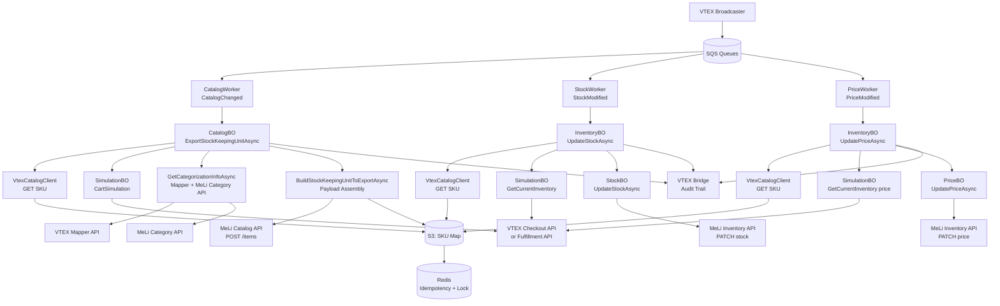

# Marketplace Product Data Capture Analysis

**Repository:** integration-mercadolivre-1  
**Analysis date:** 2026-05-06  
**Analyst:** Claude Code (claude-sonnet-4-6)

---

## 1. Executive Summary

This repository is a .NET Core / C# application that integrates VTEX with **Mercado Livre (MeLi)**, the dominant marketplace in Latin America. It is deployed as two independent services — a REST API (`MeliIntegration.WebApi`) and a background worker process (`MeliIntegration.Worker`) — both on AWS Elastic Beanstalk.

The application is fully responsible for publishing VTEX products as MeLi listings ("anúncios") and keeping them synchronized. It captures catalog data, pricing, inventory/availability, logistics attributes, and product images from VTEX and transforms them into the MeLi item format. Synchronization is predominantly **asynchronous and event-driven**, using AWS SQS queues as the backbone.

The application:
- **Sends** product data outward to MeLi (catalog, price, stock, shipping).
- **Receives** feedback from MeLi (moderation, quality, BuyBox status, price suggestions, competition).
- Manages **order flow** inbound from MeLi and outbound to VTEX OMS.
- Supports **multiple MeLi sites** (BR, AR, MX, CL, CO, PE, UY, EC, VE).
- Supports **multiple listing types** (`gold_pro`, `gold_special`) per account.

**Critical finding:** Availability (stock) is not read directly from VTEX Inventory API. It is computed through a **checkout/fulfillment simulation** (`SimulationBO → CheckoutClient.CheckoutCartSimulationAsync` or `FulfillmentClient.FulfillmentCartSimulationAsync`), which returns the final sellable quantity accounting for sales channel, logistics, and delivery channel restrictions. Price is also retrieved from this same simulation response, not from a dedicated pricing API.

---

## 2. Application Scope and Marketplace Responsibilities

**External marketplace:** Mercado Livre (mercadolivre.com.br and regional sites).

**Product-related responsibilities:**

| Responsibility | Handled? | Notes |
|---|---|---|
| Catalog / content export | Yes | Full SKU export with title, category, attributes, images, description |
| Price synchronization | Yes | Via checkout simulation; supports BuyBox pricing |
| Inventory / availability synchronization | Yes | Via checkout/fulfillment simulation |
| Logistics / shipping attributes | Yes | ME1/ME2/Fulfillment mode, dimensions, shipping preferences |
| Offer / listing status management | Yes | ACTIVE, PAUSED, CLOSED, UNDER_REVIEW handling |
| BuyBox management | Yes | Opportunity creation, price/stock updates for catalog ads |
| Category mapping | Yes | Via VTEX Mapper or internal mapping table |
| Size charts | Yes | Association of MeLi size charts to SKU variations |
| Kit / bundle export | Yes | VTEX kits mapped to MeLi kits (bundles) |
| Order placement | Yes | Orders from MeLi are placed into VTEX OMS |
| Inbound marketplace feedback | Yes | Moderation, quality, BuyBox competition status, price suggestions |

---

## 3. Product Discovery Process

### 3.1 Entry Points

Product synchronization begins from three classes of triggers:

**A. SQS Queue Events (primary path)**

| Queue | Worker | Handler |
|---|---|---|
| `QueueEndpoint.CatalogChanged` | `CatalogWorker` | `CatalogBO.ExportStockKeepingUnitAsync` |
| `QueueEndpoint.StockModified` | `StockWorker` | `InventoryBO.UpdateStockAsync` |
| `QueueEndpoint.PriceModified` | `PriceWorker` | `InventoryBO.UpdatePriceAsync` |
| `QueueEndpoint.ProductUpdated` | `CatalogUpdateWorker` | `CatalogBO.UpdateStockKeepingUnitAsync` |
| `QueueEndpoint.CatalogFullUpdated` | `CatalogFullWorker` | Full scan flow |

Queue messages carry a `QueueDto` with `SkuId` (VTEX SKU ID) and account/listing-type metadata. The `WorkerBase<T>` polls the corresponding SQS queue in a loop via `_sqsClient.GetEventsAsync<T>()`, bounded to a channel capacity of 500.

**Code reference:** [`MeliIntegration.Worker/WorkerBase.cs`](src/VTEX%20Commerce%20-%20MeliIntegration/MeliIntegration.Worker/WorkerBase.cs) — `GetItemsAsync()` method, line ~56.

**B. REST API endpoints (manual / webhook)**

`StockKeepingUnitController` exposes HTTP endpoints that directly invoke `CatalogBO` or `InventoryBO`:
- `POST /api/sku/export` — triggers `CatalogBO.ExportStockKeepingUnitAsync`
- `PUT /api/sku/stock` — triggers `InventoryBO.UpdateStockAsync`
- `PUT /api/sku/price` — triggers `InventoryBO.UpdatePriceAsync`

**Code reference:** [`MeliIntegration.WebApi/Controllers/StockKeepingUnitController.cs`](src/VTEX%20Commerce%20-%20MeliIntegration/MeliIntegration.WebApi/Controllers/StockKeepingUnitController.cs)

**C. Internal queue re-injection**

During stock or price updates, the code may re-enqueue a SKU into `CatalogChanged` if no existing MeLi mapping is found. This prevents SKUs from being permanently skipped when catalog changes arrive before the initial export.

**Code reference:** [`InventoryBO.cs:126-142`](src/VTEX%20Commerce%20-%20MeliIntegration/MeliIntegration.BO/InventoryBO.cs#L126) — inside `UpdateStockAsync`, when `meliSku == null`.

### 3.2 SKU Eligibility Filtering

In `CatalogBO.ExportStockKeepingUnitAsync` (line 145+), before any processing, the application validates:

```csharp
if (!(stockKeepingUnit.IsActive ?? false) ||
    string.IsNullOrWhiteSpace(stockKeepingUnit.ProductId) ||
    !(stockKeepingUnit.SalesChannels?.Contains(storeConfig.SaleChannel) ?? false))
{
    // SKU inelegível
}
```

A SKU is **eligible** if and only if:
1. `IsActive == true`
2. `ProductId` is not empty
3. `SalesChannels` contains the configured `SaleChannel` of the store config

**Code reference:** [`CatalogBO.cs:155-212`](src/VTEX%20Commerce%20-%20MeliIntegration/MeliIntegration.BO/Catalog/CatalogBO.cs#L155)

### 3.3 Store Configuration (StoreConfig)

Each message carries an `AccountName` and `ListingType`. The worker resolves `StoreConfig` from S3 via `StoreConfig.S3Repository.GetAsync()`. `StoreConfig` contains:
- `AccountName`, `ListingType`
- `SaleChannel` (VTEX sales channel/trade policy ID)
- `Country`, `SiteId` (MeLi site, e.g., `MLB`, `MLA`)
- `MinimumStock`, `IsPickupEnabled`, `OfficialStoreId`
- OAuth tokens for MeLi API

No scheduled cron job for full discovery was found in the Worker folder; full catalog sync appears to be manually triggered via `CatalogFullWorker` responding to `CatalogFullUpdated` queue events or admin endpoints.

### 3.4 Exclusion Rules

A SKU is discarded (not exported or updated) when:
- `IsActive == false` and no existing MeLi mapping exists.
- `SalesChannels` does not include the configured sales channel.
- `ProductId` is null or empty.
- MeLi item status is `CLOSED` or `INACTIVE` (mapping is deleted; no update sent).
- Fulfillment logistics type and SKU is out of sales channel (paused in MeLi instead).
- Seller does not have permission (`ERR_USER_UNABLE_TO_LIST`).
- Official store ID is missing or invalid.
- Product has no description, category, or images (`CheckSkuInfoAsync` — line 4133).

---

## 4. End-to-End Product Data Capture Flow

### 4.1 New SKU Export (Happy Path)

```
SQS CatalogChanged queue
  └─ CatalogWorker.ProcessItemAsync(skuId)
       └─ CatalogBO.ExportStockKeepingUnitAsync(skuId, storeConfig)
            ├─ VtexCatalogClient.GetStockKeepingUnitAsync(skuId)       ← VTEX Catalog API
            ├─ [Eligibility check: IsActive, SalesChannel, ProductId]
            └─ RedisClient.LockActionAsync(...)
                 └─ LockedExportStockKeepingUnitAsync(vtexSku, storeConfig)
                      ├─ CatalogService.GetMkpSkuByVtexSkuIdAsync(skuId)  ← S3 SKU map lookup
                      ├─ [If not in MeLi] → CreateAdOnMeliAsync(vtexSku)
                      │    ├─ CheckSkuInfoAsync(vtexSku)                   ← Pre-validation
                      │    ├─ CartSimulationAsync(skuId)                   ← Inventory + Price via simulation
                      │    │    └─ SimulationBO.GetInfoAsync()
                      │    │         └─ CheckoutClient / FulfillmentClient ← VTEX simulation API
                      │    ├─ GetCategorizationInfoAsync(vtexSku)          ← Mapper + MeLi category
                      │    ├─ BuildStockKeepingUnitToExportAsync(...)      ← Payload assembly
                      │    │    ├─ BuildStockKeepingUnitAttributesToExportAsync()
                      │    │    │    ├─ MappingTableRules() / Mapper        ← VTEX→MeLi attribute mapping
                      │    │    │    ├─ GTIN / EAN → GTIN attribute
                      │    │    │    ├─ BRAND → BrandName from VTEX
                      │    │    │    └─ SizeChartService.GetSizeChartId()
                      │    │    ├─ GetMkpAndVtexShippingPreferences()
                      │    │    └─ BuildMkpAdShippingAsync()
                      │    ├─ CatalogService.ExportStockKeepingUnitAsync() ← Sends to MeLi API
                      │    └─ StockKeepingUnitMap.S3Repository.SaveAsync() ← Persists mapping
```

### 4.2 Stock Update Flow

```
SQS StockModified queue
  └─ StockWorker.ProcessItemAsync(skuId)
       └─ InventoryBO.UpdateStockAsync(vtexSkuId, storeConfig, deactivation)
            ├─ VtexCatalogClient.GetStockKeepingUnitAsync(vtexSkuId)
            ├─ CatalogService.GetMkpSkuByVtexSkuIdAsync(vtexSku.Id)  ← S3 map
            ├─ SimulationBO (GetCurrentInventoryAsync)                ← Checkout/Fulfillment sim
            ├─ StockBO.UpdateStockAsync(vtexSkuId, quantity, meliSku) ← dispatch by method
            │    ├─ [Default] InventoryClient.UpdateStockAsync()
            │    ├─ [MultiOrigin] InventoryClient.UpdateStockTypeSellerWarehouseAsync()
            │    └─ [ConvivenciaFullFlex] InventoryClient.UpdateStockTypeSellingAddressAsync()
            ├─ MeliCatalogClient.ChangeStockKeepingUnitStatusAsync()  ← ACTIVE/PAUSED
            └─ SqsClient.SendEventAsync(BridgeDocument)               ← Audit log
```

### 4.3 Price Update Flow

```
SQS PriceModified queue
  └─ PriceWorker.ProcessItemAsync(skuId)
       └─ InventoryBO.UpdatePriceAsync(skuId, storeConfig)
            ├─ VtexCatalogClient.GetStockKeepingUnitAsync(skuId)
            ├─ CatalogService.GetMkpSkuByVtexSkuIdAsync(skuId)
            ├─ SimulationBO (GetCurrentInventoryAsync) → price field
            └─ PriceBO.UpdatePriceAsync(skuId, storeConfig, price, marketplaceSku)
                 ├─ CultureConfig.S3Repository.GetAsync(country)        ← Currency decimals
                 ├─ [Simple] InventoryClient.UpdatePriceAsync()
                 ├─ [Variation] InventoryClient.UpdateVariationPriceAsync()
                 └─ SqsClient.SendEventAsync(BridgeDocument)
```

---

## 5. Catalog and Content Data

### 5.1 Data Retrieved from VTEX

All catalog data is fetched from VTEX via `VtexCatalogClient.GetStockKeepingUnitAsync()`, which calls:

```
GET /api/catalog_system/pvt/sku/stockkeepingunitbyid/{skuId}?an={accountName}
```

**Code reference:** [`MeliIntegration.VtexClient/CatalogClient.cs:35`](src/VTEX%20Commerce%20-%20MeliIntegration/MeliIntegration.VtexClient/CatalogClient.cs#L35)

The response is deserialized into `Contracts.Catalog.StockKeepingUnitDTO` which includes:

| VTEX Field | Description |
|---|---|
| `Id` | VTEX SKU ID → `SellerCustomField` in MeLi |
| `ProductId` | VTEX Product ID |
| `ProductName`, `SkuName`, `NameComplete` | Used to build the MeLi title |
| `IsActive` | Eligibility gate |
| `SalesChannels` | Array checked against `storeConfig.SaleChannel` |
| `Images` | Product images → `Pictures` in MeLi payload |
| `ProductDescription` | Validated; sent as description |
| `BrandName`, `BrandId` | → `BRAND` attribute in MeLi |
| `EAN` | → `GTIN` attribute in MeLi (validated with `Helper.IsValidGtin`) |
| `SkuSpecifications`, `ProductSpecifications` | Mapped to MeLi attributes via Mapper |
| `ProductCategories`, `ProductCategoryIds` | VTEX category tree used for MeLi category mapping |
| `IsKit`, `KitItems` | Kit/bundle flag and components |
| `Dimension`, `Weight` | Used for ME2 shipping dimension attributes |
| `DetailUrl` | Product URL |

Additional calls made during categorization:
- `VtexCatalogClient.GetCategorySpecificationList(categoryId)` — to get VTEX category specs
- `VtexCatalogClient.GetVtexCategoryTreeAsync(depth)` — for category tree traversal

**Code reference for GetVtexCategoryTreeAsync:** [`CatalogClient.cs`](src/VTEX%20Commerce%20-%20MeliIntegration/MeliIntegration.VtexClient/CatalogClient.cs)

### 5.2 Attribute Mapping Logic

Mapping from VTEX specifications to MeLi attributes happens in `BuildStockKeepingUnitAttributesToExportAsync` (CatalogBO, line ~2600).

Two approaches are supported:
1. **VTEX Mapper service** (`MapperClient`) — reads a category mapping from VTEX's Mapper app
2. **Internal mapping table** (`storeConfig.UseCategoryMappingSheet == true`) — uses a spreadsheet-based rule

For each specification in `categorizationMap.Specifications`:
- Calls `MappingTableRules()` to find the corresponding MeLi attribute
- Required attributes throw `ERR_SKU_NO_VALUE_IN_TABLE` or `ERR_SKU_NO_VALUE_IN_MAPPER` if missing

Additional always-included attributes:
- `BRAND` ← `vtexSku.BrandName`
- `GTIN` ← `vtexSku.EAN` (only when SKU has no variations and GTIN is valid)

**Code reference:** [`CatalogBO.cs:2600`](src/VTEX%20Commerce%20-%20MeliIntegration/MeliIntegration.BO/Catalog/CatalogBO.cs#L2600)

### 5.3 Categorization

`GetCategorizationInfoAsync` (line 4531) fetches:
1. `MkpCategory` — the MeLi category (`_meliCatalogClient.GetCategoryAsync`)
2. `MkpCategoryAttributes` — MeLi category attribute definitions
3. `VtexCategorizationMap` — from VTEX Mapper or internal table
4. Category domain ID for BuyBox/Catalog determination

**Code reference:** [`CatalogBO.cs:4531`](src/VTEX%20Commerce%20-%20MeliIntegration/MeliIntegration.BO/Catalog/CatalogBO.cs#L4531)

### 5.4 Title Construction

`GetTitleFromVtexSkuField()` builds the MeLi title from VTEX SKU name fields. For User Products flow, the title is sent as `FamilyName`; for classic flow, it goes as `Title`.

### 5.5 Images

Images are taken from `vtexSku.Images` and converted to `StockKeepingUnitPictureDTO` with `Url` field. The primary image is placed first (`MainImageFirstUrlList()`). The count is capped at `maxPicturesPerItem` (default 12) or `maxPicturesPerItemVar` (10 for variation thumbnails).

### 5.6 Content Validation

Before export, `CheckSkuInfoAsync` validates:
- `ProductCategoryIds` is not empty
- `ProductDescription` is not empty
- `Images` list is not empty
- Official Store ID is valid (for Official Stores accounts)

Validation failures throw `IntegrationException` with specific error codes, which are caught by the worker error handler and sent to VTEX Bridge for visibility.

### 5.7 Kit / Bundle Handling

When `vtexSku.IsKit == true` and feature toggle `ExportVtexKitAsMeliKit` is enabled:
- Each kit component VTEX SKU is resolved to its MeLi `UserProductId` via `CatalogService.GetMkpSkuByVtexSkuIdAsync`
- Kit creation request is built as `KitCreationRequestDTO` with `BundleComponents`
- Sent via `MeliKitClient`
- If kit composition changes, the existing ad is closed and a new one is created

**Code reference:** [`CatalogBO.cs:231`](src/VTEX%20Commerce%20-%20MeliIntegration/MeliIntegration.BO/Catalog/CatalogBO.cs#L231) — `UpdateKitAdAsync`

---

## 6. Price Synchronization

### 6.1 Price Source

Price is **not** fetched from a dedicated VTEX Pricing API. It is retrieved from the **checkout/fulfillment simulation** response:

```csharp
// InventoryBO.GetCurrentInventoryAsync (line 623)
StockKeepingUnitInventoryDTO inventoryResponse = new()
{
    Price = purchaseContextResponse?.Items?.FirstOrDefault()?.Price ?? 0
};
```

`SimulationBO.GetInfoAsync()` calls either:
- `CheckoutClient.CheckoutCartSimulationAsync()` — when `UseCheckoutSimulation` feature toggle is enabled
- `FulfillmentClient.FulfillmentCartSimulationAsync()` — otherwise (default path)

Both simulate a cart with `quantity = 1` for the SKU against the configured sales channel, returning the effective price as seen by the buyer in that channel.

**Code reference:** [`SimulationBO.cs`](src/VTEX%20Commerce%20-%20MeliIntegration/MeliIntegration.BO/Simulation/SimulationBO.cs) — `GetInfoAsync()`

**Code reference:** [`InventoryBO.cs:616`](src/VTEX%20Commerce%20-%20MeliIntegration/MeliIntegration.BO/InventoryBO.cs#L616) — `GetCurrentInventoryAsync()`

### 6.2 Price Characteristics

The simulation effectively returns the **final selling price** for the configured sales channel/trade policy, which accounts for:
- Base price
- Any active promotions
- Trade policy-specific prices
- The sales channel configuration

No explicit handling of list price, promotional discounts, or taxes was found in the price payload. The price sent to MeLi is a single `decimal` value (`Price` field of `StockKeepingUnitDTO`).

### 6.3 Currency Handling

Currency precision is adjusted per country via `CultureConfig.S3Repository.GetAsync(country)`:
```csharp
dynamic price = (countryConfig.CurrencyDecimalDigits == 0)
    ? (BigInteger)priceParam   // No decimals (e.g., CLP, ARS)
    : (dynamic)priceParam;     // Decimal precision
```

**Code reference:** [`PriceBO.cs:83`](src/VTEX%20Commerce%20-%20MeliIntegration/MeliIntegration.BO/PriceBO.cs#L83)

### 6.4 Price Update Trigger

Price changes arrive via `QueueEndpoint.PriceModified`. The `PriceWorker` dequeues and calls `InventoryBO.UpdatePriceAsync`. Additionally, after every **stock update** (`UpdateStockAsync`), the code also calls `_priceBO.UpdatePriceAsync` if the MeLi item remains active:

```csharp
// InventoryBO.cs:358
await _priceBO.UpdatePriceAsync(vtexSkuId, storeConfig, skuInventoryDTO.Price, meliSku);
```

**Code reference:** [`InventoryBO.cs:346`](src/VTEX%20Commerce%20-%20MeliIntegration/MeliIntegration.BO/InventoryBO.cs#L346)

### 6.5 Variation Price Updates

For products with variations, all variations receive the same price in a single `PATCH` call to MeLi:
```csharp
var variations = new object[marketplaceSku.Variations.Count];
for (var i = 0; i < variations.Length; i++)
    variations[i] = new { id = ..., price };
await _inventoryClient.UpdateVariationPriceAsync(marketplaceSku.Id, skuId, variations, storeConfig);
```

**Code reference:** [`PriceBO.cs:160`](src/VTEX%20Commerce%20-%20MeliIntegration/MeliIntegration.BO/PriceBO.cs#L160)

### 6.6 Price Retry

A `PriceRetryWorker` exists, consuming `QueueEndpoint.PriceRetry`. This handles transient failures. The main error handler in `WorkerBase` can also re-enqueue failed messages up to `MaxRetryCount` times.

### 6.7 BuyBox Price

For SKUs participating in BuyBox (catalog ads), a separate flow `UpdateBuyBoxProductPriceAsync` handles price updates of the catalog ad (`catalogAd`), triggered via `QueueEndpoint.OnBuyBoxSkuPriceChanged`.

**Code reference:** [`InventoryBO.cs:955`](src/VTEX%20Commerce%20-%20MeliIntegration/MeliIntegration.BO/InventoryBO.cs#L955) and [`PriceBO.cs:202`](src/VTEX%20Commerce%20-%20MeliIntegration/MeliIntegration.BO/PriceBO.cs#L202)

---

## 7. Inventory and Availability Synchronization

### 7.1 Availability Calculation Method

Availability is **not** fetched directly from VTEX Inventory API. Instead, it is computed through a **simulation**:

```csharp
// SimulationBO.GetInfoAsync → builds PurchaseContextRequestDTO
var purchaseContextRequest = new PurchaseContextRequestDTO
{
    Country = country.ThreeLetterISOCode,
    Items = [{Id = skuId, Quantity = 1, Seller = "1"}],
    PostalCode = zipCode,
    ...
};

// Returns PurchaseContextResponseDTO
inventoryResponse.AvailableQuantity =
    purchaseContextResponse?.ItemsLogistics?
        .Sum(s => s.DeliveryChannels
            .FirstOrDefault(d => d.Id == DeliveryChannelType.Delivery)
            ?.StockBalance) ?? 0;
```

If `storeConfig.IsPickupEnabled`, pickup channels are also included in the sum.

**Code reference:** [`InventoryBO.cs:618`](src/VTEX%20Commerce%20-%20MeliIntegration/MeliIntegration.BO/InventoryBO.cs#L618) — `GetCurrentInventoryAsync()`

### 7.2 Minimum Stock Threshold

A `MinimumStock` setting in `StoreConfig` acts as a safety stock floor:
```csharp
if (vtexSkuQuantity < 0 || vtexSkuQuantity <= storeConfig.MinimumStock)
    vtexSkuQuantity = 0;
```

If the simulated quantity is at or below minimum stock, zero is sent to MeLi.

**Code reference:** [`InventoryBO.cs:226`](src/VTEX%20Commerce%20-%20MeliIntegration/MeliIntegration.BO/InventoryBO.cs#L226)

### 7.3 Three-Method Stock Update Strategy

`StockBO.UpdateStockAsync` dispatches to one of three methods based on account configuration:

| Method | Condition | MeLi Endpoint Called |
|---|---|---|
| **Default** | No MultiOrigin, no ConvivenciaFullFlex | `PATCH /items/{itemId}` with `available_quantity` |
| **MultiOrigin** | `IsMeliAccountMultiOriginEnabled == true` | `PUT /user-products/{userProductId}/stock` with seller_warehouse locations |
| **ConvivenciaFullFlex** | UserProducts + no MultiOrigin + AR or CL country | `PUT /user-products/{userProductId}/stock` with selling_address location |

**Code reference:** [`StockBO.cs:41`](src/VTEX%20Commerce%20-%20MeliIntegration/MeliIntegration.BO/Inventory/StockBO.cs#L41)

### 7.4 Status Management (ACTIVE / PAUSED)

After stock update, the application automatically manages MeLi item status:
- If `hasVariationStockGreaterThanMinimumStock == true` and current status is `PAUSED` → sets to `ACTIVE`
- If `hasVariationStockGreaterThanMinimumStock == false` and current status is `ACTIVE` → sets to `PAUSED`

**Code reference:** [`InventoryBO.cs:317`](src/VTEX%20Commerce%20-%20MeliIntegration/MeliIntegration.BO/InventoryBO.cs#L317)

### 7.5 Variation Stock

For products with variations, stock is updated per variation using `InventoryClient.UpdateVariationStockAsync()`. The variation is identified by matching `SellerCustomField` to the VTEX SKU ID.

### 7.6 Mirrored Listing Type (User Products)

For sellers using the User Products flow with `gold_pro` and `gold_special` listing types that share stock (same `UserProductId`), the application takes the **minimum stock** across both listing types:

```csharp
return Math.Min(vtexSkuQuantity, vtexSkuQuantityMirrored);
```

**Code reference:** [`InventoryBO.cs:410`](src/VTEX%20Commerce%20-%20MeliIntegration/MeliIntegration.BO/InventoryBO.cs#L410) — `GetLowestVtexSkuQuantityComparedWithMirroredListingType`

### 7.7 Kit Inventory

For kit/bundle products, inventory is computed as the **minimum quantity** across all kit component SKUs:
```csharp
// InventoryBO.GetKitInventory
minItemQuantity = Math.Min(minItemQuantity, kitItemInventory?.AvailableQuantity ?? 0);
```

**Code reference:** [`InventoryBO.cs:839`](src/VTEX%20Commerce%20-%20MeliIntegration/MeliIntegration.BO/InventoryBO.cs#L839)

### 7.8 Fulfillment Logistics Exclusion

If a MeLi SKU uses `LogisticType == "fulfillment"`, the stock is managed by MeLi's fulfillment center, not by the seller. The application throws `ERR_UPDATE_FULFILLMENT_STOCK` rather than attempting to update it. If the SKU also left the sales channel, it pauses the listing instead.

**Code reference:** [`InventoryBO.cs:196`](src/VTEX%20Commerce%20-%20MeliIntegration/MeliIntegration.BO/InventoryBO.cs#L196)

---

## 8. Logistics and Delivery Synchronization

### 8.1 Shipping Mode

MeLi supports two main shipping modes:
- `me1` — Mercado Envios (carrier-delivered, Correios for BR)
- `me2` — Mercado Envios Full (dropship to MeLi warehouse or Flex)

The shipping mode for each SKU is read from a VTEX custom product field called `meli_shipping_mode`. It is validated against:
1. The seller's MeLi shipping preferences (`_meliCatalogClient.GetCategoryShippingPreferenceAsync`)
2. The MeLi category's allowed shipping modes

**Code reference:** [`CatalogBO.cs:53`](src/VTEX%20Commerce%20-%20MeliIntegration/MeliIntegration.BO/Catalog/CatalogBO.cs#L53) — constants `VtexShippingModeFieldName`, `ShippingModeValuesAllowed`

### 8.2 Free Shipping

A custom product field `free_shipping` (values: "true"/"false") drives whether free shipping is enabled on MeLi. This is included in the MeLi item `shipping` object.

**Code reference:** [`CatalogBO.cs:54`](src/VTEX%20Commerce%20-%20MeliIntegration/MeliIntegration.BO/Catalog/CatalogBO.cs#L54) — `VtexFreeShippingFieldName`

### 8.3 Dimension Attributes (ME2)

When the SKU uses ME2 and feature toggle `SendMeliSkuDimensionsWhenMe2` is enabled, package dimensions (length, width, height, weight) from `vtexSku.Dimension` are included as MeLi attributes via `ShipmentPackagingAttributesBO.GetDimensionAttributes()`.

**Code reference:** [`CatalogBO.cs:2608`](src/VTEX%20Commerce%20-%20MeliIntegration/MeliIntegration.BO/Catalog/CatalogBO.cs#L2608) and [`ShipmentPackagingAttributesBO.cs`](src/VTEX%20Commerce%20-%20MeliIntegration/MeliIntegration.BO/Catalog/ShipmentPackagingAttributesBO.cs)

### 8.4 Logistics Client

`ILogisticsClient` is used for pickup point support:
- `GetStockBySlaAsync(skuId, accountName, storeConfig)` — retrieves carriers with SLA information, used in `InventoryBO.GetStockByPickupPoint()` to sum inventory from carriers serving a specific pickup point.

**Code reference:** [`InventoryBO.cs:674`](src/VTEX%20Commerce%20-%20MeliIntegration/MeliIntegration.BO/InventoryBO.cs#L674) — `GetStockByPickupPoint`

### 8.5 Logistics and Offer Availability

Logistics mode directly affects offer availability:
- If ME2/Fulfillment and SKU leaves sales channel → listing is paused
- ME2 mode requires dimension attributes to be present
- ConvivenciaFullFlex (AR/CL) requires a `selling_address` location type in the MeLi stock

### 8.6 Pickup Points

A separate `PickupPointBO` and `PickUpPointClient` handle pickup point configuration synchronization, managed by `PickupPointCreationWorker` and `PickupPointUpdateWorker` queues. This is independent of product synchronization.

### 8.7 Flex / Self-Service Settings

`FlexSettingsSyncEventAsync` (called after `UpdateStockKeepingUnitAsync`) enqueues a `FlexSettingsSyncWorker` event to synchronize Mercado Envios Flex settings for the MeLi item.

---

## 9. Synchronization Architecture

### 9.1 Overview

The architecture is **fully asynchronous**, event-driven, queue-based. No synchronous polling of VTEX APIs for change detection is present.

### 9.2 Worker Pattern

All background processing uses `WorkerBase<T>` which:
1. Polls SQS for messages in `GetItemsAsync()`
2. Processes each message via `ProcessItemAsync()`
3. On success: deletes SQS message
4. On failure: retries up to `MaxRetryCount` (configurable per worker), then sends to `EventDeadLetter` queue

Channel buffer: 500 items per worker. Workers run as .NET `IHostedService`.

**Code reference:** [`WorkerBase.cs`](src/VTEX%20Commerce%20-%20MeliIntegration/MeliIntegration.Worker/WorkerBase.cs) — full file

### 9.3 Queue Topology (Product-Relevant)

```
VTEX Broadcaster → CatalogChanged queue → CatalogWorker → CatalogBO.ExportStockKeepingUnitAsync
VTEX Broadcaster → StockModified queue  → StockWorker   → InventoryBO.UpdateStockAsync
VTEX Broadcaster → PriceModified queue  → PriceWorker   → InventoryBO.UpdatePriceAsync
                → ProductUpdated queue  → CatalogUpdateWorker → CatalogBO.UpdateStockKeepingUnitAsync
```

Internal re-queuing paths:
- Stock update → detects missing Meli SKU → re-queues to `CatalogChanged`
- Catalog export → completes → queues `ProductUpdated` for attribute update pass
- Catalog export → completes → queues `StockModified` if MeLi stock is zero
- Price/stock update → BuyBox relation found → queues `OnBuyBoxSkuPriceChanged` / `OnBuyBoxSkuInventoryChanged`

### 9.4 Idempotency via Redis

Before enqueuing a SKU, the code always calls `_redisClient.SetIfNotExistsAsync(accountName, listingType, skuId, queueEndpoint)`. This returns `true` only if the key did not exist, preventing duplicate messages for the same SKU in the same queue.

**Code reference:** [`InventoryBO.cs:126`](src/VTEX%20Commerce%20-%20MeliIntegration/MeliIntegration.BO/InventoryBO.cs#L126) and many other places throughout BO files.

### 9.5 Distributed Lock for Export

The initial export of a SKU is wrapped in `RedisClient.LockActionAsync(...)` with a 4-minute lock and 1-minute retry interval, preventing concurrent exports of the same SKU:

```csharp
await _redisClient.LockActionAsync(
    (sku, cfg) => LockedExportStockKeepingUnitAsync(sku, cfg),
    stockKeepingUnit, storeConfig,
    TimeSpan.FromMinutes(4),    // lock duration
    TimeSpan.FromMinutes(1),    // retry wait
    TimeSpan.FromSeconds(1));   // poll interval
```

**Code reference:** [`CatalogBO.cs:214`](src/VTEX%20Commerce%20-%20MeliIntegration/MeliIntegration.BO/Catalog/CatalogBO.cs#L214)

### 9.6 State Persistence

| State | Storage | Key Format |
|---|---|---|
| VTEX SKU → MeLi SKU mapping | AWS S3 | `{accountName}_{listingType}/{vtexSkuId}` |
| StoreConfig (account settings) | AWS S3 | account+listingType key |
| CultureConfig (currency per country) | AWS S3 | country code |
| Warehouse mapping (MultiOrigin) | AWS S3 via `WarehouseMappingRepository` | — |
| Feature toggles | AWS S3 + Vtex.Core FeatureToggle | per accountName |
| Idempotency tokens (in-flight queue de-dup) | Redis | `{account}_{listingType}_{skuId}_{queueEndpoint}` |
| Category domain cache | Redis (1h TTL) | `meli:catalogDomain:{type}:{siteId}` |
| Lock tokens (export) | Redis | per SKU+account+listingType |
| Bridge audit trail | VTEX Bridge API | accountName + documentId + origin |

### 9.7 Full Sync vs Incremental Sync

- **Incremental sync:** Event-driven via SQS queues triggered by VTEX Broadcaster notifications.
- **Full sync:** Available via `CatalogFullWorker` and `GetAllStockKeepingUnitIdsAsync` / `GetAllStockKeepingUnitIdsScrolledAsync` which page/scroll through all SKUs in a sales channel. Triggered manually or via admin API.

### 9.8 Rate Limiting

No explicit rate limiting logic was found in the codebase. Worker concurrency is controlled by pool size configuration (`WorkerConfiguration.PoolSize`). The SQS channel buffer is bounded at 500. MeLi API rate limit handling appears to rely on standard HTTP retry (via VTEX HTTP client infrastructure).

---

## 10. Marketplace Payload Assembly

### 10.1 Where the Payload Is Built

The final MeLi listing payload is assembled in `CatalogBO.BuildStockKeepingUnitToExportAsync()` (line 2545), which produces a `StockKeepingUnitDTO` (MeLi contracts namespace).

**Code reference:** [`CatalogBO.cs:2545`](src/VTEX%20Commerce%20-%20MeliIntegration/MeliIntegration.BO/Catalog/CatalogBO.cs#L2545)

### 10.2 Payload Fields

| MeLi Field | Source | Transformation |
|---|---|---|
| `SellerCustomField` | `vtexSku.Id` | Direct (used as cross-reference) |
| `Title` / `FamilyName` | `vtexSku.NameComplete` / `vtexSku.ProductName` | `GetTitleFromVtexSkuField()` |
| `CategoryId` | VTEX category → Mapper → MeLi category | `GetCategorizationInfoAsync()` |
| `Condition` | VTEX specification or default | `GetVtexSkuCondition()` |
| `ListingType` | `storeConfig.ListingType` | Direct (gold_pro / gold_special) |
| `Price` | Checkout/Fulfillment simulation | `BigInteger` cast for 0-decimal currencies |
| `AvailableQuantity` | Checkout/Fulfillment simulation | Capped at 0 if ≤ MinimumStock |
| `Pictures` | `vtexSku.Images` | URL list, ordered, truncated to max allowed |
| `Attributes` | `vtexSku.SkuSpecifications + ProductSpecifications` | `BuildStockKeepingUnitAttributesToExportAsync()` via Mapper |
| `AttributesSaleTerms` | Filtered from attributes | `FilterMeliSkuAttributes()` |
| `Shipping` | VTEX product fields + storeConfig | `BuildMkpAdShippingAsync()` |
| `CurrencyId` | MeLi country config | `_meliCatalogClient.GetCountryAsync()` |
| `OfficialStoreId` | `storeConfig.OfficialStoreId` or SKU spec | `GetOfficialStoreIdAsync()` |
| `StockLocations` | MultiOrigin VTEX warehouse mapping | `MultiOriginBO.UpdateMultiOriginProperties()` |

### 10.3 Variation Payload

When the MeLi category is a variation category, `BuildVariationAsync()` (line 2405) produces a `StockKeepingUnitVariationDTO` which is merged into the parent product via `_skuHelper.MergeVariationAttributesOntoProductAttributes()`.

### 10.4 Payload Sending

The final payload is sent via `CatalogService.ExportStockKeepingUnitAsync()` which delegates to `MeliCatalogClient.ExportStockKeepingUnitAsync()`.

For MultiOrigin accounts: `CatalogService.ExportStockKeepingUnitMultiOriginAsync()` adds stock location data.

**Code reference:** [`CatalogService.cs`](src/VTEX%20Commerce%20-%20MeliIntegration/MeliIntegration.Service/CatalogService.cs)

### 10.5 Payload Separation

Stock and price are **not** sent in the same call as catalog data:
- Catalog: `POST /items` (new) or `PUT /items/{id}` (update)
- Stock: `PATCH /items/{id}` (`available_quantity`) or User Products inventory endpoints
- Price: `PATCH /items/{id}` or variation price endpoint

---

## 11. Error Handling and Observability

### 11.1 Exception Types

| Exception | Meaning |
|---|---|
| `IntegrationException` | Business rule violation (missing data, invalid state) |
| `ApiException` | External API call failure (VTEX or MeLi) |
| `InvalidSkuMappingException` | SKU mapping inconsistency |
| `StoreConfigNullException` | Missing account configuration |
| `LockedPromotionException` | MeLi promotion lock prevents update |
| `DynamicPricingException` | Price update failed due to dynamic pricing constraint |

Error codes are defined in `ErrorCode.cs` (100+ codes covering every failure scenario).

### 11.2 Worker-Level Error Handling

In `WorkerBase.ConsumeItemAsync`, unhandled exceptions:
1. Are logged via `Logger.Exception`
2. Trigger `HandleItemErrorAsync` which:
   - Increments retry counter
   - Re-enqueues to `EventDeadLetter` queue after `MaxRetryCount` retries
3. SQS message is not deleted on failure (natural SQS visibility timeout retry)

**Code reference:** [`WorkerBase.cs`](src/VTEX%20Commerce%20-%20MeliIntegration/MeliIntegration.Worker/WorkerBase.cs) — `ConsumeItemAsync`

### 11.3 Bridge Documents (Audit Trail)

After every significant operation (stock update, price update, catalog export), a `BridgeDocument` is sent to `QueueEndpoint.BridgeDocument` which is processed by `BridgeWorker` and written to VTEX Bridge via `BridgeClient`:

```csharp
var bridgeDocument = new BridgeDocument
{
    AccountName = storeConfig.AccountName,
    DocumentId = vtexSku.Id,
    Origin = Helper.GetBridgeOriginString(storeConfig.ListingType),
    Status = BridgeDocumentStatus.Success | Warning | Error,
    Type = BridgeDocumentType.Stock | Price | Product,
    Message = "..."
};
```

This is the primary observability mechanism for support teams. It populates the Bridge UI in VTEX admin.

**Code reference:** [`InventoryBO.cs:328`](src/VTEX%20Commerce%20-%20MeliIntegration/MeliIntegration.BO/InventoryBO.cs#L328) and [`PriceBO.cs:185`](src/VTEX%20Commerce%20-%20MeliIntegration/MeliIntegration.BO/PriceBO.cs#L185)

### 11.4 Logging

Structured logging via `Vtex.Diagnostics` with `Logger.Info`, `Logger.Error`, `Logger.Exception`. All log calls include:
- `skuId`
- `accountName`
- `listingType`
- `message` (human-readable)
- Optional `evidence` (JSON serialized object for debugging)
- Optional `fields` (structured key-value pairs)
- Optional `workflowType`

Logs are aggregated to OpenSearch (based on `MkpMessage.cs` patterns).

### 11.5 Prometheus Metrics

`PrometheusMetricsInitializer.cs` sets up Prometheus metrics. Specific metric definitions were not read but the infrastructure is in place.

### 11.6 Dead Letter Queue

`EventDeadLetterWorker` processes messages from `QueueEndpoint.EventDeadLetter`, providing a catch-all for permanently failed messages.

### 11.7 Moderation Handling

When MeLi returns `UNDER_REVIEW` status (moderated item), the code:
1. Detects it in `UpdateStockAsync` / `UpdatePriceAsync`
2. Calls `_moderationBO.GenerateModerationException(skuId, meliSkuId, storeConfig)`
3. Enqueues a `SentOffersModerationUpdate` event for the VTEX Sent Offers module

**Code reference:** [`InventoryBO.cs:151`](src/VTEX%20Commerce%20-%20MeliIntegration/MeliIntegration.BO/InventoryBO.cs#L151)

---

## 12. Dependencies, Assumptions, and Risks

### 12.1 VTEX Platform Dependencies

| Dependency | Usage |
|---|---|
| VTEX Catalog API (`/api/catalog_system/pvt/sku/...`) | SKU data, product data, specs |
| VTEX Checkout API (`/api/checkout/pub/orderForms/simulation`) | Availability + price simulation |
| VTEX Fulfillment API | Alternative simulation for non-checkout mode |
| VTEX Logistics API (`/api/logistics/pvt/...`) | SLA/carrier data for pickup stock |
| VTEX Mapper app | Category and attribute mapping |
| VTEX Bridge | Audit trail / observability |
| VTEX Sent Offers module | Offer status tracking |
| VTEX License Manager | Account permissions |
| VTEX ID | Authentication tokens |
| VTEX Template Render | Product attribute rendering (specific use not detailed) |

### 12.2 External Dependencies

| Dependency | Usage |
|---|---|
| Mercado Livre API | All product/stock/price operations |
| AWS SQS | Event queue backbone |
| AWS S3 | State storage (SKU mappings, configs, feature toggles) |
| Redis | Idempotency, distributed locking, caching |
| AWS Systems Manager Parameter Store | Application secrets and configuration |

### 12.3 Required Merchant Configurations

- **StoreConfig** must exist in S3 with valid `AccountName`, `ListingType`, `SaleChannel`, `Country`, `SiteId`, MeLi OAuth tokens.
- **Category mapping** must be configured in VTEX Mapper or as a mapping table per seller.
- **VTEX product fields** `meli_shipping_mode` and `free_shipping` must exist in the VTEX catalog.
- **CultureConfig** must exist in S3 for each country served.
- **MinimumStock** setting must be configured in StoreConfig.

### 12.4 Hardcoded Assumptions

- Seller ID is hardcoded as `"1"` in simulation requests: `Seller = "1"` ([SimulationBO.cs:52](src/VTEX%20Commerce%20-%20MeliIntegration/MeliIntegration.BO/Simulation/SimulationBO.cs#L52))
- ConvivenciaFullFlex is available only for Argentina and Chile.
- Catalog Domain Restricted feature not available on certain sites (defined in `FeaturesAvailableSites.CatalogDomainRestrictedNotAvailable`).
- Default postal code per country is defined in `StoreConfig.GetDefaultCountryPostalCode()`.
- Simulation uses `quantity = 1` for every SKU, regardless of minimum order quantity.
- Kit component availability is computed as min of component stock, not considering kit quantities (`KitItems.Amount`).

### 12.5 Coupling Risks

- Price and stock both depend entirely on the checkout/fulfillment simulation. If simulation returns incorrect data (e.g., wrong sales channel, postal code issue), both price and stock sent to MeLi will be wrong.
- MeLi SKU mapping stored in S3 has a 60-second TTL cache. A mapping change or deletion may not propagate immediately.
- The Worker `_maxRetryCount` being small could cause messages to drop to dead letter without sufficient retries during MeLi API downtime.
- No explicit circuit breaker for MeLi API failures.

---

## 13. Step-by-Step Flow

### New SKU Export (from VTEX Broadcaster to MeLi):

1. VTEX Broadcaster detects catalog change and sends message to `QueueEndpoint.CatalogChanged` SQS queue.
2. `CatalogWorker.ProcessItemAsync` dequeues the message, extracting `skuId`, `accountName`, `listingType`.
3. `StoreConfig` is loaded from S3.
4. `CatalogBO.ExportStockKeepingUnitAsync(skuId, storeConfig)` is called.
5. `VtexCatalogClient.GetStockKeepingUnitAsync(skuId)` fetches full SKU data from VTEX Catalog API.
6. SKU eligibility is checked: `IsActive`, `ProductId` not empty, `SalesChannels` contains `storeConfig.SaleChannel`.
7. `CatalogService.GetMkpSkuByVtexSkuIdAsync(skuId)` checks S3 for an existing MeLi mapping.
8. Distributed Redis lock is acquired for the SKU.
9. `CheckSkuInfoAsync` validates required fields: category, description, images, official store ID.
10. `CartSimulationAsync` calls `SimulationBO.GetInfoAsync` → VTEX Checkout/Fulfillment API → returns `{AvailableQuantity, Price}`.
11. `GetCategorizationInfoAsync` calls MeLi Category API + VTEX Mapper → returns `{MkpCategory, MkpCategoryAttributes, VtexCategorizationMap}`.
12. `BuildStockKeepingUnitToExportAsync` assembles the MeLi payload:
    - Maps VTEX specifications to MeLi attributes via Mapper rules
    - Adds `BRAND` from `BrandName`, `GTIN` from `EAN`
    - Builds shipping object from VTEX product fields
    - Sets `Price`, `AvailableQuantity`, `Pictures`, `Title`, `CategoryId`, `ListingType`
13. Payload is sent to MeLi API via `CatalogService.ExportStockKeepingUnitAsync`.
14. MeLi returns the created item with its `Id`.
15. Mapping `{vtexSkuId, meliSkuId, accountName, listingType}` is saved to S3.
16. `UpdateSKUOnMeliAsync` is skipped (new ad), but `ProductUpdated` queue event is enqueued for a follow-up attribute sync pass.
17. Bridge document (success) is sent to `QueueEndpoint.BridgeDocument`.

---

## 14. Mermaid Diagram



---

## 15. Source-to-Destination Mapping Table

| Data type | VTEX source/API/module | Main files/functions | Transformation/business logic | Marketplace destination/use |
|---|---|---|---|---|
| **Catalog / content** | `GET /api/catalog_system/pvt/sku/stockkeepingunitbyid/{id}` | `VtexCatalogClient.GetStockKeepingUnitAsync` → `CatalogBO.BuildStockKeepingUnitToExportAsync` | Title built from `NameComplete`/`ProductName`; attributes mapped via VTEX Mapper; GTIN validated before inclusion; category resolved via GetCategorizationInfoAsync | MeLi `POST /items` payload: `title`, `category_id`, `attributes`, `pictures`, `condition`, `listing_type_id` |
| **Price** | VTEX Checkout Simulation (`/api/checkout/pub/orderForms/simulation`) or Fulfillment Simulation | `SimulationBO.GetInfoAsync` → `InventoryBO.GetCurrentInventoryAsync` → `PriceBO.UpdatePriceAsync` | Effective selling price for the configured sales channel; `BigInteger` cast for 0-decimal currencies (AR, CL) | MeLi `PATCH /items/{id}` `price` field; or variation `price` |
| **Inventory / stock** | VTEX Checkout/Fulfillment Simulation (`ItemsLogistics.DeliveryChannels.StockBalance`) | `SimulationBO.GetInfoAsync` → `InventoryBO.UpdateStockAsync` → `StockBO.UpdateStockAsync` | Sum of `StockBalance` per delivery channel; capped at 0 if ≤ `MinimumStock`; minimum across listing types for User Products | MeLi `PATCH /items/{id}` `available_quantity`; or User Products stock endpoint |
| **Availability** | Same as inventory (simulation-based) | `InventoryBO.UpdateStockAsync` | Item status set ACTIVE if qty > MinimumStock; PAUSED if qty ≤ MinimumStock | MeLi `PATCH /items/{id}` `status` (active/paused) |
| **Logistics / delivery** | VTEX catalog product fields (`meli_shipping_mode`, `free_shipping`); VTEX Logistics API for pickup | `CatalogBO.BuildMkpAdShippingAsync`; `CatalogBO.GetMkpAndVtexShippingPreferences`; `InventoryBO.GetStockByPickupPoint` | ME1/ME2 mode from custom field; free shipping flag; dimension attributes for ME2; validated against MeLi category shipping preferences | MeLi item `shipping` object: `logistic_type`, `free_shipping`, `dimensions`; ME2 required attributes |
| **Mapping / state** | Internal (S3 + Redis) | `StockKeepingUnitMap.S3Repository.SaveAsync/GetAsync`; `RedisClient.SetIfNotExistsAsync` | SKU mapping persisted after first export; Redis keys prevent duplicate queue processing | Internal cross-reference: `vtexSkuId` ↔ `meliSkuId`; MeLi `seller_custom_field` |

---

## 16. Open Questions and Unclear Areas in the Code

1. **Price source for catalog ads (BuyBox):** `UpdateBuyBoxProductPriceAsync` also uses simulation. It is not clear whether the simulation uses the catalog ad's seller context or the traditional ad's seller context.

2. **Full sync trigger:** `CatalogFullWorker` and `GetAllStockKeepingUnitIdsScrolledAsync` exist but the automated trigger (if any) was not found. It is unclear whether this is run on a schedule, manually, or triggered by a VTEX event.

3. **`TemplateRenderClient` usage:** This client is injected in `CatalogBO` but its role in attribute building was not traced (it may be used in `MappingTableRules` or description rendering).

4. **`SellerCustomField` vs `VariationId` alignment:** The comment at line 144 in `StockBO.cs` notes a `TODO` about the DTO having fields that must be null to avoid JSON serialization issues. This suggests the multi-origin stock DTO is being repurposed.

5. **`storeConfig.SaleChannel == "0"` guard:** In `SimulationBO.GetInfoAsync`, sales channel `"0"` returns null immediately. It is unclear which configuration triggers this and how it affects the flow.

6. **`UseDeliveryFromFranchise` and `IsPickupWhiteLabelEnabled`:** These are marked `Obsolete` in comments but still have active code paths. Their removal timeline and impact is unknown.

7. **Meli API pagination / scroll for full catalog:** Two methods exist (`GetAllStockKeepingUnitIdsPagedAsync` and `GetAllStockKeepingUnitIdsScrolledAsync`) — it is not documented which is preferred or how pagination limits are set.

8. **Rate limiting for MeLi API:** No explicit retry-with-backoff or rate-limit-aware logic was found for MeLi API calls. All HTTP calls go through `MeliHttpClient` which may have infrastructure-level retry, but the specifics were not read.

9. **`catalogProductId` parameter in `CreateTraditionalAdOnMeliAsync`:** This parameter is used when a BuyBox catalog product is found by GTIN but the opportunity type is Optional. The semantics of `catalog_listing=false` in `TraditionalAdParameter` vs actual catalog listing behavior is not clearly documented.

10. **Error recovery for `S3Repository` failures:** If S3 is unavailable (for reading mappings or writing new mappings), the behavior is not explicitly handled with retries.

---

## 17. Recommendations for Comparison with Other Marketplace Applications

When comparing this application with other VTEX marketplace integrations, focus on:

1. **Availability computation method:** This application uses checkout/fulfillment simulation. Other integrations may use VTEX Inventory API directly (`GET /api/logistics/pvt/inventory/skus/{skuId}`). Simulation captures trade-policy-specific visibility but is heavier; direct inventory reads are lighter but may miss sales-channel-level restrictions.

2. **Price computation method:** Price here comes from simulation, not a pricing API. Compare with integrations that use `GET /api/pricing/prices/{skuId}` or price tables. The simulation approach captures promotional prices automatically but couples price and stock retrieval.

3. **Mapping persistence strategy:** This application uses S3 for mapping with a Redis cache (60s TTL). Compare whether other integrations use S3, VTEX Masterdata, or in-memory mapping.

4. **Queue idempotency mechanism:** This application uses Redis `SET NX` per `(accountName, listingType, skuId, queueEndpoint)` tuple. Compare with other patterns (message deduplication IDs in SQS, database-level idempotency).

5. **Category/attribute mapping:** This application supports both VTEX Mapper and a spreadsheet-based mapping table. Other integrations may only support one approach.

6. **Shipping mode configuration:** Uses custom VTEX product fields (`meli_shipping_mode`, `free_shipping`). Compare with integrations that configure shipping at the account/store level only.

7. **Multi-listing-type support:** This application manages two listing types (`gold_pro`, `gold_special`) per account and handles mirrored stock correctly. Compare with single-listing-type integrations.

8. **BuyBox / catalog ad management:** This application has a full BuyBox flow (opportunity creation, catalog ad stock/price sync). Other integrations may not have this.

9. **Kit/bundle support:** VTEX kit export as MeLi bundle. Not all integrations support this.

10. **Multi-country / multi-site support:** 9 MeLi sites supported with country-specific currency and postal code configuration. Compare with single-country integrations.
