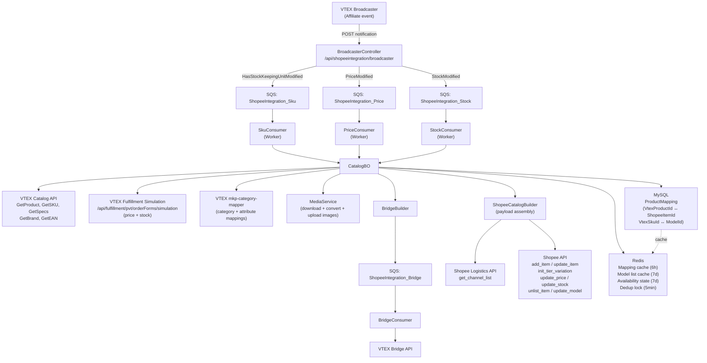

# Marketplace Product Data Capture Analysis
**Repository:** `integration-shopee`  
**Date:** 2026-05-06  
**Language/Stack:** C# (.NET 8), ASP.NET Core, MassTransit + Amazon SQS, MySQL, Redis, AWS S3  

---

## 1. Executive Summary

This application integrates VTEX with **Shopee Brazil** (`partner.shopeemobile.com`). It is a two-process system — an **API** (`Vtex.Integration.Shopee.Web`) that receives VTEX Broadcaster webhook notifications, and a **Worker** (`Vtex.Integration.Shopee.Worker`) that processes catalog, price, stock, and order events asynchronously via Amazon SQS queues.

Product data capture is **event-driven**: VTEX Broadcaster notifies the integration when a SKU changes (catalog, price, or stock). The notification is routed to an SQS queue and processed by a typed MassTransit consumer. Each consumer calls `CatalogBO`, which fetches VTEX catalog data, runs a **cart simulation** (Fulfillment API) to obtain sellable price and availability, uploads images to Shopee, assembles the Shopee payload, and calls the Shopee API.

State is persisted in **MySQL** (`ProductMapping` table) mapping VTEX `ProductId`/`SkuId` to Shopee `ItemId`/`ModelId`. **Redis** provides caching on top of MySQL reads and for Shopee model lists. Synchronization status flows back to VTEX Bridge for visibility.

The application both **sends** product data to Shopee (catalog, price, stock) and **receives** order data back from Shopee (order creation, order cancellation, fulfillment events). A custom logistics channel flag (FeatureHub) allows per-account channel selection.

---

## 2. Application Scope and Marketplace Responsibilities

| Responsibility | Present |
|---|---|
| Catalog (create/update item and tier variations) | Yes |
| Price synchronization | Yes |
| Stock/inventory synchronization | Yes |
| Availability toggle (item unlist / model UNAVAILABLE) | Yes |
| Image upload (Shopee media space) | Yes |
| Logistics channel selection | Yes |
| Order ingestion (Shopee → VTEX) | Yes |
| Order cancellation | Yes |
| Shipping label / tracking | Yes |
| Shopee Fulfillment by Shopee (FBS) support | Yes |
| Category/attribute mapping (VTEX Mapper) | Yes |
| Bridge observability | Yes |

**Direction of product data:** Primarily outward (VTEX → Shopee). Order and order-triggered stock updates flow back inward (Shopee → VTEX).

---

## 3. Product Discovery Process

### 3.1 Primary entry point — VTEX Broadcaster webhook

```
POST /api/shopeeintegration/broadcaster  (BroadcasterController.ProductChange)
```

VTEX Broadcaster calls this endpoint whenever a SKU is modified within the registered affiliate. The payload is `BroadCasterNotificationDTO`, which contains:

| Field | Meaning |
|---|---|
| `SkuId` | VTEX SKU ID that changed |
| `ProductId` | VTEX Product ID |
| `An` | Account name |
| `AffiliateId` | Affiliate ID |
| `PriceModified` | True if price changed |
| `StockModified` | True if stock changed |
| `HasStockKeepingUnitModified` | True if catalog/SKU changed |
| `HasStockKeepingUnitRemovedFromAffiliate` | True if SKU removed from affiliate (inactive) |

The controller overwrites `An` with the verified account from the request context (prevents sub-account confusion), then routes to one of four SQS queues based on the notification flags:

```
PriceModified      → ShopeeIntegration_Price
StockModified      → ShopeeIntegration_Stock
HasStockKeepingUnitModified | HasStockKeepingUnitRemovedFromAffiliate → ShopeeIntegration_Sku
```

If none of the flags matches, the queue name resolves to `null` — the message is silently dropped without error.

**File:** [`Vtex.Integration.Shopee.Web/Controllers/BroadcasterController.cs`](Vtex.Integration.Shopee/Vtex.Integration.Shopee.Web/Controllers/BroadcasterController.cs)

### 3.2 Secondary entry points

| Endpoint | Trigger | Queue / Direct |
|---|---|---|
| `POST /api/shopeeintegration/catalog/pvt/product/{skuId}` | Manual/admin | Direct call to `CatalogBO.ReprocessProductAsync` |
| `POST /api/shopeeintegration/catalog/pvt/product/{skuId}/stock` | Manual/admin | Direct call to `CatalogBO.HandlerStockAsync` |
| `POST /api/shopeeintegration/catalog/pvt/product/{skuId}/price` | Manual/admin | Direct call to `CatalogBO.HandlerPriceAsync` |
| `POST /api/shopeeintegration/catalog/pvt/fix/reCreateProducts` | Batch file/text | Direct call to `CatalogBO.FixSkuMapProblemsAsync` per SKU |
| `POST /api/shopeeintegration/catalog/recreate/product/mapping` | Batch file/text | Enqueues each product to `ShopeeIntegration_Recreate_Product` |
| `SendOrderItemsToStockQueueAsync` (triggered post-order) | Order creation | Enqueues to `ShopeeIntegration_Stock` per order item |

### 3.3 Filtering / eligibility

- The integration only processes SKUs that are part of the configured **affiliate/sales channel** (`shopeeCredential.SalesChannel`, `shopeeCredential.AffiliateId`).
- The Fulfillment simulation (`api/fulfillment/pvt/orderForms/simulation?sc=...&affiliateId=...`) acts as the final eligibility gate: if a SKU returns `null` or has an error from the simulation, it is rejected with the message "SKU não exportado, pois não está disponível para a Política Comercial".
- Products with status `Banned`, `Reviewing`, `SellerDelete`, or `ShopeeDelete` in Shopee are rejected during update.
- SKUs with `IsActive = false` in VTEX are still processed but their stock is set to 0.
- Products with no active SKUs throw an exception during creation: "Erro ao criar o produto, é necessário que ao menos um SKU esteja ativo".

### 3.4 Account/credential context

Credentials are stored in MySQL (`CredentialRepository`) and loaded per account on every request. The `ShopeeCredential` object carries:

- `AccountName` — VTEX account (multi-tenant key)
- `SalesChannel` — the trade policy used for cart simulation
- `AffiliateId` — the affiliate registered in VTEX fulfillment
- `MinStock` — minimum stock threshold (items below this are published with 0 stock)
- `FulfillmentWarehouseId` — warehouse ID for FBS mode

---

## 4. End-to-End Product Data Capture Flow

### 4.1 New product flow (create)

```
1. BroadcasterController receives HasStockKeepingUnitModified=true
2. → enqueues to ShopeeIntegration_Sku
3. SkuConsumer.Consume → CatalogBO.HandlerNotificationAsync
4.   → VtexCatalogClient.GetStockKeepingUnitAsync (gets ProductId)
5.   → LockHandlerProductAsync (Redis distributed lock, 60s TTL, 100s timeout, 1s retry)
6.     → CatalogBO.HandlerProductAsync
7.       → ProductMappingRepository.GetByVtexProductIdAsync (MySQL + Redis, 6h TTL)
8.       → productInfo.Count == 0 → not yet integrated
9.         → CatalogBO.ProcessProductAsync
10.           → VtexCatalogClient.GetProductAsync          (catalog/pvt/product/{id})
11.           → MapperCategoryService.GetCategoryMappedAsync (mkp-category-mapper)
12.           → ShopeeCatalogClient.GetAttributeTreeAsync   (Shopee API)
13.           → VtexCatalogClient.GetProductSpecsAsync      (catalog_system/pvt/products/{id}/specification)
14.           → ShopeeCatalogBuilder.BuildAttributes        (VTEX spec → Shopee attribute mapping)
15.           → CatalogService.GetShopeeBrandAsync          (VTEX brand + Shopee brand list)
16.           → VtexCatalogClient.GetProductSkusAsync       (catalog_system/pvt/sku/stockkeepingunitByProductId/{id})
17.           → VtexCatalogClient.GetStockKeepingUnitAsync  (per SKU, parallel)
18.           → CatalogService.IsProductFulfillment        (reads "shopee_fulfillment" spec)
19.           → FulfillmentClient.GetCartSimulation         (api/fulfillment/pvt/orderForms/simulation)
20.           → MediaService.UploadImageFromUrlAsync        (download + convert + Shopee media_space/upload_image)
21.           → LogisticsClient.GetChannelList              (Shopee api/v2/logistics/get_channel_list)
22.           → ShopeeCatalogBuilder.BuildAddItem           (assemble AddItemDTO)
23.           → ShopeeCatalogClient.InsertProductAsync      (Shopee api/v2/product/add_item)
24.           → CatalogService.SaveProductMappingAsync      (MySQL: VtexProductId → ShopeeItemId)
25.           → ShopeeCatalogBuilder.BuildProductTierVariationRequest
26.           → ShopeeCatalogClient.InitTierVariationAsync  (Shopee api/v2/product/init_tier_variation)
27.           → CatalogService.SaveSkuMappingAsync (per model, MySQL: VtexSkuId → ShopeeGlobalModelSku)
28.         → CatalogBO.GetCachedModelListAsync (refresh model list cache)
29. → BridgeBuilder.BuildAndSendBridgeMessage → BRIDGE_ENDPOINT queue → BridgeConsumer → BridgeClient
```

### 4.2 Product update flow

When `productInfo.Count > 1` (already integrated with SKUs):
```
CatalogBO.UpdateProductAndSkuAsync
  → VtexCatalogClient.GetProductAsync
  → ShopeeCatalogClient.GetItemBaseInfoAsync (validates Shopee item status)
  → MapperCategoryService.GetCategoryMappedAsync
  → VtexCatalogClient.GetProductSpecsAsync + BuildAttributes
  → CatalogService.GetShopeeBrandAsync
  → VtexCatalogClient.GetProductSkusAsync + GetStockKeepingUnitAsync (parallel)
  → MediaService.UploadImageFromUrlAsync (item images + tier images)
  → ShopeeCatalogBuilder.BuildUpdateItem → ShopeeCatalogClient.UpdateProductAsync
  → ShopeeCatalogBuilder.BuildUpdateTierVariationRequest → ShopeeCatalogClient.UpdateTierVariationAsync
  → AddNewModelIfNeeded (if notified SKU is new)
      → FulfillmentClient.GetCartSimulation
      → ShopeeCatalogBuilder.BuildAddModelRequest → ShopeeCatalogClient.AddModelAsync
      → CatalogService.SaveSkuMappingAsync
```

### 4.3 Price update flow

```
BroadcasterController (PriceModified=true) → ShopeeIntegration_Price
→ PriceConsumer → CatalogBO.HandlerPriceNotificationAsync
→ ProductMappingRepository.GetBySkuIdAsync (MySQL + Redis)
→ VTEXFulfillmentBuilder.BuildSimulationRequestDTO (qty=1, seller="1", country=BRA)
→ FulfillmentClient.GetCartSimulation
→ ShopeeCatalogBuilder.BuildUpdatePriceRequest (extracts item.Price)
→ ShopeeCatalogClient.UpdatePriceAsync (Shopee api/v2/product/update_price)
→ BridgeBuilder.BuildAndSendBridgeMessage
```

### 4.4 Stock update flow

```
BroadcasterController (StockModified=true) → ShopeeIntegration_Stock
→ StockConsumer → CatalogBO.HandlerStockNotificationAsync
→ check IsShopeeFulfillment → if true, log and return (no stock update for FBS)
→ ProductMappingRepository.GetBySkuIdAsync (MySQL + Redis)
→ VTEXFulfillmentBuilder.BuildSimulationRequestDTO
→ FulfillmentClient.GetCartSimulation
→ ShopeeCatalogBuilder.BuildUpdateStockRequest
    → reads logisticsInfo.DeliveryChannels["delivery"].StockBalance
    → applies cap: if > 99999 → 99999; if <= minStock → 0
→ ShopeeCatalogClient.UpdateStockAsync (Shopee api/v2/product/update_stock)
→ ToggleShopeeItemOrModelAvailabilityAsync
    → if stockQty == 0 → check if already deactivated (Redis, 7d TTL)
    → if modelList.Count > 1 → ShopeeCatalogClient.UpdateModelAsync (UNAVAILABLE/NORMAL)
    → else → ShopeeCatalogClient.UnlistItemAsync
→ BridgeBuilder.BuildAndSendBridgeMessage
```

---

## 5. Catalog and Content Data

### 5.1 VTEX APIs used for catalog data

| Data | VTEX API endpoint | Method |
|---|---|---|
| Product details | `api/catalog/pvt/product/{id}?an=` | `VtexCatalogClient.GetProductAsync` |
| Product SKU list | `api/catalog_system/pvt/sku/stockkeepingunitByProductId/{id}?an=` | `VtexCatalogClient.GetProductSkusAsync` |
| SKU details (full) | `api/catalog_system/pvt/sku/stockkeepingunitbyid/{id}?an=&v={timestamp}` | `VtexCatalogClient.GetStockKeepingUnitAsync` |
| SKU EAN/GTIN | `api/catalog/pvt/stockkeepingunit/{id}/ean?an=` | `VtexCatalogClient.GetSkuEanAsync` |
| Product specifications | `api/catalog_system/pvt/products/{id}/specification?an=` | `VtexCatalogClient.GetProductSpecsAsync` |
| Brand details | `api/catalog_system/pvt/brand/{id}?an=` | `VtexCatalogClient.GetBrandAsync` |
| Category tree | `api/catalog_system/pub/category/tree/10?an=` | `VtexCatalogClient.GetCategoryTreeAsync` |
| Category details | `api/catalog_system/pvt/category/{id}?an=` | `VtexCatalogClient.GetCategoryAsync` |
| SKU IDs (paged) | `api/catalog_system/pvt/sku/stockkeepingunitids/?page=&pagesize=1000&an=` | `VtexCatalogClient.StockKeepingUnitIdGetPagedAsync` |

### 5.2 Catalog fields mapped to Shopee

| VTEX field | Source | Shopee field in `AddItemDTO` |
|---|---|---|
| `product.Name` | `ProductDTO.Name` | `item_name` |
| `product.Description` (HTML stripped, max 5000 chars) | `ProductDTO.Description` | `description` |
| `product.IsActive && sku.IsActive` | `ProductDTO` + `StockKeepingUnitDTO` | `item_status` (NORMAL/UNLIST) |
| `product.Id` | `ProductDTO.Id` | `item_sku` |
| Mapped category | `MappingDataMapper.MappedCategoryId` | `category_id` |
| `sku.Dimension.Weight` (g → kg conversion) | `StockKeepingUnitDTO` | `weight` |
| `sku.Dimension.Height/Length/Width` (cm unit from CREPO) | `StockKeepingUnitDTO` | `dimension` |
| SKU EAN | `VtexCatalogClient.GetSkuEanAsync` | `gtin_code` |
| Images (up to 9, first SKU) | `sku.Images[]`, uploaded to Shopee media space | `image.image_id_list` |
| Brand (matched by name to Shopee brand list) | `VtexCatalogClient.GetBrandAsync` → Shopee brand list | `brand` |
| Product spec attributes (mapped via VTEX Mapper) | `ProductSpecificationDTO` | `attribute_list` |
| Logistics channels | `LogisticsClient.GetChannelList` | `logistic_info` |
| Pre-order: always false | Hardcoded | `pre_order.is_pre_order = false` |
| Condition: always NEW | Hardcoded | `condition = "NEW"` |
| Dangerous goods: always 0 | Hardcoded | `item_dangerous = 0` |

### 5.3 Variations / tier variations

Shopee's tier variation (SKU model) corresponds to VTEX's SKU specifications with `IsFilter = true`. Build logic in `ShopeeCatalogBuilder.FulfillTierVariation`:
1. If filterable specifications exist → use spec `FieldName` as `variation_name` and `FieldValues` as options
2. If a single SKU with non-filterable specs → use the first specification as a single-value tier
3. If no specifications → fallback to SKU name with product name stripped; for a single SKU the value is hardcoded `"UNICA"`

Each tier option carries the image ID from the corresponding uploaded SKU image.

### 5.4 Fulfillment flag detection

`CatalogService.IsProductFulfillment` reads `sku.ProductSpecifications` for a spec named `"shopee_fulfillment"` with value `"true"` (case-insensitive). This gates FBS vs. regular fulfillment behavior throughout the flow.

**File:** [`Vtex.Integration.Shopee.Business/Services/CatalogService.cs:110`](Vtex.Integration.Shopee/Vtex.Integration.Shopee.Business/Services/CatalogService.cs)

### 5.5 Description normalization

`ShopeeCatalogBuilder.NormalizeDescription`:
- Strips HTML tags using HtmlAgilityPack
- Converts `<br>` variants to `\n`
- Minimum 10 characters required (throws if shorter)
- Truncates to 5000 characters

### 5.6 Missing/invalid data handling

| Situation | Behavior |
|---|---|
| No images on SKU | Throws exception — product not created/updated |
| Description too short (< 10 chars) | Throws |
| Dimension has a 0 value | Throws "Dimensão deve ser maior ou igual a 1 Centímetro" |
| No active SKUs | Throws — product not created |
| Missing category mapping | Throws |
| Mandatory Shopee attribute missing in VTEX | Throws with friendly message naming the missing attribute |
| Spec value not mapped to Shopee value | Throws with value and attribute name |
| Image in WebP or other non-JPG/PNG format | Converted to JPG via Magick.NET |

---

## 6. Price Synchronization

### 6.1 Source

Price is **not fetched from a VTEX pricing API**. It is obtained exclusively from the **VTEX Fulfillment Cart Simulation**:

```
POST api/fulfillment/pvt/orderForms/simulation?sc={salesChannel}&affiliateId={affiliateId}&an={accountName}
```

Request body:
```json
{
  "items": [{ "id": "{skuId}", "quantity": 1, "seller": "1" }],
  "country": "BRA"
}
```

Response: `CartSimulationResponseDTO.Items[n].Price` — this is the final selling price for the SKU under the configured trade policy/affiliate.

### 6.2 Shopee price fields

| Shopee field | Value source |
|---|---|
| `original_price` (AddItem) | `simulationResponse.Items[0].Price` |
| `PriceList[n].OriginalPrice` (UpdatePrice) | `cartSimulation.Items[sku].Price` |
| Model `original_price` (InitTierVariation / AddModel) | `simulationResponse.Items[skuId].Price` |

Only `original_price` is sent — no `current_price`, no discount fields, no tax breakdown.

### 6.3 Price change detection

Via VTEX Broadcaster `PriceModified = true` flag → routed to the `ShopeeIntegration_Price` queue.

### 6.4 No caching or local price storage

Price data is always freshly fetched from the Fulfillment simulation at the moment of the update. No local price caching or persistence.

### 6.5 Failure handling

- `PriceException` (typed exception) is caught in `PriceConsumer`, logged, and reported to Bridge as `BridgeDocumentStatus.Error` — **not re-thrown**, so the message is consumed (not retried via MassTransit).
- `ApiException` is re-thrown, which triggers MassTransit's retry/error queue behavior.
- Generic exceptions are re-thrown as well.

---

## 7. Inventory and Availability Synchronization

### 7.1 Source

Stock and availability are obtained exclusively from the **VTEX Fulfillment Simulation**, identical to the price call. The simulation returns `CartSimulationLogisticsInfoDTO` per item index.

The relevant field:
```
simulationResponse.LogisticsInfo[itemIndex].DeliveryChannels["delivery"].StockBalance
```

**File:** [`Vtex.Integration.Shopee.Business/Builder/ShopeeCatalogBuilder.cs:321`](Vtex.Integration.Shopee/Vtex.Integration.Shopee.Business/Builder/ShopeeCatalogBuilder.cs)

### 7.2 Stock calculation

```csharp
var stock = deliveryChannel.StockBalance > MaxStock   // 99999
    ? MaxStock
    : deliveryChannel.StockBalance > minStock          // credential.MinStock (configurable)
        ? deliveryChannel.StockBalance
        : 0;
```

- If stock is above 99,999 → capped to 99,999.
- If stock is at or below `minStock` → published as 0 (considered out-of-stock for the marketplace).
- `minStock` defaults to 0 if not configured.

For **FBS products** (`IsShopeeFulfillment = true`):
- Stock updates from VTEX are **completely ignored** — stock is managed by Shopee warehouse.
- During initial product creation, stock is sent as 0 regardless.

### 7.3 Availability toggle (item/model deactivation)

After every stock update, `ToggleShopeeItemOrModelAvailabilityAsync` checks whether the item/model should be activated or deactivated on Shopee:

1. Check Redis cache key `availabilityupdate:{accountName}:{skuId}` (7-day TTL) to avoid redundant Shopee API calls.
2. If item has **more than 1 model** → call `UpdateModelAsync` with `ModelStatus = "UNAVAILABLE"` or `"NORMAL"`.
3. If item has **exactly 1 model** → call `UnlistItemAsync` with `Unlist = true` or `false`.

**Files:**
- [`Vtex.Integration.Shopee.Business/CatalogBO.cs:229`](Vtex.Integration.Shopee/Vtex.Integration.Shopee.Business/CatalogBO.cs)

### 7.4 Inactive SKU handling

When `HasStockKeepingUnitRemovedFromAffiliate = true`:
```
CatalogBO.HandlerNotificationInactiveAsync
→ ProductMappingRepository.GetBySkuIdAsync
→ CatalogBO.InactiveSkuAsync
    → ShopeeCatalogBuilder.BuildUpdateWithoutStockRequest (stock = 0 for all models)
    → ShopeeCatalogClient.UpdateStockAsync
```

### 7.5 No raw inventory polling

There is no scheduled inventory polling. All stock updates are driven by Broadcaster events.

---

## 8. Logistics and Delivery Synchronization

### 8.1 Logistics channel list

On every new product creation, the application fetches the seller's enabled Shopee logistics channels:
```
GET api/v2/logistics/get_channel_list{signedQueryString}
```
**Client:** `LogisticsClient.GetChannelList`

The response is mapped to `List<LogisticInfoDTO>`:
```csharp
{ LogisticId, LogisticName, Enabled }
```

This list is embedded in the `AddItemDTO.logistic_info` field.

### 8.2 Custom logistics channel flag

`FeatureFlagBO.GetFlagStatusByAccountAsync<CustomLogisticsChannelConfigDTO>(account, UseCustomLogisticsChannel)` — when enabled, only the channel with the configured `ChannelId` is included in `logistic_info`. Evaluated both on initial item creation and on item update.

**File:** [`Vtex.Integration.Shopee.Business/Builder/ShopeeCatalogBuilder.cs:366`](Vtex.Integration.Shopee/Vtex.Integration.Shopee.Business/Builder/ShopeeCatalogBuilder.cs)

### 8.3 Logistics in order creation (SLA selection)

During order placement (`VTEXFulfillmentBuilder.BuildShippingData`):
1. Cart simulation is run with the buyer's postal code.
2. SLAs are filtered: scheduled-delivery windows and pickup-in-point are removed.
3. For **FOB orders** (carrier = not "Logística do vendedor") → first valid SLA is selected.
4. For **fulfillment orders** (FBS) → SLA matching `FulfillmentWarehouseId` is selected.
5. `HandlingTime` (dock estimate + 1, +1 on Thursday, +2 on Friday/Saturday) and `ShippingTime`/`PromiseTime` are derived from the SLA.

### 8.4 Logistics and product availability

Logistics data affects product **payload** (logistic channels list at creation) and **order processing** (SLA selection), but does NOT independently trigger product re-synchronization. Missing logistics channels result in an empty `logistic_info` array — no exception thrown.

---

## 9. Synchronization Architecture

### 9.1 Overview

| Aspect | Implementation |
|---|---|
| Asynchrony | Amazon SQS queues + MassTransit consumers (Worker process) |
| API layer | ASP.NET Core (API process) |
| Queue technology | Amazon SQS via MassTransit `AmazonSQSReceiveEndpointConfigurationExtension` |
| Concurrency control | Redis distributed lock on product-level processing (60s TTL) |
| State storage | MySQL (`ProductMapping` table) + Redis cache (6h TTL for mappings) |
| Observability | VTEX Bridge (dedicated `ShopeeIntegration_Bridge` queue → `BridgeConsumer`) |

### 9.2 Queues

| Queue name | Consumer | Purpose |
|---|---|---|
| `ShopeeIntegration_Sku` | `SkuConsumer` | Catalog create/update |
| `ShopeeIntegration_Price` | `PriceConsumer` | Price updates |
| `ShopeeIntegration_Stock` | `StockConsumer` | Stock/availability updates |
| `ShopeeIntegration_Bridge` | `BridgeConsumer` | VTEX Bridge status messages |
| `ShopeeIntegration_Recreate_Product` | `RecreateProductConsumer` | Batch product remapping |
| `ShopeeIntegration_NewOrder` | `NewOrderConsumer` | Shopee → VTEX order creation |
| `ShopeeIntegration_TrackingFromVTEX` | `TrackingFromVTEXConsumer` | Tracking updates |
| `ShopeeIntegration_CancelOrderFromShopee` | … | Order cancellations |
| `ShopeeIntegration_FBSInvoiceRequest` | Saga | FBS invoice workflows |

In debug mode, queues have a `_Dev` suffix.

### 9.3 Full sync vs incremental sync

- **No explicit full sync scheduler** was found in the code. There is no background cron job that iterates all SKUs periodically.
- The **batch endpoints** (`/fix/reCreateProducts`, `/recreate/product/mapping`) serve as the mechanism for a full re-sync — they accept a CSV/XLSX/text list of SKU or product IDs and enqueue them.
- `VtexCatalogClient.StockKeepingUnitIdGetPagedAsync` exists (paged SKU list endpoint), suggesting a full scan capability, but no calling code was found that actively drives periodic full syncs.

### 9.4 Redis deduplication cache

On product notification, before creating a new product, a Redis key `proceessedproduct:{accountName}:{productId}` is set with a **5-minute TTL**:
```csharp
if (await _redisClient.KeyExistsAsync(RedisProductCacheKey(...))) return;
await ProcessProductAsync(productId, shopeeCredential);
await _redisClient.StoreAsync(RedisProductCacheKey(...), "-", TimeSpan.FromMinutes(5));
```
This prevents duplicate processing of the same product when multiple SKU notifications fire in quick succession.

### 9.5 Retry behavior

- `ApiException` and generic exceptions in consumers are re-thrown → MassTransit handles retry/fault via its built-in error queue (failed messages go to `_error` SQS queue).
- `ProductNotFoundException` and `AccountNotFoundException` are caught and logged — **not re-thrown** (no retry, soft failure).
- `PriceException` and `StockException` are caught, logged, and reported to Bridge — **not re-thrown**.
- Bridge messages are fire-and-forget (MassTransit, no retry visible in Bridge consumer code).

### 9.6 Rate limits

No explicit rate-limit handling was found for VTEX APIs. For Shopee API, `GetItemList` explicitly catches `HttpStatusCode.TooManyRequests` and throws an `ApiException` with that code, which MassTransit would handle via its error queue.

---

## 10. Marketplace Payload Assembly

### 10.1 `AddItemDTO` — Product creation payload

Assembled in `ShopeeCatalogBuilder.BuildAddItem` and `BuildUpdateItem`.

```
AddItemDTO {
  item_name         ← ProductDTO.Name
  description       ← NormalizeDescription(ProductDTO.Description)
  description_type  ← "normal" (hardcoded)
  item_status       ← "NORMAL" if product.IsActive && sku.IsActive, else "UNLIST"
  category_id       ← MappingDataMapper.MappedCategoryId
  weight            ← sku.Dimension.Weight (g → kg)
  dimension         ← { height, length, width } in cm
  image             ← { image_id_list, image_url_list } (Shopee-hosted IDs)
  brand             ← { brand_id, original_brand_name }
  attribute_list    ← [ { attribute_id, attribute_value_list } ]
  gtin_code         ← first EAN from VtexCatalogClient.GetSkuEanAsync
  logistic_info     ← [ { logistic_id, logistic_name, enabled } ]
  original_price    ← CartSimulation.Items[0].Price
  seller_stock      ← [ { stock: 0 } ]  (stock set separately via tier variation)
  pre_order         ← { is_pre_order: false, days_to_ship: 0 }
  condition         ← "NEW"
  item_dangerous    ← 0
  item_sku          ← ProductDTO.Id  (VTEX product ID as tag)
}
```

### 10.2 `InitTierVariationRequestDTO` — SKU model creation payload

```
InitTierVariationRequestDTO {
  item_id              ← ShopeeItemId (from product creation response)
  standardise_tier_variation ← [
    { variation_name, variation_option_list: [ { name, image_id } ] }
  ]
  model ← [
    {
      original_price   ← CartSimulation.Items[skuId].Price
      model_sku        ← VtexSkuId
      weight           ← sku.Dimension.Weight (g → kg)
      gtin_code        ← EAN
      seller_stock     ← [ { stock: calculated } ]
      tier_index       ← [int] mapping sku to variation option
      dimension        ← { height, length, width }
    }
  ]
}
```

### 10.3 Separate payloads for price and stock updates

Price: `UpdatePriceRequestDTO` → `{ item_id, price_list: [ { model_id, original_price } ] }`  
Stock: `UpdateStockRequestDTO` → `{ item_id, stock_list: [ { model_id, seller_stock: [ { stock } ] } ] }`

### 10.4 Validations before sending

- Images must exist and upload successfully
- Description must be ≥ 10 chars
- Dimensions must be > 0 if present
- Mandatory Shopee attributes must have values
- Shopee item status must be `NORMAL` or `UNLIST` before update
- Cart simulation must return items (not null)

### 10.5 Shopee API signing

Every Shopee API call is signed via `SignService.GenerateShopSign` (HMAC-SHA256 signature per Shopee's authentication protocol) before appending to the query string.

---

## 11. Error Handling and Observability

### 11.1 VTEX Bridge integration

Every product, price, and stock operation sends a final status message to VTEX Bridge via `BridgeBuilder.BuildAndSendBridgeMessage`. Bridge documents include:

| Field | Content |
|---|---|
| `An` | Account name |
| `Id` | SKU ID |
| `Status` | "Success" or "Error" |
| `Type` | "product", "price", "stock" |
| `Message` | Exception message or "Success" |
| `LastRetryDate` | Current datetime (Brazil timezone) |

### 11.2 `ILogClient` logging

Used throughout with levels `Important` and `Debug` and types `Info` and `Error`. Log entries include:
- `skuId` / `accountName` as correlation keys
- `Field` key-value pairs for context
- Exception objects
- `evidence` (raw JSON of request/response)
- `workflowType` (method name)

### 11.3 Exception taxonomy

| Exception | When thrown | Retry? |
|---|---|---|
| `ProductNotFoundException` | VTEX or Shopee product not found | No (swallowed in consumer) |
| `AccountNotFoundException` | Credential not found in MySQL | No (swallowed) |
| `PriceException` | Shopee price update failure list | No (swallowed) |
| `StockException` | Shopee stock update failure list | No (swallowed) |
| `ApiException` | HTTP error from VTEX or Shopee | Yes (re-thrown → MassTransit error queue) |
| `ShopeeException` | Shopee API business error | Re-thrown in some cases |
| `IntegrationException` | Business validation error | No (varies) |
| `DocumentException` | Shipping document not ready | Re-queues |

### 11.4 Shopee-side error inspection

`ShopeeCatalogClient` inspects both `httpResponse.IsSuccessStatusCode` and the response body `Error`/`Message` fields. The `Helper.CheckShopeeErrorMessage` maps known Shopee error codes to user-friendly messages.

### 11.5 Admin/debug endpoints

- `GET /api/shopeeintegration/catalog/itemByItemId/{itemId}` — inspect Shopee item
- `GET /api/shopeeintegration/catalog/itemByVTEXProductId/{vtexProductId}` — inspect Shopee item by VTEX ID
- `GET /api/shopeeintegration/catalog/modelListByItemId/{itemId}` — inspect models
- `POST /api/shopeeintegration/catalog/pvt/product/{skuId}` — force product reprocess
- `POST /api/shopeeintegration/catalog/pvt/product/{skuId}/stock` — force stock sync
- `POST /api/shopeeintegration/catalog/pvt/product/{skuId}/price` — force price sync
- `POST /api/shopeeintegration/catalog/pvt/fix/reCreateProducts` — batch fix SKU mappings
- `POST /api/shopeeintegration/catalog/recreate/product/mapping` — batch recreate product mappings

---

## 12. Dependencies, Assumptions, and Risks

### 12.1 VTEX platform dependencies

| Dependency | Purpose |
|---|---|
| VTEX Broadcaster | SKU/price/stock change events |
| VTEX Fulfillment Simulation API (`api/fulfillment/pvt/orderForms/simulation`) | Price and stock/availability |
| VTEX Catalog API (`api/catalog/pvt/product`, `api/catalog_system/...`) | Product, SKU, brand, EAN, category, specs |
| VTEX Fulfillment API (`api/fulfillment/pvt/orders`, `pvt/affiliates`) | Order placement, affiliate management |
| VTEX mkp-category-mapper (`api/mkp-category-mapper/...`) | Category mapping and attribute mapping |
| VTEX Bridge (`api/bridge/...`) | Sync status visibility |
| VTEX CREPO (`configurationrepository.vtex.com.br`) | Unit of length for dimension conversion |
| VTEX OMS (`api/oms/pvt/orders`) | Order status check (idempotency) |
| VTEX Checkout (`api/checkout/pvt/orderForms/orderForm`) | Custom data / order form apps |
| ViaCEP (`viacep.com.br`) | Neighborhood lookup when buyer omits it |
| FeatureHub | Feature flag evaluation (custom logistics channel, order total calculation) |

### 12.2 Shopee API dependencies

All calls target `https://partner.shopeemobile.com/api/v2/`:

| API | Purpose |
|---|---|
| `product/add_item` | Create item |
| `product/update_item` | Update item |
| `product/init_tier_variation` | Create SKU models |
| `product/update_tier_variation` | Update tier variation |
| `product/add_model` | Add new SKU model |
| `product/update_model` | Activate/deactivate model |
| `product/unlist_item` | Unlist/relist item |
| `product/update_price` | Update price |
| `product/update_stock` | Update stock |
| `product/get_item_base_info` | Validate item exists and status |
| `product/get_model_list` | Get model list (cached 7 days) |
| `product/get_category` | Category list |
| `product/get_attribute_tree` | Attribute tree by category |
| `product/get_brand_list` | Brand list by category |
| `media_space/upload_image` | Image upload |
| `logistics/get_channel_list` | Logistics channels |

### 12.3 Required merchant configuration

| Configuration | Impact |
|---|---|
| `ShopeeCredential.SalesChannel` | Cart simulation trade policy — wrong value → all SKUs excluded |
| `ShopeeCredential.AffiliateId` | Broadcaster routing — wrong value → no notifications received |
| `ShopeeCredential.MinStock` | Stock zero-out threshold |
| `ShopeeCredential.FulfillmentWarehouseId` | Required for FBS orders; throws exception if missing |
| VTEX Mapper category mapping | Every product must have its VTEX category mapped to a Shopee category |
| VTEX Mapper attribute mapping | Mandatory Shopee attributes must be mapped to VTEX specifications |
| `"shopee_fulfillment"` product specification | Must exist in VTEX with value `"true"` for FBS products |
| CREPO unit of length | Determines dimension unit (defaults to `cm` if missing) |
| FeatureHub flags | `UseCustomLogisticsChannel`, `UseEscrowToCalculateOrderTotalAmount` |

### 12.4 Hardcoded assumptions

| Assumption | Location |
|---|---|
| Country always `"BRA"` | `VTEXFulfillmentBuilder.BuildSimulationRequestDTO` |
| Seller always `"1"` | Cart simulation items |
| Pre-order always `false` | `ShopeeCatalogBuilder.BuildAddItem` |
| Item condition always `"NEW"` | `ShopeeCatalogBuilder.BuildAddItem` |
| Item dangerous always `0` | `ShopeeCatalogBuilder.BuildAddItem` |
| Max stock cap at `99,999` | `ShopeeCatalogBuilder` |
| Model list Redis TTL 7 days | `ShopeeCatalogClient.GetCachedModelListAsync` |
| SKU mapping Redis TTL 6 hours | `ProductMappingRepository` |
| Image resized to `1000-auto` via URL pattern | `MediaService.UploadImageFromUrlAsync` |
| Handling time adds 1 always, +1 on Thursday, +2 on Friday/Saturday | `VTEXFulfillmentBuilder.CreateSimulationRequesposeQuotation` |
| Brazil timezone for Bridge date | `Helper.GetDateTimeNowBrazil` |

### 12.5 Key risks

- **No full sync scheduler**: Products changed outside Broadcaster (e.g., direct catalog API edits without triggering broadcaster) will not be synchronized automatically.
- **Simulation as sole price/stock source**: If the Fulfillment simulation returns cached or stale data, the published price/stock will be stale.
- **Redis dedup cache (5 min)**: Multiple SKU notifications within 5 minutes for a new product that fails on the first attempt will be silently dropped.
- **ProductNotFoundException not retried**: If VTEX catalog is temporarily unavailable, the product won't be retried.
- **Raw SQL strings** in repository (TODO comments noted in code): SQL injection risk if inputs are ever not parameterized correctly.
- **No pagination enforcement** on product update: `UpdateProductAndSkuAsync` fetches all SKUs of a product at once; very large product variants may cause timeouts.

---

## 13. Step-by-Step Flow

### Full new product creation

```
1.  VTEX SKU is activated or modified in the affiliate
2.  VTEX Broadcaster calls POST /api/shopeeintegration/broadcaster with HasStockKeepingUnitModified=true
3.  BroadcasterController validates account context and routes to ShopeeIntegration_Sku queue
4.  SkuConsumer receives message, calls CatalogBO.HandlerNotificationAsync
5.  VtexCatalogClient.GetStockKeepingUnitAsync fetches full SKU data (including ProductId)
6.  Redis distributed lock acquired on productId (60s)
7.  CatalogBO.HandlerProductAsync: ProductMappingRepository.GetByVtexProductIdAsync — empty result
8.  Redis dedup key checked — not present → proceed
9.  CatalogBO.ProcessProductAsync begins:
    a. VtexCatalogClient.GetProductAsync → product data
    b. MapperCategoryService.GetCategoryMappedAsync → mapped Shopee category + spec mappings
    c. ShopeeCatalogClient.GetAttributeTreeAsync → Shopee attribute tree for category
    d. VtexCatalogClient.GetProductSpecsAsync → product specifications
    e. ShopeeCatalogBuilder.BuildAttributes → attribute list
    f. CatalogService.GetShopeeBrandAsync → brand resolution
    g. VtexCatalogClient.GetProductSkusAsync → list of all SKU IDs for product
    h. VtexCatalogClient.GetStockKeepingUnitAsync (parallel per SKU) → SKU details + specs + images
    i. CatalogService.IsProductFulfillment → check "shopee_fulfillment" spec
    j. Filter productSkus to only IsActive ones
    k. VTEXFulfillmentBuilder.BuildSimulationRequestDTO → simulation request
    l. FulfillmentClient.GetCartSimulation → price and stock per SKU
    m. MediaService.UploadImageFromUrlAsync (parallel): download images → convert to JPG → POST Shopee media_space/upload_image
    n. LogisticsClient.GetChannelList → Shopee logistics channels
    o. ShopeeCatalogBuilder.MapLogisticsInfoAsync → filter by CustomLogisticsChannel flag
    p. ShopeeCatalogBuilder.BuildAddItem → AddItemDTO assembled
    q. ShopeeCatalogClient.InsertProductAsync → POST Shopee api/v2/product/add_item
    r. CatalogService.SaveProductMappingAsync → MySQL insert (VtexProductId → ShopeeItemId)
    s. ShopeeCatalogBuilder.BuildProductTierVariationRequest → InitTierVariationRequestDTO (with price, stock, GTIN per model)
    t. ShopeeCatalogClient.InitTierVariationAsync → POST Shopee api/v2/product/init_tier_variation
    u. CatalogService.SaveSkuMappingAsync (per model) → MySQL insert (VtexSkuId → ShopeeGlobalModelSku)
    v. CatalogService.RemoveProductWithoutSkuAsync → clean up stub product mapping row
10. Redis dedup key set (5 min)
11. ShopeeCatalogClient.GetCachedModelListAsync (force refresh, 7d TTL) → model list cached
12. BridgeBuilder.BuildAndSendBridgeMessage → ShopeeIntegration_Bridge queue → BridgeConsumer → VTEX Bridge API
```

---

## 14. Mermaid Diagram



---

## 15. Source-to-Destination Mapping Table

| Data type | VTEX source / API / module | Main files / functions | Transformation / business logic | Marketplace destination / use |
|---|---|---|---|---|
| **Catalog / content** | `api/catalog/pvt/product/{id}` → `ProductDTO` | `VtexCatalogClient.GetProductAsync`, `ShopeeCatalogBuilder.BuildAddItem` | Description HTML stripped (HtmlAgilityPack), max 5000 chars; status → NORMAL/UNLIST | `item_name`, `description`, `item_status`, `item_sku` in `add_item` / `update_item` |
| **SKU details** | `api/catalog_system/pvt/sku/stockkeepingunitbyid/{id}` → `StockKeepingUnitDTO` | `VtexCatalogClient.GetStockKeepingUnitAsync`, `ShopeeCatalogBuilder.BuildProductTierVariationRequest` | `IsActive=false` → stock=0; weight g→kg; dimensions cm (CREPO unit) | Model list in `init_tier_variation`, `weight`, `dimension` |
| **EAN/GTIN** | `api/catalog/pvt/stockkeepingunit/{id}/ean` → `List<string>` | `VtexCatalogClient.GetSkuEanAsync` | First EAN taken, empty string if null | `gtin_code` per model and item |
| **Product specifications / attributes** | `api/catalog_system/pvt/products/{id}/specification` → `List<ProductSpecificationDTO>` | `VtexCatalogClient.GetProductSpecsAsync`, `ShopeeCatalogBuilder.BuildAttributes` | Mapped via VTEX Mapper; mandatory check; value/unit extraction for TEXT_FIELD type; hierarchical tree traversal | `attribute_list` in `add_item` |
| **Variations / tier variations** | `StockKeepingUnitDTO.SkuSpecifications` (IsFilter=true) | `ShopeeCatalogBuilder.FulfillTierVariation` | Filter-marked specs → variation name + options; fallback to name substring or "UNICA" | `standardise_tier_variation` in `init_tier_variation` |
| **Brand** | `api/catalog_system/pvt/brand/{id}` + Shopee brand list | `VtexCatalogClient.GetBrandAsync`, `ShopeeCatalogClient.GetBrandListAsync`, `CatalogService.GetShopeeBrandAsync` | VTEX brand name matched case-insensitively to Shopee brand list; falls back to `{brand_id:0, name:"NoBrand"}` | `brand` in `add_item` |
| **Category mapping** | `api/mkp-category-mapper/categories/mapping/{mapperId}` | `MapperClient.GetMappedCategoriesAsync`, `MapperCategoryService.GetCategoryMappedAsync` | VTEX category ID → Shopee category ID + spec mappings | `category_id` in `add_item`; used to fetch attribute tree |
| **Images** | `StockKeepingUnitDTO.Images[].ImageUrl` + `sku.ImageUrl` | `MediaService.UploadImageFromUrlAsync`, `ShopeeCatalogClient.UploadImageAsync` | URL rewritten to 1000px; WebP → JPG via Magick.NET; uploaded to Shopee media space | `image.image_id_list` (item, up to 9); `image_id` per tier variation option |
| **Price** | VTEX Fulfillment Simulation `CartSimulationResponseDTO.Items[n].Price` | `FulfillmentClient.GetCartSimulation`, `ShopeeCatalogBuilder.BuildUpdatePriceRequest` | Price from simulation for configured sales channel / affiliate; no tax/discount decomposition | `original_price` per model in `init_tier_variation`, `add_model`; `price_list[n].original_price` in `update_price` |
| **Inventory / stock** | VTEX Fulfillment Simulation `LogisticsInfo[n].DeliveryChannels["delivery"].StockBalance` | `FulfillmentClient.GetCartSimulation`, `ShopeeCatalogBuilder.BuildUpdateStockRequest` | Cap at 99,999; zero if ≤ minStock; zero if inactive SKU; zero for FBS products | `seller_stock[].stock` per model in `init_tier_variation`, `update_stock` |
| **Availability** | Derived from stock calculation above + Shopee model list cache | `CatalogBO.ToggleShopeeItemOrModelAvailabilityAsync` | stock=0 → UNAVAILABLE/unlist; stock>0 → NORMAL/relist; Redis dedup 7d | `update_model` (UNAVAILABLE/NORMAL) or `unlist_item` (Unlist=true/false) |
| **Logistics / delivery** | Shopee `api/v2/logistics/get_channel_list` | `LogisticsClient.GetChannelList`, `ShopeeCatalogBuilder.MapLogisticsInfoAsync` | Optional FeatureFlag filters to single channel; maps to LogisticInfoDTO list | `logistic_info` in `add_item`; used in order SLA selection |
| **Mapping / state** | MySQL `ProductMapping` table + Redis (6h TTL) | `ProductMappingRepository`, `CatalogService.SaveProductMappingAsync`, `SaveSkuMappingAsync` | Persists VtexProductId → ShopeeItemId and VtexSkuId → ShopeeGlobalModelSku (ModelId) mappings | Internal state for routing price/stock updates; not sent to Shopee directly |

---

## 16. Open Questions and Unclear Areas in the Code

1. **No full sync scheduler found**: `StockKeepingUnitIdGetPagedAsync` exists but no active caller drives a full catalog scan. It is unclear how the merchant performs an initial full integration of existing products.

2. **Broadcaster routing gap**: If `PriceModified`, `StockModified`, and `HasStockKeepingUnitModified/RemovedFromAffiliate` are all `false` in a notification, `queueName` is `null` and the message is silently sent to a null queue. It is unclear whether MassTransit handles this gracefully or drops it.

3. **TODO comments on raw SQL**: Multiple repository methods use raw SQL string concatenation of table names (`$"SELECT * FROM {tableName}"`). While the parameterized values are safe, the table name injection is not exploitable in current code but violates hygiene.

4. **Single PriceList entry**: `BuildUpdatePriceRequest` constructs a full `priceList` but then sends only `[priceList.FirstOrDefault()]`. This means multi-SKU price updates only send the first SKU's price. This may be intentional (one model at a time) but looks inconsistent.

5. **`ShouldUseNewOrderTotalAmountCalcAsync` random chance**: A random percentage chance is used to A/B test a new order total amount formula. The flow path comments say "We won't use this flow, because it's calculated wrong, but will keep it for deploy safety." This dead-code path is a maintenance risk.

6. **`logistic_info` absent on update**: On item update (`BuildUpdateItem`), `logistic_info` is only populated if the `UseCustomLogisticsChannel` feature flag is active. Otherwise it is null and passed as `null` to `AddItemDTO` which has `NullValueHandling.Ignore`. It is unclear whether Shopee updates the logistics channel on item update or preserves the existing one.

7. **Model list cache 7-day TTL**: The model list is cached for 7 days and only forcibly refreshed after a product notification. If Shopee models are changed externally (e.g., seller deletes a model from Shopee UI), the cache may be stale for up to 7 days, causing availability updates to reference non-existent model IDs.

---

## 17. Recommendations for Comparison with Other Marketplace Applications

The following aspects are particularly distinctive in this integration and would be useful to compare against other marketplace applications:

1. **Availability toggle strategy**: This integration uses a two-level toggle (model UNAVAILABLE vs. item unlist) based on model count. Compare with: does the other integration use a simple stock=0 approach or an explicit deactivation mechanism?

2. **Price/stock source via cart simulation only**: This integration does not use the VTEX Pricing API or inventory API directly. All price and stock data comes exclusively from the Fulfillment simulation. Compare with: do other integrations use the Pricing API, Logistics API stock endpoints, or also rely on simulation?

3. **FBS (Fulfillment by Shopee) mode**: A per-product flag (`shopee_fulfillment` spec) gates stock update suppression. Compare with: how do other integrations handle marketplace-managed inventory (FBA, FBM, etc.)?

4. **Category/attribute mapping via VTEX mkp-category-mapper**: This integration uses the shared VTEX Mapper service for VTEX→marketplace category and specification mapping, including hierarchical attribute tree traversal. Compare with: do other integrations use the same mapper service, a custom mapping table, or direct hardcoded mappings?

5. **Image upload at creation/update time**: Images are downloaded from VTEX CDN, converted if necessary, and uploaded to Shopee's media space on every product create and update. Compare with: do other integrations use image URLs directly (no upload), use CDN caching, or handle format conversion?

6. **No scheduled full sync**: Synchronization is entirely event-driven with no cron/scheduler for periodic reconciliation. Compare with: do other integrations use scheduled jobs for full/delta syncs?

7. **Redis deduplication window (5 min) for product creation**: A short-lived Redis key prevents duplicate processing when multiple SKU events arrive for the same product within 5 minutes. Compare with: do other integrations use idempotency keys, hashing, or database-level upsert semantics?

8. **Multi-tenancy (accountName as tenant key)**: All MySQL and Redis keys include `accountName`. Compare with: do other integrations use a single-tenant MySQL schema or a similar multi-tenant key strategy?

9. **Bridge observability**: Every sync operation sends a document to VTEX Bridge for support visibility. Compare with: what observability mechanisms do other integrations use (logs only, Bridge, custom dashboards)?

10. **Handling time weekday adjustment**: The logistics quotation response adds extra days based on the current day of the week (Thursday +1, Friday/Saturday +2). Compare with: do other integrations use VTEX-provided SLA estimates directly or apply custom handling time logic?
