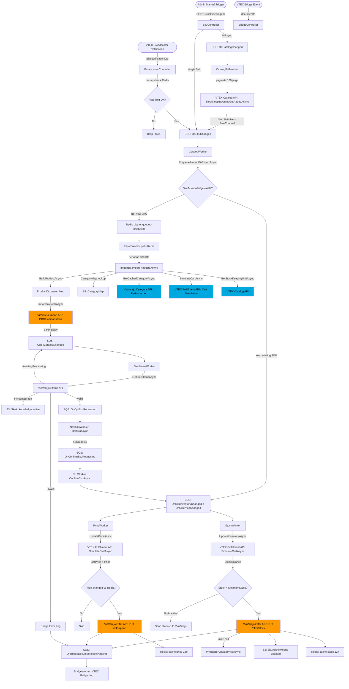

# Marketplace Product Data Capture Analysis
# Repository: integration-viavarejo

**Analysis date:** 2026-05-06  
**Technology stack:** .NET 8 (C# 12), ASP.NET Core, AWS SQS/S3, Redis, MySQL  
**Solution file:** `src/Vtex.Integration.ViaVarejo.Web.sln`

---

## 1. Executive Summary

This application integrates VTEX (a Brazilian SaaS e-commerce platform) with **ViaVarejo** — the marketplace brand that operates digital sales channels for Casas Bahia, Ponto, and Extra. The integration is a standalone .NET 8 service deployed on AWS Elastic Beanstalk and is responsible for the full lifecycle of product data flowing from VTEX to ViaVarejo: catalog import/registration, offer price updates, inventory synchronization, and freight simulation.

The core architectural pattern is **event-driven + asynchronous queue processing** using AWS SQS. Product changes in VTEX trigger events that are enqueued into dedicated SQS queues. A set of long-running background worker threads poll those queues and call VTEX and ViaVarejo APIs to complete the sync. A key design choice is that **price and inventory are always derived from cart simulation** (`/api/fulfillment/pvt/orderForms/simulation`) rather than from raw pricing or logistics APIs — this ensures that the values sent to ViaVarejo reflect what the customer would actually pay.

The application also handles the **bidirectional order flow**: receiving orders from ViaVarejo and placing them into VTEX OMS via the fulfillment API. This analysis focuses on the product data direction only.

---

## 2. Application Scope and Marketplace Responsibilities

### Marketplace
**ViaVarejo** — also referred to as Via Marketplace, operating as `api-mktplace.viavarejo.com.br`. As of recent years this marketplace is commercially known as Casas Bahia online (formerly B2W/Via Varejo Group).

### Product-related responsibilities

| Responsibility | Present? | Notes |
|---|---|---|
| Catalog registration (new products) | Yes | Full import flow via `ImportClient` |
| Catalog updates (existing products) | Yes | Re-export via `CatalogWorker` |
| Price synchronization | Yes | `PricingBo` + `SellerItemClient.UpdatePriceAsync` |
| Inventory synchronization | Yes | `InventoryBo` + `SellerItemClient.UpdateStockAsync` |
| Freight/logistics simulation | Yes | `FreightBo` serving inbound ViaVarejo requests |
| Order creation in VTEX | Yes | `OrderBo` (bidirectional, not analyzed here) |
| Order tracking updates to ViaVarejo | Yes | `TrackingWorker` (out of scope) |
| Receiving catalog/offer feedback from marketplace | Yes | SKU status polling via `ImportBo.CheckSkuStatusAsync` |
| Category mapping (VTEX ↔ ViaVarejo) | Yes | `CategoryMap` stored in S3 |

### Data flows
- **Outbound:** VTEX → ViaVarejo: catalog (product/SKU), price, inventory, tracking
- **Inbound:** ViaVarejo → VTEX: orders, freight simulation requests, SKU status feedback, stock reservation

---

## 3. Product Discovery Process

### 3.1 Entry points

There are four ways in which product synchronization is initiated:

#### A. VTEX Broadcaster Notification (event-driven, real-time)
- **Endpoint:** `POST /api/viavarejointegration/broadcaster/notification`
- **Controller:** [`BroadcasterController.cs:37`](src/Vtex.Integration.ViaVarejo.Web/Controllers/BroadcasterController.cs)
- VTEX's native broadcaster service pushes `SkuNotificationDto` payloads when a SKU is modified.
- The controller inspects which type of change occurred:
  - `HasStockKeepingUnitModified` → enqueues to `OnSkuChanged` (catalog update, 30-minute dedup block)
  - `PriceModified` → enqueues to `OnSkuPriceChanged` (6-hour dedup block — note the comment in code mentions this was extended for Black Friday)
  - `StockModified` → enqueues to `OnSkuInventoryChanged` (30-minute dedup block)
  - `SkuHasRemovedFromAffiliate` → enqueues to `OnSkuChanged`
- **Deduplication:** Uses `BroadcasterNotificationControl.MustAddAndBlockAsync` backed by Redis to prevent flooding a single SKU within the same time window.

#### B. Manual / Admin Trigger (on-demand)
- **Endpoints (SkuController):**
  - `POST /api/viavarejointegration/stockkeepingunit` → triggers full catalog sync (enqueues to `OnCatalogChanged`, Redis lock prevents duplicate within 24h)
  - `POST /api/viavarejointegration/stockkeepingunit/stock` → triggers full inventory sync (`OnInventoryChanged`)
  - `POST /api/viavarejointegration/stockkeepingunit/price` → triggers full price sync (`OnPriceChanged`)
  - `POST /api/viavarejointegration/stockkeepingunit/{skuId}` → enqueues a single SKU

#### C. Bridge Document Events (BridgeController)
- Bridge is VTEX's internal middleware for marketplace integrations.
- `POST /api/viavarejointegration/bridge/selleritem/{documentId}/process` → triggers export for a single SKU.
- `POST /api/viavarejointegration/bridge/selleritem/{documentId}/stock` / `/price` → triggers stock/price updates.

#### D. ViaVarejo SKU Opt-In Feedback (async, event-driven)
- After a new product is submitted, ViaVarejo sends back a status code indicating whether it was accepted. The application polls this status via `OnSkuStatusChanged` queue.

### 3.2 Product eligibility filtering

A SKU is considered eligible for the channel when **all** of the following conditions are true (checked in multiple workers and business objects):

1. **IsActive = true** — the SKU must be active in VTEX catalog (`StockKeepingUnitDto.IsActive`).
2. **SaleChannel membership** — `StockKeepingUnitDto.SalesChannels` must contain the configured `storeConfig.SaleChannel` integer ID.
3. **Category mapping exists** — there must be a `CategoryMap` record in S3 for the SKU's VTEX category ID.
4. **Description present** — `ProductDescription` must be non-empty (validated in `CatalogBo.BuildProductAsync:215`).
5. **Images present** — at least one image must exist.
6. **Cart simulation succeeds** — the fulfillment cart simulation must return a non-zero price.
7. **Not a Kit (if configured)** — if `storeConfig.SendKit = false`, kit SKUs are excluded (`CatalogBo.EnqueueProductToExportAsync:148`).
8. **Integration not blocked** — `storeConfig.IsCatalogIntegrationBlocked`, `IsPriceIntegrationBlocked`, `IsInventoryIntegrationBlocked` are flags that can halt individual streams.
9. **SkuAcknowledge state** — if `storeConfig.IsUsingSkuAcknowledge = true`, a `SkuAcknowledge` record must exist in S3. This flag gates whether a SKU has completed the ViaVarejo import lifecycle.

---

## 4. End-to-End Product Data Capture Flow

### 4.1 New Product Import Flow (first-time export)

```
1. Trigger (Broadcaster / Admin / Bridge)
        ↓
2. SQS: OnSkuChanged
        ↓
3. CatalogWorker: dequeues message, calls CatalogBo.EnqueueProductToExportAsync(skuId)
        ↓
4. CatalogBo.EnqueueProductToExportAsync:
   a. Checks SkuAcknowledge (S3) — if already acknowledged, re-routes to price/inventory queues
   b. Fetches SKU from VTEX Catalog API (CatalogClient.GetStockKeepingUnitAsync)
   c. Validates IsActive, SaleChannel membership
   d. If IsUsingSkuAcknowledge and no record → enqueues skuId to Redis list (enqueued:{account}:productId)
   e. Checks ViaVarejo status via ImportClient.GetSkuStatusAsync
   f. If status is Invalid → enqueues to Redis list
   g. Otherwise → enqueues to SQS OnSkuStatusChanged (10-min delay)
        ↓
5. SQS: Redis list (enqueued:{account}:productId)
        ↓
6. ImportWorker: dequeues batch of 300 product IDs, calls ImportBo.ImportProductsAsync
        ↓
7. ImportBo.ImportProductsAsync:
   a. For each skuId → CatalogClient.GetStockKeepingUnitAsync
   b. CatalogBo.BuildProductAsync (full data assembly — see section 5)
   c. Groups SKUs by ProductId (deduplication)
   d. Validates multi-SKU products have at least one specification
   e. Sends batch to ViaVarejo via ImportClient.ImportProductsAsync
   f. Post-import: enqueues each SKU to OnSkuStatusChanged (5-min delay)
        ↓
8. SQS: OnSkuStatusChanged
        ↓
9. SkuStatusWorker → ImportBo.CheckSkuStatusAsync:
   status = AwaitingProcessing → reschedule to OnSkuStatusChanged (10 min)
   status = Valid → enqueue to OnOptSkuRequested
   status = AwaitingConfirmation → enqueue to OnConfirmSkuRequested (10 min)
   status = Invalid → report violations via Bridge
   status = Integrating / FichaIntegrada → mark SkuAcknowledge as active in S3
        ↓
10. SQS: OnOptSkuRequested
        ↓
11. NewSkuWorker → ImportBo.OptStockKeepingUnitAsync → ImportClient.OptSkuAsync
        ↓
12. SQS: OnConfirmSkuRequested (5-min delay)
        ↓
13. SkuWorker → ImportBo.ConfirmStockKeepingUnitAsync → ImportClient.ConfirmSkuAsync
        ↓
14. After confirmation: enqueues to OnSkuInventoryChanged (triggers stock + price sync)
```

### 4.2 Existing Product Update Flow (catalog change)

When a SKU is already in ViaVarejo (`SkuAcknowledge` exists or `cachedSellerItem` exists):
- `CatalogBo.EnqueueProductToExportAsync` short-circuits and enqueues `OnBridgeDocumentIndexPending` (success log) + `OnSkuInventoryChanged` + `OnSkuPriceChanged`.
- Does **not** re-import via the full import flow.

### 4.3 Price Update Flow

```
1. Trigger: Broadcaster (PriceModified) OR Admin OR SkuInventoryChanged completion
        ↓
2. SQS: OnSkuPriceChanged
        ↓
3. PriceWorker → PricingBo.UpdatePriceAsync(skuId, storeConfig)
        ↓
4. PricingBo.UpdatePriceAsync:
   a. Fetch SKU from VTEX Catalog (validates IsActive, SaleChannel)
   b. If inactive → enqueues to OnSkuInventoryChanged (to zero out stock)
   c. Checks SkuAcknowledge (if IsUsingSkuAcknowledge)
   d. SimulateCart → FulfillmentClient.SimulateCartAsync
   e. Extract ListPrice and Price from cart simulation
   f. Ensures ListPrice >= Price (correction if ListPrice < Price)
   g. Compare against cached price in Redis (PriceQueueRedisKey)
   h. If no change → skip API call
   i. Calls SellerItemClient.UpdatePriceAsync → PUT api/v4/api-front-offer-v4/jersey/offer/price
   j. Stores new price in Redis (12-hour TTL)
   k. Sends success to OnBridgeDocumentIndexPending
```

### 4.4 Inventory Update Flow

```
1. Trigger: Broadcaster (StockModified) OR Admin OR Post-SKU-Confirmation
        ↓
2. SQS: OnSkuInventoryChanged
        ↓
3. StockWorker → InventoryBo.UpdateInventoryAsync(skuId, storeConfig)
        ↓
4. InventoryBo.UpdateInventoryAsync:
   a. Fetch SKU from VTEX Catalog
   b. If inactive/not in SaleChannel → send stock = 0 to ViaVarejo + update SkuAcknowledge.IsActive = false
   c. Checks SkuAcknowledge (if IsUsingSkuAcknowledge)
   d. SimulateCart → FulfillmentClient.SimulateCartAsync
   e. Extract StockBalance from ItemsLogistics[0]
   f. If StockBalance <= MinimumStock → override with 0
   g. Compare against Redis cached stock (SkuRedisKey)
   h. If changed → calls SellerItemClient.UpdateStockAsync → PUT api/v4/api-front-offer-v4/jersey/offer/stock
   i. Caches new stock in Redis (12-hour TTL)
   j. Updates SkuAcknowledge in S3
   k. After stock update → calls PricingBo.UpdatePriceAsync (reuses same cart simulation result)
```

---

## 5. Catalog and Content Data

### 5.1 Data assembled in `CatalogBo.BuildProductAsync`
**File:** [`src/Vtex.Integration.ViaVarejo.Business/CatalogBo.cs:213`](src/Vtex.Integration.ViaVarejo.Business/CatalogBo.cs)

| VTEX Field | Source | Transformation | ViaVarejo field |
|---|---|---|---|
| `ProductId` | `StockKeepingUnitDto.ProductId` | `.ToString()` | `idItem` (ProductDto.Id) |
| `ProductName` | `StockKeepingUnitDto.ProductName` | May be overridden by `CustomCatalogFields["ProductName"]` spec | `titulo` (ProductDto.Title) |
| `ProductDescription` | `StockKeepingUnitDto.ProductDescription` | HTML stripped via `StripHtmlTags()`; may be overridden by `DescriptionAttributeName` spec or `CustomCatalogFields["ProductDescription"]` | `descricao` (ProductDto.Description) |
| `BrandName` | `StockKeepingUnitDto.BrandName` | None | `marca` (ProductDto.Brand) |
| `ProductCategoryIds` | `StockKeepingUnitDto.ProductCategoryIds` | Last non-empty segment → looked up in `CategoryMap` | `idCategoria` (mapped ViaVarejo category ID) |
| `ProductSpecifications` | `StockKeepingUnitDto.ProductSpecifications` | Mapped via `CategoryMap.Specifications` + `CategoryAttributeDto.MpUdas` (variant = "N") | `atributos` (product-level) |
| `SkuSpecifications` | `StockKeepingUnitDto.SkuSpecifications` | Mapped via `CategoryMap.Specifications` (variant = "Y") | `atributos` (SKU-level) |
| `AlternateIds["Ean"]` | `StockKeepingUnitDto.AlternateIds` | Empty string → null | `gtin` |
| `Images` | `StockKeepingUnitDto.Images` + `ImageUrl` | Max 4 images; main image prioritized | `imagens` |
| `Dimension.HeightCentimeter` | `StockKeepingUnitDto.Dimension` | cm/100 → meters, rounded to 2 decimals | `dimensao.altura` |
| `Dimension.LengthCentimeter` | `StockKeepingUnitDto.Dimension` | cm/100 → meters | `dimensao.profundidade` |
| `Dimension.WidthCentimeter` | `StockKeepingUnitDto.Dimension` | cm/100 → meters | `dimensao.largura` |
| `Dimension.WeightKg` | `StockKeepingUnitDto.Dimension` | g/1000 → kg | `dimensao.peso` |
| `ProductSpecifications["viavarejogarantia"]` | custom spec | Must be numeric (months); throws if contains letters | `garantia` |
| CartSimulation: `ListPrice` | Fulfillment cart simulation | If ListPrice < Price → set ListPrice = Price | `preco.padrao` |
| CartSimulation: `Price` | Fulfillment cart simulation | Formatted with comma decimal separator | `preco.oferta` |
| CartSimulation: `StockBalance` | Fulfillment cart simulation `ItemsLogistics[0]` | Raw value | `estoque.quantidade` |

### 5.2 Validation before sending

The following validations are enforced and throw `IntegrationException` if they fail:
- `ProductDescription` must be non-empty.
- `Images` must be non-empty.
- `CategoryId` must be derivable from `ProductCategoryIds`.
- A `CategoryMap` must exist for the category in S3.
- The mapped ViaVarejo category must exist (fetched from `CategoryClient`).
- The mapped category must be a leaf category (`HasChildren == false`).
- Cart simulation must succeed and return a non-zero price.
- Warranty (`viavarejogarantia` spec) must be numeric if present.
- Multi-SKU products: all SKUs must have at least one mapped specification.

### 5.3 Attribute/Category mapping logic
**File:** [`src/Vtex.Integration.ViaVarejo.Business/CatalogBo.cs:408`](src/Vtex.Integration.ViaVarejo.Business/CatalogBo.cs)

1. Load `CategoryMap` from S3 by key `{accountName}/{vtexCategoryId}`.
2. Load `CategoryAttributeDto` from ViaVarejo API (cached in Redis, 7-day TTL).
3. For each `SpecificationMap` in `CategoryMap.Specifications`:
   - Match VTEX spec name → find corresponding ViaVarejo `MpUda` by `MappedSpecificationName`.
   - Match VTEX spec value → find corresponding `MappedSpecificationValue`.
   - If `UdaValues` exist on the marketplace side, must match exactly (case-insensitive).
4. Non-matched specs are silently skipped.

### 5.4 Kit products
Kit products can be excluded entirely via `storeConfig.SendKit = false` (defaults to `true` for backward compatibility per code comment at `StoreConfig:53`).

---

## 6. Price Synchronization

### 6.1 VTEX API used
**Cart Simulation:** `POST /api/fulfillment/pvt/orderForms/simulation?sc={saleChannel}&affiliateId={affiliateId}&an={accountName}`  
**File:** [`src/Vtex.Integration.ViaVarejo.Services/Seller/FulfillmentClient.cs:106`](src/Vtex.Integration.ViaVarejo.Services/Seller/FulfillmentClient.cs)

The application **does not use** the VTEX Pricing API (`/api/pricing/`) or price tables. All price data comes exclusively from cart simulation results.

### 6.2 What is captured from simulation

- `CartResponseDto.Items[0].ListPrice` → ViaVarejo `preco.padrao` (default/from price)
- `CartResponseDto.Items[0].Price` → ViaVarejo `preco.oferta` (offer/sale price)

**Business rule:** If `ListPrice < Price`, the `ListPrice` is set equal to `Price`. This prevents sending a "sale price" higher than the "list price".

### 6.3 Price change detection (deduplication)
**File:** [`src/Vtex.Integration.ViaVarejo.Business/PricingBo.cs:103`](src/Vtex.Integration.ViaVarejo.Business/PricingBo.cs)

- A `SkuSimulation` object `{SkuId, ListPrice, Price}` is serialized and stored in Redis with key `via:enqueuedprice:{account}:{skuId}` and a 12-hour TTL.
- If the new simulation matches the cached one → API call is skipped entirely.
- This prevents redundant ViaVarejo API calls for price events that don't result in actual changes.

### 6.4 ViaVarejo price update endpoint
`PUT api/v4/api-front-offer-v4/jersey/offer/price`  
Payload: `{idSkuLojista, preco: {oferta, padrao}}`  
**File:** [`src/Vtex.Integration.ViaVarejo.Services/Marketplace/SellerItemClient.cs:60`](src/Vtex.Integration.ViaVarejo.Services/Marketplace/SellerItemClient.cs)

**Safety check:** ViaVarejo rejects price changes where the new price is more than 50% lower than the current price (response contains "Preço Oferta possui variação maior que 50%"). The app catches this and wraps it as a descriptive `IntegrationException`.

### 6.5 Price synchronization triggers

| Trigger | Queue | Worker |
|---|---|---|
| Broadcaster `PriceModified` | `OnSkuPriceChanged` | `PriceWorker` |
| Admin full sync | `OnPriceChanged` | `PriceFullWorker` |
| After inventory update | Inline call from `InventoryBo.UpdateInventoryAsync` | Same process |
| After catalog update (existing SKU) | `OnSkuPriceChanged` | `PriceWorker` |

### 6.6 Full price sync (PriceFullWorker)
Paginates VTEX catalog via `StockKeepingUnitIdGetPagedAsync` (page size 100), filters by `IsActive` + `SaleChannel`, enqueues each eligible SKU to `OnSkuPriceChanged`. Up to 10 retries on retryable HTTP errors per page.

---

## 7. Inventory and Availability Synchronization

### 7.1 VTEX API used
Cart simulation (same as price) — `FulfillmentClient.SimulateCartAsync`.  
The application **does not call** VTEX's dedicated inventory API (`/api/logistics/pvt/inventory/skus/{skuId}`). Availability is entirely derived from the simulation response.

### 7.2 What is captured

- `CartResponseDto.ItemsLogistics[0].StockBalance` → final sellable quantity sent to ViaVarejo.

This value represents VTEX's view of available stock after applying logistics rules, reservations, and active warehouse configurations for the configured sale channel and affiliate.

### 7.3 Availability calculation

```
if (SKU is inactive OR not in SaleChannel) → quantity = 0
else if (StockBalance <= storeConfig.MinimumStock) → quantity = 0
else → quantity = StockBalance
```

The `MinimumStock` threshold is configurable per merchant in `StoreConfig`. If stock equals or falls below this threshold, zero is sent to ViaVarejo to create a buffer.

### 7.4 Stock change detection (deduplication)
**File:** [`src/Vtex.Integration.ViaVarejo.Business/InventoryBo.cs:129`](src/Vtex.Integration.ViaVarejo.Business/InventoryBo.cs)

- Stock value stored in Redis with key `ViaSkuStockKey:{account}:{skuId}`, 12-hour TTL.
- If the new quantity equals the cached value → `UpdateStockAsync` is **skipped**.
- If no cached value exists → always calls `UpdateStockAsync`.

### 7.5 ViaVarejo stock update endpoint
`PUT api/v4/api-front-offer-v4/jersey/offer/stock`  
Payload: `{idSkuLojista, estoque: {quantidade, tempoDePreparacao}}`  
**File:** [`src/Vtex.Integration.ViaVarejo.Services/Marketplace/SellerItemClient.cs:91`](src/Vtex.Integration.ViaVarejo.Services/Marketplace/SellerItemClient.cs)

### 7.6 SkuAcknowledge persistence
**File:** [`src/Vtex.Integration.ViaVarejo.Repository/Domain/SkuAcknowledge.cs`](src/Vtex.Integration.ViaVarejo.Repository/Domain/SkuAcknowledge.cs)

After every stock update, a `SkuAcknowledge` record is saved to S3 with `IsActive = true` (if stock > 0) or `IsActive = false` (if zeroed out). This record serves as the application's internal state tracking whether a SKU has been successfully registered with ViaVarejo.

### 7.7 Out-of-stock and inactive handling

- **Inactive SKU:** Stock = 0 is immediately sent to ViaVarejo. The application does not remove the offer from ViaVarejo — it zeroes it out.
- **Below minimum stock:** Same as inactive — zero is sent.
- **Partial availability:** Not considered — only total `StockBalance` is used.

---

## 8. Logistics and Delivery Synchronization

### 8.1 How logistics data is used

Logistics data is **not synchronized independently** as part of the regular offer flow. Instead, it is used in two contexts:

1. **Inbound freight simulation from ViaVarejo** (on-demand, per order):  
   ViaVarejo calls the integration's freight endpoint before placing an order to determine if the seller can deliver and at what cost.

2. **Stock balance derivation** (implicit):  
   The cart simulation `ItemsLogistics[0].StockBalance` is used to determine available quantity.

### 8.2 Freight endpoints (PubController)

- `GET/POST /api/viavarejointegration/pub/{accountName}/freight` → V1 freight simulation  
- `POST /api/viavarejointegration/pub/{accountName}/freight` with `FreightRequestDto` → V2 freight simulation  

Both call `FulfillmentClient.SimulateCartAsync` and transform the result.

### 8.3 Freight V1 logic
**File:** [`src/Vtex.Integration.ViaVarejo.Business/FreightBo.cs:43`](src/Vtex.Integration.ViaVarejo.Business/FreightBo.cs)

1. Sends cart simulation request with items and postal code.
2. For each item, finds logistics info from `ItemsLogistics`.
3. Filters out `pickup-in-point` delivery channels.
4. Selects the cheapest SLA from the remaining options (`normalFreight.Min(price)`).
5. Returns `FreightDto` with `DeliveryTime`, `FreightAmount`, `FreightType = "Normal"`.

**Error cases returned as `FreightErrorDto`:**
- Item not found in simulation response → ErrorType 1
- Item quantity = 0 → "indisponível para entrega"
- No SLA available → "indisponível para entrega"
- Insufficient stock for requested quantity

### 8.4 Freight V2 logic
**File:** [`src/Vtex.Integration.ViaVarejo.Business/FreightBo.cs:174`](src/Vtex.Integration.ViaVarejo.Business/FreightBo.cs)

More sophisticated than V1:
1. Builds a dictionary of items with their requested and received quantities.
2. Validates out-of-stock and missing SLA separately.
3. Aggregates delivery options across multiple items (takes worst-case delivery time).
4. Selects cheapest SLA (Normal method) and fastest SLA (Expressa method).
5. Returns up to two delivery options: `Normal` and `Expressa`.

### 8.5 Logistics data captured from simulation

- `SlaCollection[].Estimate` → delivery time in business days/hours (parsed by stripping "bd"/"d"/"h")
- `SlaCollection[].DockEstimate` → warehouse handling time
- `SlaCollection[].Price` → freight cost
- `SlaCollection[].DeliveryIds[0].CourierName` → carrier name
- `SlaCollection[].Id` → SLA identifier

---

## 9. Synchronization Architecture

### 9.1 Queue topology (AWS SQS)
**File:** [`src/Vtex.Integration.ViaVarejo.AWS/SQS/QueueEndpoint.cs`](src/Vtex.Integration.ViaVarejo.AWS/SQS/QueueEndpoint.cs)

| Queue | Purpose | Consumer Worker |
|---|---|---|
| `OnSkuChanged` | Catalog change events (per SKU) | `CatalogWorker` |
| `OnCatalogChanged` | Full catalog sync trigger | `CatalogFullWorker` |
| `OnSkuInventoryChanged` | Per-SKU inventory update | `StockWorker` |
| `OnInventoryChanged` | Full inventory sync trigger | `StockFullWorker` |
| `OnSkuPriceChanged` | Per-SKU price update | `PriceWorker` |
| `OnPriceChanged` | Full price sync trigger | `PriceFullWorker` |
| `OnSkuStatusChanged` | ViaVarejo import status check | `SkuStatusWorker` |
| `OnOptSkuRequested` | ViaVarejo SKU opt-in | `NewSkuWorker` |
| `OnConfirmSkuRequested` | ViaVarejo SKU confirmation | `SkuWorker` |
| `OnBridgeDocumentIndexPending` | Bridge log (success/error index) | `BridgeWorker` |
| `OnOrderReceived` | New order from ViaVarejo | `OrderWorker` |
| `OnOrderApprovalReceived` | Order approved | `ApprovedOrderWorker` |
| `OnOrderCanceledReceived` | Order canceled | `CanceledOrderWorker` |
| `OnCategoryHasMapped` | Category mapping notification | `SendCategoryMapWorker` |
| `OnApiAccessTokenRequested` | OAuth token refresh | `OAuthWorker` |

All SQS queue URLs are hardcoded constants in `QueueEndpoint.cs` using account ID `053131491888` in `us-east-1`.

### 9.2 Worker architecture
**Files:** [`src/Vtex.Integration.ViaVarejo.Worker/WorkerBase.cs`](src/Vtex.Integration.ViaVarejo.Worker/WorkerBase.cs), [`WorkerManager.cs`](src/Vtex.Integration.ViaVarejo.Worker/WorkerManager.cs)

- Workers extend `WorkerBase<T>` and implement `GetItemsToProcessAsync` (poll SQS) and `ProcessItemAsync` (business logic).
- Each worker type handles three distinct error paths:
  - `ProcessItemErrorAsync` — generic exceptions (usually doesn't ACK the message, allowing SQS redelivery)
  - `ProcessItemApiErrorAsync` — HTTP errors; retryable codes (429, 5xx) skip ACK; non-retryable codes ACK + write to Bridge error
  - `ProcessItemIntegrationErrorAsync` — validation errors; always ACKs and writes to Bridge
- Message ACK (`ConfirmMessageAsync`) deletes the message from SQS.

### 9.3 Full sync vs incremental sync

| Type | Trigger | Scope | Worker |
|---|---|---|---|
| Incremental (event-driven) | Broadcaster notification | Single SKU | `CatalogWorker`, `StockWorker`, `PriceWorker` |
| Full sync | Admin API call | All active SKUs | `CatalogFullWorker`, `StockFullWorker`, `PriceFullWorker` |
| Catch-up batch | `ImportWorker` polling Redis | Up to 300 SKUs per cycle | `ImportWorker` |

### 9.4 Redis usage

| Redis key pattern | TTL | Purpose |
|---|---|---|
| `via:enqueuedprice:{account}:{skuId}` | 12 hours | Price deduplication cache |
| `ViaSkuStockKey:{account}:{skuId}` | 12 hours | Stock deduplication cache |
| `enqueued:{account}:productId` | None (list) | Redis list queue for import batch |
| `enqueued:{account}:product` | None (list) | Legacy Redis list queue (ProductDto objects) |
| `ViaStatusSafeTrigger:{account}:{skuId}` | 24 hours | Guards against status check flooding |
| `catalog:synchronize:{account}` | 24 hours | Prevents duplicate full catalog sync |
| `{account}:{GetCachedSellerItemAsync}:{skuId}` | 7 days (604800s) | ViaVarejo seller item cache |
| BroadcasterNotificationControl keys | Variable | Dedup windows per event type |

### 9.5 S3 storage (persistent state)

| Entity | S3 Key | Purpose |
|---|---|---|
| `StoreConfig` | `{accountName}` | Merchant configuration |
| `SkuAcknowledge` | `{accountName}/{skuId}` | Per-SKU integration state |
| `CategoryMap` | `{accountName}/{vtexCategoryId}` | Category and spec mapping |

### 9.6 Concurrency and retries

- **Retries:** Retryable HTTP status codes (429, 503, etc.) skip ACK, allowing SQS to redeliver the message after the queue's visibility timeout.
- **Max retries per page in full sync:** 10 retries before abandoning the page (both `ApiException` and `TaskCanceledException`).
- **Batch size:** Import worker dequeues 300 SKU IDs per cycle. Full sync pagination: 100 SKUs per page.
- **Concurrency:** Not directly visible in code; controlled by SQS visibility timeout and worker instance count in configuration.
- **Rate limiting prevention:** BroadcasterNotificationControl uses Redis SET NX to prevent the same SKU from entering the same queue within the deduplication window.

---

## 10. Marketplace Payload Assembly

### 10.1 New product import payload (ImportDto)
**File:** [`src/Vtex.Integration.ViaVarejo.Contracts/ViaVarejo/ImportDto.cs`](src/Vtex.Integration.ViaVarejo.Contracts/ViaVarejo/ImportDto.cs)

```json
{
  "itens": [
    {
      "idItem": "vtexProductId",
      "marca": "brand",
      "titulo": "product name",
      "idCategoria": "viaVarejoMappedCategoryId",
      "descricao": "HTML-stripped description",
      "garantia": "12",
      "atributos": [{"idUda": "vvj_attr_id", "valor": "mapped_value"}],
      "skus": [
        {
          "idSkuLojista": "vtexSkuId",
          "gtin": "ean",
          "imagens": ["url1","url2","url3","url4"],
          "dimensao": {"largura": 0.30, "altura": 0.20, "peso": 1.50, "profundidade": 0.40},
          "atributos": [{"idUda": "vvj_variant_attr_id", "valor": "value"}],
          "preco": {"padrao": "2999,90", "oferta": "2499,90"},
          "estoque": {"tempoDePreparacao": "0", "quantidade": 10}
        }
      ]
    }
  ]
}
```

**Endpoint:** `POST api/v4/api-front-importer-v4/jersey/import/itens`

**Important notes:**
- Price in the import payload uses **comma** as decimal separator (e.g., `"2999,90"`).
- Price in the update endpoint uses numeric decimal type.
- Multiple SKUs of the same product are grouped in a single `ProductDto.Skus[]`.
- Null fields are excluded from serialization (`IgnoreNullValues = true`).

### 10.2 Price update payload
```json
{"idSkuLojista": "skuId", "preco": {"oferta": 2499.90, "padrao": 2999.90}}
```

### 10.3 Stock update payload
```json
{"idSkuLojista": "skuId", "estoque": {"quantidade": 10, "tempoDePreparacao": 0}}
```

### 10.4 Separate vs combined payloads
- **Catalog:** Sent as a combined payload (all SKUs of a product in one request) via import endpoint.
- **Price and stock:** Sent **separately** via dedicated update endpoints after the product is already registered.
- **Logistics:** Not pushed proactively; served on demand via freight simulation endpoint.

---

## 11. Error Handling and Observability

### 11.1 Error handling strategy

| Error type | Strategy | Bridge log? |
|---|---|---|
| Retryable HTTP (429, 5xx) | SQS message stays invisible → redelivered | No |
| Non-retryable HTTP (400, 404) | ACK message + write error to `OnBridgeDocumentIndexPending` | Yes (Error) |
| IntegrationException | ACK message + write error/warning to Bridge | Yes (Error or Warning) |
| Generic Exception | Do NOT ACK (SQS redelivery) | No |
| Validation failures in BuildProduct | Per-SKU: logged + error Bridge entry + continue batch | Yes (Error) |
| ViaVarejo import error per SKU | Per-SKU: logged + error Bridge entry + continue batch | Yes (Error) |
| ViaVarejo Invalid status with violations | Violations reported as HTML in Bridge message | Yes (Error) |
| Price variance >50% (ViaVarejo safety) | IntegrationException with descriptive message | Yes (Error) |

### 11.2 Bridge logging (`OnBridgeDocumentIndexPending`)

Every significant operation result is published to this SQS queue with a `DocumentDto`:
```
DocumentId = skuId
AccountName = accountName
Status = Success | Error | Warning
Type = Product | Price | Stock
Message = human-readable status message
LastRetryDate = Brazil timezone timestamp
```

This drives the admin UI in VTEX's Bridge portal where support teams can review per-SKU status.

### 11.3 Observability stack

- **LogClient** — structured logging with `LogLevel` (Important, Debug) and `LogType` (Info, Error, Warning); includes evidence (full request/response payloads) for failed operations.
- **OpenTelemetry** — configured in `appsettings.json`, exports traces and metrics.
- **Prometheus** — metrics endpoint exposed for collection.
- **Splunk** — referenced in `SplunkConfiguration` (external log aggregation).
- **Evidence service** — `http://evidence.vtex.com` (TTL 180 days) for long-term audit logs.

### 11.4 Debugging support

- **Compare All** (`PUT /api/viavarejointegration/stockkeepingunit/compareAll`): Fetches all SKUs from ViaVarejo, runs cart simulation for each, compares prices and stock, enqueues mismatches for resync, and exports a CSV report to S3. This is the main support/debugging tool.
- **Per-SKU status check** (`POST /api/viavarejointegration/stockkeepingunit/teste/{skuId}`): Manually triggers `ImportBo.CheckSkuStatusAsync` for debugging the import lifecycle.
- **Reprocess stuck** (`POST /api/viavarejointegration/pvt/reprocessstuck`): Available via PrivateController.

---

## 12. Dependencies, Assumptions, and Risks

### 12.1 VTEX platform dependencies

| API | Purpose | Configured endpoint |
|---|---|---|
| Catalog API (`/api/catalog_system/pvt/sku/...`) | Fetch SKU data, pagination | `ServicesConfiguration.CatalogEndpoint` |
| Fulfillment/Cart Simulation (`/api/fulfillment/pvt/orderForms/simulation`) | Price AND inventory (single source of truth) | `ServicesConfiguration.FulfillmentEndpoint` |
| OMS (`/api/oms/pvt/orders`) | Order management | `ServicesConfiguration.OmsEndpoint` |
| License Manager | Account/auth validation | `ServicesConfiguration.LicenseManagerEndpoint` |
| VTEX ID | User authentication | `ServicesConfiguration.VtexIdEndpoint` |
| Broadcaster | Event notifications | VTEX internal push |
| Bridge | Document state tracking | `ServicesConfiguration.BridgeEndpoint` |

### 12.2 ViaVarejo API dependencies

| API | Purpose |
|---|---|
| `api-front-importer-v4/jersey/import/itens` | Submit new products |
| `api-front-importer-v4/jersey/import/itens/{pid}/sku/{sid}/status` | Poll SKU status |
| `api-front-importer-v4/jersey/import/itens/{pid}/sku/{sid}/optar` | Opt-in new SKU |
| `api-front-importer-v4/jersey/import/itens/{pid}/sku/{sid}/confirmar` | Confirm SKU |
| `api-front-offer-v4/jersey/offer/price` | Update price |
| `api-front-offer-v4/jersey/offer/stock` | Update stock |
| `api-front-products-v4/jersey/product/{skuId}` | Get current seller item |
| `api-front-products-v4/jersey/product` | Paginated seller item listing |
| `/oauth/access-token` | OAuth token exchange |
| Category and attribute APIs | Fetch category tree and UDAs |

### 12.3 Required merchant configurations (StoreConfig)

| Field | Purpose |
|---|---|
| `accountName` | VTEX store account name |
| `AccessToken` (`apiAccessToken`) | ViaVarejo OAuth token |
| `saleChannel` | VTEX trade policy/sale channel ID |
| `affiliateId` | VTEX affiliate ID for order routing |
| `minimumStock` | Stock buffer below which zero is sent |
| `sendKit` | Whether kit/bundle SKUs are exported |
| `customCatalogFields` | Optional spec overrides for name/description |
| `descriptionAttributeName` | Optional custom description spec field name |
| `IsUsingSkuAcknowledge` | Whether to track integration state per SKU |
| `isCatalogIntegrationBlocked` | Emergency stop for catalog |
| `isPriceIntegrationBlocked` | Emergency stop for price |
| `isInventoryIntegrationBlocked` | Emergency stop for inventory |
| `orderAllowanceRate` | Price divergence tolerance % for order placement |
| `sandbox` | Whether to use ViaVarejo sandbox environment |

### 12.4 Required operational dependencies

- **CategoryMap records in S3:** Without category mappings, no product can be exported. There is no fallback — export fails with an `IntegrationException`.
- **ViaVarejo category must be a leaf:** If the mapped ViaVarejo category has children, the product is rejected.
- **Cart simulation must succeed:** If VTEX's cart simulation fails or returns price = 0, both catalog export and updates are blocked for that SKU.
- **AWS SQS URLs hardcoded:** All 17 SQS queue URLs are hardcoded in `QueueEndpoint.cs` with a fixed AWS account ID. This means the application cannot be deployed to a different AWS account without code changes.

### 12.5 Key assumptions and risks

1. **Price always via simulation:** The application assumes cart simulation accurately reflects the actual selling price. Any simulation-side bugs (affiliate misconfiguration, inactive SLA) will silently send wrong prices or zero inventory to ViaVarejo.
2. **Single seller assumption:** `DefaultSellerId = "1"` is hardcoded in `CatalogBo`, `PricingBo`, `InventoryBo`, and `FreightBo`. This assumes the store is always seller 1 (the account's own inventory). Multi-seller scenarios are not supported for product data.
3. **Country hardcoded:** `Country = "BRA"` is hardcoded in multiple business objects. The application is Brazil-only.
4. **Redis as primary dedup:** Redis failures would cause duplicate API calls to ViaVarejo (redundant updates), but would not cause data loss or incorrect values.
5. **No idempotency key for imports:** The `ImportProductsAsync` call does not include an idempotency key. A retry after a timeout could result in a duplicate import attempt.
6. **OptSkuAsync success check inverted:** In `ImportClient.OptSkuAsync:93`, success status codes throw an exception (`if (httpResponse.IsSuccessStatusCode) throw ...`). This appears intentional — the ViaVarejo API returns 200 for errors in this specific opt-in case, and the actual response is read on non-success status.
7. **SQS visibility timeout not configured in code:** The code does not explicitly set visibility timeouts when sending messages — relies on queue defaults. Only delay in seconds is set (e.g., 5-minute delay for status checks).
8. **Image limit of 4:** ViaVarejo accepts a maximum of 4 images. VTEX may have more. The app selects the first 4, prioritizing the main image.
9. **Warranty must be numeric:** The `viavarejogarantia` custom specification must contain only digits (months of warranty). If a store uses text values, all products in that category fail to export.

---

## 13. Step-by-Step Flow

### 13.1 New product registration flow

1. SKU is created/updated in VTEX catalog.
2. VTEX Broadcaster pushes `SkuNotificationDto` to `POST /api/viavarejointegration/broadcaster/notification`.
3. `BroadcasterController` checks dedup lock (Redis). If not locked → sends SKU ID to `OnSkuChanged` SQS queue.
4. `CatalogWorker` picks up message from `OnSkuChanged`.
5. Loads `StoreConfig` from S3 to get `AccessToken` and `SaleChannel`.
6. Calls `CatalogBo.EnqueueProductToExportAsync(skuId, storeConfig)`.
7. Checks `SkuAcknowledge` in S3 (is this SKU already integrated?).
8. Calls `CatalogClient.GetStockKeepingUnitAsync` → `GET /api/catalog_system/pvt/sku/stockkeepingunitbyid/{skuId}`.
9. Validates SKU: active, in sale channel, not a blocked kit.
10. Pushes SKU ID to Redis list: `enqueued:{account}:productId`.
11. ACKs the SQS message.
12. `ImportWorker` (polling) dequeues batch of ≤300 IDs from Redis list.
13. `ImportBo.ImportProductsAsync` iterates each SKU ID:
    a. Calls `CatalogClient.GetStockKeepingUnitAsync` again.
    b. Calls `CatalogBo.BuildProductAsync`:
       - Validates description, images, category.
       - Loads `CategoryMap` from S3.
       - Fetches ViaVarejo category from `CategoryClient` (Redis-cached).
       - Runs cart simulation: `FulfillmentClient.SimulateCartAsync`.
       - Maps specifications via category attribute mapping.
       - Assembles `ProductDto` with dimensions (converted), images (max 4), price, stock.
14. Deduplicates products by `ProductId`.
15. Calls `ImportClient.ImportProductsAsync` → `POST api/v4/api-front-importer-v4/jersey/import/itens`.
16. Enqueues each SKU to `OnSkuStatusChanged` (5-min delay).
17. `SkuStatusWorker` polls ViaVarejo status via `ImportClient.GetSkuStatusAsync`.
18. If `Valid` → enqueues to `OnOptSkuRequested`.
19. `NewSkuWorker` calls `ImportBo.OptStockKeepingUnitAsync` → `ImportClient.OptSkuAsync`.
20. Enqueues to `OnConfirmSkuRequested` (5-min delay).
21. `SkuWorker` calls `ImportBo.ConfirmStockKeepingUnitAsync` → `ImportClient.ConfirmSkuAsync`.
22. Enqueues to `OnSkuInventoryChanged`.
23. `StockWorker` → `InventoryBo.UpdateInventoryAsync`:
    - Runs cart simulation.
    - Sends stock to `SellerItemClient.UpdateStockAsync`.
    - Saves `SkuAcknowledge` with `IsActive = true`.
    - Calls `PricingBo.UpdatePriceAsync` (reuses simulation).
24. `PricingBo.UpdatePriceAsync`:
    - Compares against Redis cached price.
    - Sends price to `SellerItemClient.UpdatePriceAsync`.
    - Caches new price in Redis.
25. Both operations log success to `OnBridgeDocumentIndexPending`.

---

## 14. Mermaid Diagram



---

## 15. Source-to-Destination Mapping Table

| Data type | VTEX source/API/module | Main files/functions | Transformation/business logic | Marketplace destination/use |
|---|---|---|---|---|
| **Catalog/content** | `GET /api/catalog_system/pvt/sku/stockkeepingunitbyid/{skuId}` → `StockKeepingUnitDto` | `CatalogClient.GetStockKeepingUnitAsync`, `CatalogBo.BuildProductAsync`, `ImportBo.ImportProductsAsync` | HTML stripping; custom field overrides for name/description; max 4 images with main image prioritization; spec mapping via `CategoryMap`; dimension unit conversion (cm→m, g→kg) | `POST api/v4/api-front-importer-v4/jersey/import/itens` as `ImportDto.ProductDto[]` |
| **Price** | `POST /api/fulfillment/pvt/orderForms/simulation` → `CartResponseDto.Items[0].ListPrice` + `.Price` | `FulfillmentClient.SimulateCartAsync`, `PricingBo.UpdatePriceAsync` | Ensures ListPrice ≥ Price; Redis dedup (12h TTL); comma decimal format for import payload | `PUT api/v4/api-front-offer-v4/jersey/offer/price` as `{idSkuLojista, preco: {padrao, oferta}}` |
| **Inventory/stock** | `POST /api/fulfillment/pvt/orderForms/simulation` → `CartResponseDto.ItemsLogistics[0].StockBalance` | `FulfillmentClient.SimulateCartAsync`, `InventoryBo.UpdateInventoryAsync` | Minimum stock threshold (≤MinimumStock → 0); inactive/out-of-channel → 0; Redis dedup (12h TTL) | `PUT api/v4/api-front-offer-v4/jersey/offer/stock` as `{idSkuLojista, estoque: {quantidade}}` |
| **Availability** | Same as inventory (cart simulation) | `InventoryBo.UpdateInventoryAsync`, `CatalogBo.BuildProductAsync` | Active + SaleChannel + cart simulation + MinimumStock threshold | Zero stock = unavailable; positive stock = available on ViaVarejo offer |
| **Logistics/delivery** | `POST /api/fulfillment/pvt/orderForms/simulation` → `CartResponseDto.ItemsLogistics[0].SlaCollection` | `FulfillmentClient.SimulateCartAsync`, `FreightBo.GetFreightV1Async`, `FreightBo.GetFreightV2Async` | Filter out pickup-in-point; select cheapest SLA (Normal) + fastest (Expressa for V2); parse estimate string "bd"/"d"/"h" → integer days | Inbound response to ViaVarejo freight endpoint: `FreightDto` / `FreightResponseDto` |
| **Mapping/state** | S3 (`SkuAcknowledge`, `CategoryMap`, `StoreConfig`); Redis cache | `S3Repository.GetAsync/SaveAsync`, `CatalogBo`, `InventoryBo` | Per-SKU integration state tracked in `SkuAcknowledge.IsActive`; category/spec mapping in `CategoryMap`; merchant config in `StoreConfig` | Internal state — determines import vs update path; gates all sync operations |

---

## 16. Open Questions and Unclear Areas in the Code

1. **`OptSkuAsync` success check logic (line 93):** The method throws an exception on `IsSuccessStatusCode = true`. This is unusual and may indicate that ViaVarejo returns HTTP 200 for failure cases in this specific endpoint. The actual documentation for this API behavior is not present in the code.

2. **Redis list vs SQS for import queue:** There are two queuing mechanisms for the import batch: a Redis list (`enqueued:{account}:productId`) and legacy full `ProductDto` objects (also in Redis). A TODO comment at `CatalogBo.cs:63` reads "Remove old redis queues handlers after migration." The exact state of this migration is unclear — whether the legacy DTO queue is still active.

3. **`OnSkuImportRequested` queue defined but no consumer visible:** The constant `QueueEndpoint.OnSkuImportRequested` is defined but no corresponding worker was found in the scanned files. It may be unused or consumed by a component not visible in the repository.

4. **No retry limit or dead-letter queue configuration visible:** The SQS messages that fail generically (non-ACKed) will be redelivered indefinitely unless SQS-level DLQ is configured externally. The code doesn't configure message retention or max receive count.

5. **Warranty validation gap:** The warranty field (`viavarejogarantia`) must be numeric, but the check throws only if the value "has letters" — what about special characters or non-numeric strings without letters? This edge case may cause unexpected failures.

6. **`MapCategoryWorker` and `SendCategoryMapWorker`:** These workers handle category mapping. The exact trigger and flow of how categories are mapped (who initiates the mapping, whether it's manual or automatic) is not fully clear from the scanned code.

7. **Import payload size limit:** `appsettings.json` mentions `800KB batch size` in ViaVarejo configuration. It is not clear where this limit is enforced in the import payload construction.

8. **`IsCreatedAsync` StoreConfig field:** This field exists in `StoreConfig` but no usage was found in the scanned product-related code.

9. **Feature flags (FeatureHubBo):** The application uses OpenFeature/FeatureHub, but the specific feature flags and their impact on the product sync flow were not identified in the scanned code.

---

## 17. Recommendations for What Should Be Compared with Other Marketplace Applications

The following are the most distinctive or potentially inconsistent design decisions in this application that should be evaluated against other marketplace integrations in the VTEX ecosystem:

1. **Price and inventory via cart simulation (not dedicated APIs):** Most marketplace integrations use VTEX's Pricing API and Logistics/Inventory APIs directly. This application uses cart simulation as the single source of truth for both price and stock. This is unusual and should be verified: does this provide more accurate values (respecting trade policies), or does it introduce latency/failure risks?

2. **Multi-step SKU import lifecycle (Import → Status → Opt → Confirm):** ViaVarejo requires a 4-step import process unique to this marketplace. Other integrations likely have simpler push models. This stateful lifecycle creates complexity and multiple retry opportunities.

3. **Redis list as intermediate queue for batch import:** The use of a Redis list as a secondary queue (in addition to SQS) is a notable pattern. Other integrations should be checked to see if they use SQS exclusively or also use Redis as a buffer.

4. **Hardcoded SQS queue URLs:** The queue URLs include a hardcoded AWS account ID. Other marketplace integrations should be checked for whether they parameterize this or use a similar hardcoded approach.

5. **SkuAcknowledge as integration state (Import vs Update routing):** The `SkuAcknowledge` S3 entity determines whether a SKU goes through the import flow or the update flow. This is a critical design decision. Other integrations should be compared to understand their state tracking strategy.

6. **Minimum stock threshold:** The `MinimumStock` configuration that overrides actual stock with 0 is a business-specific safety mechanism. Other integrations should be checked for whether they implement a similar buffer concept.

7. **deduplication window for price events (6 hours for Black Friday):** The `BroadcasterController` has a hardcoded 6-hour deduplication window for price events (with a code comment noting "Tempo alterado de 1800 para 21600 para blackfriday"). This suggests the deduplication window was changed for a specific event and never reverted. Other integrations should be checked for similar hardcoded time values.

8. **Category mapping required as a pre-condition:** Without a `CategoryMap` in S3, no product can be exported. This is a strict pre-condition with no fallback. Other integrations should be compared for whether they handle unmapped categories differently (e.g., attempting to auto-map or sending to a default category).

9. **Image limit of 4:** The ViaVarejo marketplace accepts a maximum of 4 images. Other marketplaces have different limits. The image selection logic (main image prioritization when more than 4 exist) is worth comparing.

10. **Compare All reconciliation tool:** The `CompareAll` function in `SkuController` compares all ViaVarejo seller items against VTEX simulations and re-queues divergences. This kind of active reconciliation capability is worth checking in other integrations as a reliability best practice.
